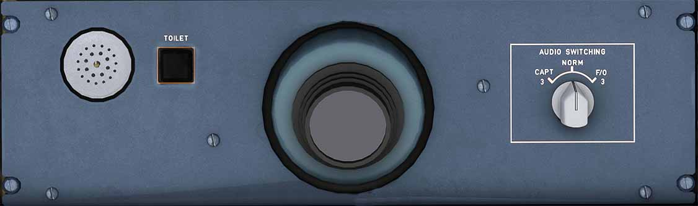

# Pedestal Light and Audio 3 Switch

---

[Back to Flight Deck](../index.md){ .md-button }

---

## Description

### Pedestal Light

Light for the pedestal. Controlled by the potentiometer on the right side of the pedestal itself.

### Audio Switching

The third ACP can be used if ACP1 or ACP2 fail.
Doing so takes away the third occupant's access to the acoustic equipment. AUDIO 3 XFRD appears in green on the ECAM MEMO display.

If set to CAPT 3 or F/O 3 the corresponding pilot uses his acoustic equipment and the third ACP.

!!! info ""
    Currently not available or INOP in the FBW A32NX for Microsoft Flight Simulator.

!!! info ""
    Currently not available or INOP in the FBW A32NX for Microsoft Flight Simulator.

---

[Back to Flight Deck](../index.md){ .md-button }

