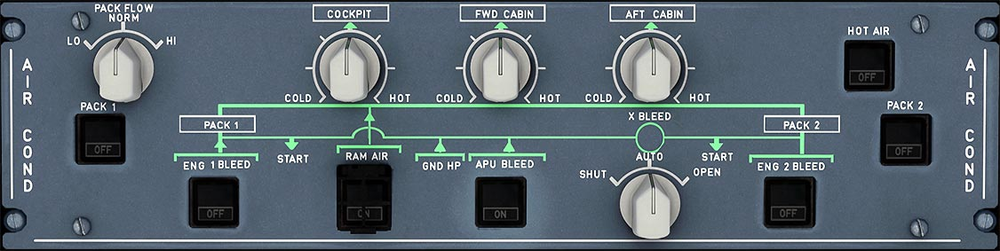

# Air Condition Control Panel

---

[Back to Flight Deck](../index.md){ .md-button }

---

{loading=lazy}

!!! note "API Documentation: [AC Panel API](../../../../../aircraft/a32nx/a32nx-api/a32nx-flightdeck-api.md#air-condition-panel)"

## Description

The air conditioning system operation is fully automatic and refreshes air constantly and maintains the temperature in the aircraft.

The two air conditioning packs (PACK 1+2) operate automatically and independently of each other.

## Usage

### COCKPIT, FWD CABIN, AFT CABIN

- 12 o'clock position : 24 °C (76 °F).
- COLD position : 18 °C (64 °F).
- HOT position : 30 °C (86 °F).

### HOT AIR

- ON:
    - Hot air is provided
- OFF:
    - Hot air valve is closed. FAULT is reset.
- FAULT:
    - Amber light and ECAM caution when overheat is detected. (> 88 °C/190 °F). Valves close automatically. Below 70 °C (158 °F) or if the flight crew selects OFF, the FAULT light goes OFF.

### PACK 1 + 2

- ON:
    - The pack flow control valve is automatically controlled.
- OFF:
    - The pack flow control valve closes.
- FAULT:
    - Amber light and ECAM caution if the pack flow control valve position disagrees with the selected position, or in the case of compressor outlet overheat or pack outlet overheat.

### PACK FLOW selector

- Permits the selection of pack valve flow, according to the number of passengers and ambient conditions (smoke removal, hot or wet conditions).
- LO (80 %) - NORM (100 %) - HI (120 %).
- Irrelevant in single pack operation, or with APU bleed supply. Always HI in these cases.
- If cooling demand cannot be satisfied will go to 100 % even when the setting is LO.

### RAM AIR (guarded)

- ON:
    - The RAM air inlet opens.
    - If &#916;p >= 1 psi: The outflow valve control remains normal. No emergency RAM air flows in.
    - If &#916;p < 1 psi: The outflow valve opens to about 50 % when under automatic control. It does not automatically open when it is under manual control. Emergency RAM airflow is directly supplied to the mixer unit.
    - When DITCHING is pressed, this is closed.
- OFF:
    - The RAM air inlet closes.

!!! info ""
    Currently not available or INOP in the FBW A32NX for Microsoft Flight Simulator.

### ENG 1 and ENG 2 BLEED

- ON:
    - Bleed pressure is provided
- FAULT:
    - Amber light and an ECAM caution, if:
        - overpressure downstream of the bleed valve.
        - bleed air overheat.
        - wing or engine leak on the related side.
        - bleed valve is not closed during engine start.
        - bleed valve is not closed with APU bleed ON.
        It goes out when the ENG BLEED pushbutton switch is OFF or if the fault has disappeared.
- OFF:
    - The bleed valve and HP valve close. The white OFF light comes on.

### APU BLEED

- ON:
    - The APU valve opens if APU N > 95 %. The blue ON light comes on.
- OFF:
    - The APU valve closes.
- FAULT:
    -  Amber light and an ECAM caution, when the system detects an APU leak.

### X-BLEED selector

- AUTO:
    - Crossbleed valve is open if the APU bleed valve is open. It is closed if the APU bleed valve is closed or, in case of a wing, pylon, or APU leak (except during engine start).
- OPEN:
    - Crossbleed valve is open.
- CLOSE:
    - Crossbleed valve is closed.

---

[Back to Flight Deck](../index.md){ .md-button }
