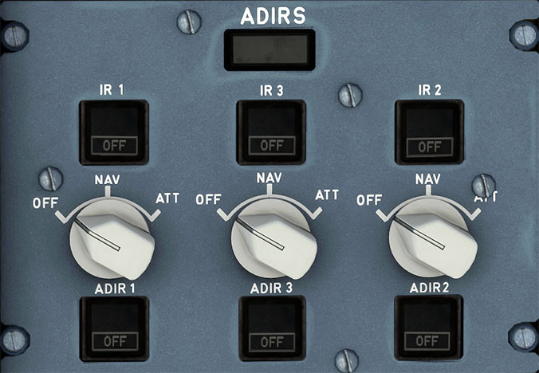

# ADIRS Panel

---

[Back to Flight Deck](../index.md){ .md-button }

---

!!! warning ""

    Please note: The labels under the rotary switches should say "ADR" rather than "ADIR". This will be fixed in a future update.

!!! note "API Documentation: [ADIRS Panel API](../../../../../aircraft/a32nx/a32nx-api/a32nx-flightdeck-api.md#adirs-panel)"

## Description

- The Air Data Inertial Reference System (ADIRS) computes the aircraft's position, speed, altitude, attitude, and air data for the displays, flight management guidance system, flight controls, engine controls, and other systems.

- There are three identical air data/inertial reference units (ADIRUs) installed in the aircraft. Each ADIRU combines an air data reference (ADR) system with a laser gyro inertial reference (IR) system in a single unit. The ADR and IR systems in each ADIRU operate independently, meaning failure of one system will not cause a failure of the other.

- The ADR provides barometric altitude, airspeed, Mach number, angle of attack, temperature, and overspeed warnings. If either ADR 1 or 2 fails, ADR 3 can be manually selected.

- The IR provides attitude, flight path vector, heading, track, acceleration (speed trend), VSI, groundspeed, and aircraft position. The IR provides an inertial position input to the FMGCs for navigation computations. If either IR 1 or 2 fails, IR 3 can be manually selected.

- ADIRU 1 and 2 supply their on side systems. ADIRU 3 is a hot spare.

## Operation

Normal operation:

- The IR mode selector should be turned to NAV in the order of 1, 2, then 3.

- ON BATT will then illuminate as a self-test at the start of alignment for a few seconds. If one or more of the ADIRU's are running on battery power, ON BATT will display constantly.

- IR 1, 2 and 3, as well as ADR 1, 2 and 3 can be turned off using the corresponding push button.

- If a fault develops with any of the IR's or ADR's a FAULT light will show on its corresponding push button.

Abnormal operation:

- The IR mode selector can be turned ATT. However, this only provides attitude and heading data, when entered by the flight crew. The navigation data is not available.

- The heading data must be entered using the MCDU. This must be updated frequently, roughly every 10 minutes.

- If the IR mode selector is set from NAV to ATT, or NAV to OFF during flight, NAV mode will be inoperable for the remainder of the flight.

---

[Back to Flight Deck](../index.md){ .md-button }
