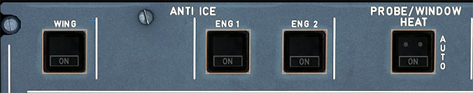

# Anti Ice Panel

---

[Back to Flight Deck](../index.md){ .md-button }

---

!!! note "API Documentation: [Anti Ice Panel API](../../../../../aircraft/a32nx/a32nx-api/a32nx-flightdeck-api.md#anti-ice-panel)"

---

## Description

The ice protection system allows unrestricted operation of the aircraft in icing conditions.

For anti-icing, either hot air or electrical heating protects critical areas of the aircraft.

Hot air is used for the three outboard leading-edge slats of each wing and for the engine air intakes.

Electrical heating is used for the flight compartment windows, the sensors, pitot probes and static ports and for the waste-water drain mast.  

For more information, see [Ice and Rain Protection](../../../a32nx-advanced-guides/ice-rain-protection.md)

## Usage

### WING anti-ice

- ON:
    - Blue light and ECAM MEMO "WING A. ICE". If pneumatic supply is available, wing anti-ice valves open. On ground only for a 30s test sequence.
- OFF:
    - No light. Anti-ice valves close.
- FAULT:
    - Amber light and ECAM caution if the anti-ice valve is not in the required position, or low pressure is detected.

### ENG 1 + 2

- ON:
    - Blue light and ECAM MEMO "ENG A. ICE". Engine anti-ice valve opens if bleed air is available. When the valve is opened and the anti-ice ENG pushbutton switch is selected ON, continuous ignition is selected. This makes the IGNITION memo appear on the ECAM.
- OFF:
    - No light. Engine anti-ice valve closes.
- FAULT:
    - Amber light and ECAM caution message, if the position of the anti-icing valve disagrees with the ENG 1 (2) pushbutton selection.

###  PROBE/WINDOW HEAT

- AUTO:
    - Probes/Windows are heated automatically in flight or on the ground (except TAT probes) when at least one engine is running.
- ON:
    - Blue light. Probes and windows are heated permanently.

[Back to Flight Deck](../index.md){ .md-button }
