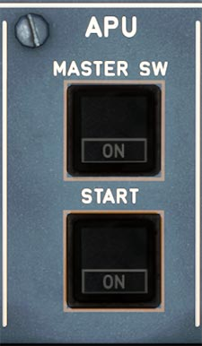

# Auxiliary Power Unit

---

[Back to Flight Deck](../index.md){ .md-button }

---

!!! note "API Documentation: [APU Panel API](../../../../../aircraft/a32nx/a32nx-api/a32nx-flightdeck-api.md#apu-panel)"

## Description

The Auxiliary Power Unit (APU) is a small jet engine in the back of the A320neo which supplies the aircraft with pneumatic and electrical power.

## Usage

### MASTER SW

Controls the APU operation and its start- and shutdown sequence.

- ON:
    - Blue ON light.
    - APU system is powered (performs a power-up test after set to ON).
    - APU Air intake flap opens.
    - Fuel valve opens.
    - The APU uses fuel from the left wing tank only.
    - If both main fuel pumps in the left wing tank are off, the APU Fuel Pump will be automatically activated.
    - ECAM shows APU page
- OFF:
    - Manual shutdown sequence.
    - ON light and the AVAIL light on the START pushbutton, go off.
    - The APU keeps running for a cooling period of 60 seconds, if the aircraft was using APU bleed air.
    - Air inlet flap closes at N = 7 %
- FAULT Lt:
    - Amber light and ECAM warning message, if an automatic APU shutdown occurs. Possible causes:
        - Air inlet flap closed
        - Clogged oil filter
        - DC power lost (BAT OFF when aircraft on batteries only)
        - ECB failure
        - EGT overtemperature
        - Fire (on ground only)
        - High oil temperature
        - IGV failure
        - Inlet overheat
        - Loss of EGT thermocouples
        - Loss of overspeed protection
        - Low oil pressure
        - No acceleration
        - No flame
        - No speed
        - Oil system shutdown
        - Overcurrent
        - Overspeed
        - Reverse flow
        - Sensor failure
        - Slow start
        - Underspeed

### START

- ON:
    - Blue ON light.
    - Starter is energized when the flap is completely open.
    - Ignition activates 1.5 seconds after the starter is energized.
    - When N = 55 %. The APU starter is de-energized. The ignition is turned off.
    - 2 seconds after N reaches 95 %, or when N is above 99.5 % the ON light on START button goes out. The APU can now supply bleed air and electrical power to the aircraft.
    - APU page disappears from the ECAM display after > 10 s.
- AVAIL Lt:
    - Green light comes on when N is above 99.5 % or 2 seconds after N reaches 95 %.

---

[Back to Flight Deck](../index.md){ .md-button }
