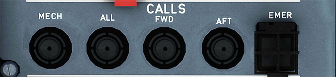

# Calls Panel

---

[Back to Flight Deck](../index.md){ .md-button }

---

!!! note "API Documentation: [Calls Panel](../../../../../aircraft/a32nx/a32nx-api/a32nx-flightdeck-api.md#calls-panel)"

## Description

- The calls panel allows the cockpit to initiate calls to the flight attendants via the cabin interphone system, and the ground crew via the flight interphone system.
- The cabin interphone system is used for communication between the cockpit, flight attendant stations, and other external locations on the aircraft.
- The flight interphone system is used for communication between the cockpit and the external service interphone panel, located near the nose gear on the External Power Panel.

## Usage

### MECH

- The cockpit call light will illuminate on the External Power Panel, and an external horn will sound. When the button is released, the horn is silenced. The cockpit call light will remain illuminated until the reset switch located on the External Power Panel is pushed.

### FWD/AFT

- These call the forward and aft sections of the cabin.
    - A pink light will illuminate at the corresponding flight attendant area call panel.
    - A "CAPTAIN CALL" message will appear on the corresponding flight attendant indication panel.
    - A high/low chime will sound through the corresponding loudspeaker.
    - Voice communication is established between the FAs station and the cockpit when the FA picks up the handset.

### All

- This calls both FWD and AFT.

### EMER

- This is used in an emergency, when pressed:
    - The ON and Call light will flash.
    - A pink light will flash at all flight attendant area call panels.
    - An "EMERGENCY CALL" message appears on all flight attendant indication panels.
    - A high/low chime sounds through all loudspeakers.

Note: These calls will be reset when the flight attendant/ground crew press the reset switch. The emergency call is reset by turning it from ON to OFF.

---

[Back to Flight Deck](../index.md){ .md-button }
