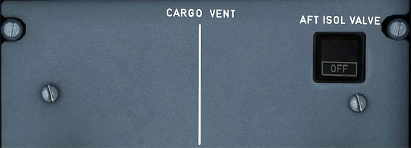

# Cargo Vent Panel

---

[Back to Flight Deck](../index.md){ .md-button }

---

## Description

An extraction fan draws air from forward cargo or aft cargo, and exhausts it overboard. Air from the cabin replaces the exhausted air, thus ventilating the cargo compartments.

## Usage

### AFT ISOL VALVE

The switch controls the aft isolation valves and the extraction fan.

- Auto:
    - Inlet and outlet isolation valves open. The extraction fan runs if there is no smoke detected in the aft cargo bay.
- OFF:
    - Inlet and outlet isolation valves and the trim air valve close. Extraction fan stops.
- FAULT Lt:
    - Amber light and ECAM caution when inlet or outlet valve is not in the selected position.

!!! info ""
    Currently not available or INOP in the FBW A32NX for Microsoft Flight Simulator.

---

[Back to Flight Deck](../index.md){ .md-button }

