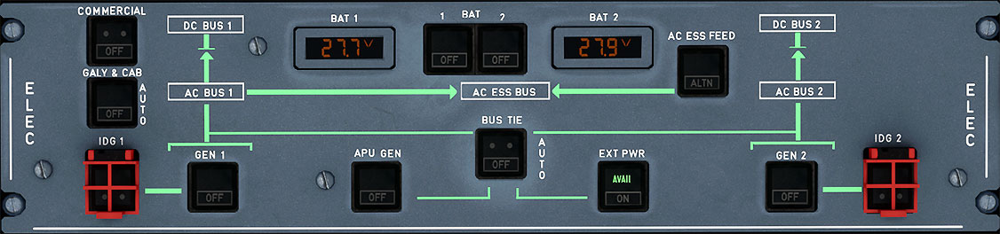

# Electrical System Control Panel

---

[Back to Flight Deck](../index.md){ .md-button }

---

{loading=lazy}

!!! note "API Documentation: [ELEC Panel API](../../../../../aircraft/a32nx/a32nx-api/a32nx-flightdeck-api.md#elec-panel)"

## Description

The A320neo's electrical system is automatic for most normal operations. There is only very little crew interaction or input required.

When the overhead electrical panel has all switches on AUTO (no lights visible) the only required manual input is the "EXT PWR" button to connect ground power to the aircraft.

- GEN 1 and 2 when operating have priority over the APU generator and over external power.
- External power has priority over the APU generator when the EXT PWR pushbutton switch is ON.
- The APU generator or external power can supply the entire network.
- One engine generator can supply the entire network.

## Usage

### BAT 1 + 2

The BAT 1+2 Indicators display the current voltage of the respective battery. Normal values are 25 to 31 volts.

The BAT 1+2 buttons control the operation of the respective battery charge limiter.

- AUTO:
    - The battery charge limiter controls automatically the connection to the DC BAT BUS.
    - The batteries are connected to the DC BAT BUS when:
          - APU is starting (MASTER SW at ON and N < 95 %).
          - Battery voltage is below 26.5 V (battery charge).
          - When AC BUS 1 and 2 are not available (lost) and below 100 knots (EMER GEN not supplying power).
    - If AC BUS 1 and 2 are not powered and emergency generator is not
    providing power:
          - battery 1 powers the AC STAT INV BUS, and the AC ESS BUS (only when speed is > 50 kt).
          - battery 2 powers the DC ESS BUS.
- OFF:
    - The battery charge limiter is off. The battery line contactor is open. White OFF light comes on when DC BAT BUS is supplied. Hot buses remain supplied.
- FAULT:
    - Amber light and ECAM caution, when the charging current for the battery is outside limits. Battery contactor opens in this case.

### EXT PWR

The AVAIL light comes on green if external power is plugged in, and external power parameters are normal.

If the AVAIL light is green, a press will close the power line contactor and the white ON light comes on. External power now powers the aircraft.

If the AVAIL light is ON, then a press will open the power line contactor and the white ON light goes off. The aircraft is no longer powered by external power.

!!! info ""
    1. External power has priority over the APU generator. The engine generators have priority over external power.
    2. The ON light stays on even when the engine generators supply the aircraft.

### GEN 1 + 2

- ON:
    - If electrical parameters are normal, the generator is powered and the line contactor closes.
- OFF:
    - The line contactors open, and the generator is unpowered. The fault circuit is reset.
- FAULT:
    - Amber light and ECAM caution appears, if :
        - The associated generator control unit (GCU) trips it.
        - Opening of the line contactor if GEN button is not OFF.

### APU GEN

- ON:
    - The APU generator is powered if parameters are normal and the EXT PWR line contactor is open, the line contactor closes. The bus tie contactor closes automatically if engine GENs are not operating.
- OFF:
    - The generator is unpowered and the line contactor opens. The fault circuit is reset.
- FAULT:
    - See GEN 1 or 2 FAULT.
    - No APU GEN FAULT light is shown if APU speed is too low or if EXT PWR or ENG GEN provide power.

### BUS TIE

- AUTO:
    - The bus tie contactors (BTCs) open or close automatically to maintain power supply to both AC BUS 1 and AC BUS 2.
        - One contactor is closed if:
            - One engine generator powers the respective AC BUS
            - The APU generator or external power supplies the other side.
        - Both contactors are closed during single-engine operation, or operation on the APU generator or external power supply.
- OFF:
    - Both bus tie contactors open. When set to OFF, the AC buses are isolated from each other and only power from the engine generators supply the respective AC buses.

### AC ESS FEED

The AC ESS BUS (ESS = essential) is normally supplied from AC BUS 1.

It may be supplied by AC BUS 2 through the AC ESS FEED pushbutton switch.

- NORMAL:
    - The AC ESS BUS is supplied from AC BUS 1.

    !!! note ""
        In case of normal AC ESS Feed failure, the AC ESS Bus is automatically fed from AC BUS 2 after 5 seconds, regardless of the pushbutton position.
- ALTN:
    - The AC ESS BUS is supplied from AC BUS 2.
- FAULT:
    - Amber light and ECAM caution, if the AC ESS BUS is not electrically supplied.

!!! info ""
    Note: In case of total loss of main generators, the AC ESS BUS is automatically supplied by the emergency generator if available, or by the static inverter.

### IDG 1 + 2 (guarded)

The IDG switches are normally spring-loaded out. Pressing these switches disconnects the IDGs from their driveshafts.

!!! note ""
    Only maintenance personnel can reconnect it.

- FAULT:
    - Amber light and ECAM caution, if:
        - IDG oil outlet overheats (above 185 °C).
        - IDG oil pressure is low (inhibited at low engine speed: N2 below 14 %). It extinguishes when the IDG is disconnected.

### GALY & CAB

- AUTO:
    - Cabin power is supplied (main galley, secondary galley, in-seat). Power supply is dropped (shed) when only one generator is operating. All galleys are available when the APU GEN or EXT PWR is supplying power.
- OFF:
    - No power supply to the cabin.
- FAULT:
    - Amber light and ECAM if load is more than 100 % of rated output on any generator.

### COMMERCIAL

- ON:
    - All aircraft commercial electrical loads are supplied:
        - cabin and cargo lights
        - water and toilet system
        - drain mast ice protection
        - galley
        - passengers' entertainment
        - semi-automatic cargo loading (if installed)
- OFF:
    - Switches off all aircraft commercial electrical loads.

## ECAM ELEC page

See [ECAM ELEC page](../../ecam/sd/elec.md)

---

[Back to Flight Deck](../index.md){ .md-button }
