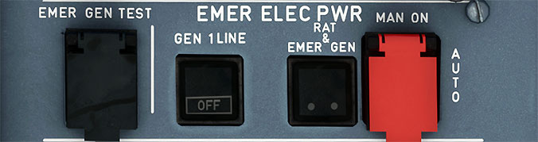

# Emergency Electric Power Panel

---

[Back to Flight Deck](../index.md){ .md-button }

---

## Usage

!!! info ""
    Currently not available or INOP in the FBW A32NX for Microsoft Flight Simulator.

### MAN ON (guarded)

- AUTO: When the following conditions are met:
    - AC BUS 1 is not electrically supplied.
    - AC BUS 2 is not electrically supplied.
    - Aircraft speed exceeds 100 knots.
    - The Ram Air Turbine (RAT) extends.
    - The blue hydraulic system drives the emergency generator.
    - As soon as the emergency generator electrical parameters are within tolerance, the emergency generator is connected to the aircraft network.
- Pressed:
    - This selects manual RAT extension.
    - Emergency generator coupling occurs 3 seconds after the RAT is supplying the emergency generator.

### FAULT LIGHT:

- This light comes on red if the emergency generator is not supplying power when AC BUS 1 and AC BUS 2 are not powered.

### EMER GEN TEST (guarded)

- Pressed and held:
    - if AC NORMAL BUSES are supplied:
        - The EMER GEN is driven hydraulically if the blue electric pump is running.
        - The AC ESS BUS and the DC ESS BUS are connected to the emergency generator. (The DC ESS SHED and AC ESS SHED buses are not powered).
        - ECAM displays the ELEC page automatically (only on the ground).
    - If only the batteries supply the aircraft:
        - The static inverter powers the AC ESS BUS.

### GEN 1 LINE

- OFF:
    - GEN 1 line contactor opens.
    - GEN 1 keeps operating and supplies one fuel pump per wing directly.
    - The AC BUS 1 channel is supplied from GEN 2 through bus tie contactors.
    !!! note ""
        This pushbutton is part of the smoke drill procedure. In order to isolate the cause of electrical smoke, the flight crew manually extends the RAT and enters Electrical Emergency configuration by turning the main generators off. This deactivates all non-essential electrical equipment.
- SMOKE Light
    - Amber light when smoke is detected in the avionics ventilation duct.

---

[Back to Flight Deck](../index.md){ .md-button }
