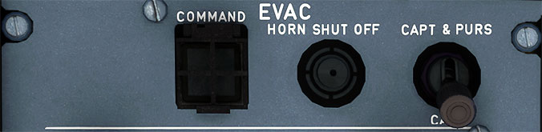

# Evacuation Panel

---

[Back to Flight Deck](../index.md){ .md-button }

---

## Description

The emergency evacuation signal system alerts the flight attendants to evacuate the passenger cabin. An EVAC COMMAND switch is located in the cockpit, and a guarded EVAC CMD (or CMD) button is located at each flight attendant panel.

## Usage

- COMMAND
    - Activates the evacuation alert. The EVAC light flashes red and the evacuation horn sounds in the cockpit and cabin. Pushing the EVAC COMMAND switch a second time cancels the evacuation alert in the cockpit and the cabin.
- HORN SHUT OFF
    - Silences the evacuation horn in the cockpit.
- CAPT & PURS/CAPT
    - CAPT & PURS
        - When the evacuation switch is selected to CAPT & PURS the evacuation alert may be activated from the cabin or cockpit.
    - CAPT
        - When the evacuation switch is selected to CAPT the evacuation alert may be activated only from the cockpit

---

[Back to Flight Deck](../index.md){ .md-button }
