# Exterior Lighting

---

[Back to Flight Deck](../index.md){ .md-button }

---

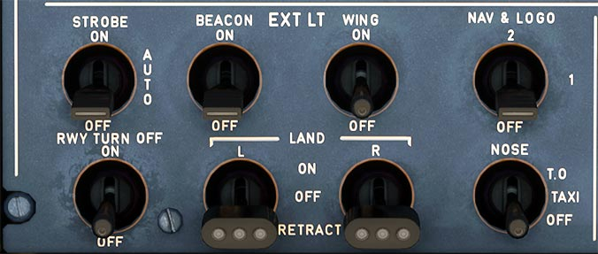

!!! note "API Documentation: [EXT LT Panel API](../../../../../aircraft/a32nx/a32nx-api/a32nx-flightdeck-api.md#external-lights-panel)"

## Description

The Exterior Lighting of an Airbus A320neo includes these lights:

- The navigation lights
- The landing lights
- The runway turn off lights
- The TO and TAXI lights
- The logo lights
- The anti collision lights
- The wing and engine scan lights.

### External lighting configuration:

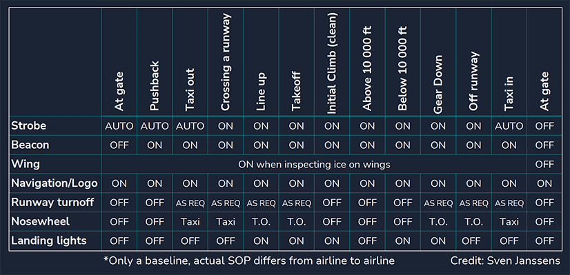{loading=lazy}

## Usage

### STROBE

Turns on and off the three synchronized strobe lights, one on each wing tip and one below the tail cone.

- ON:
    - Strobe lights or on.
- AUTO:
    - Automatically turns on strobe lights when the main gear strut is not compressed.
- OFF:
    - Strobe light are off.

Strobes are turned on at the latest when airborne. Usually shortly before the takeoff roll.

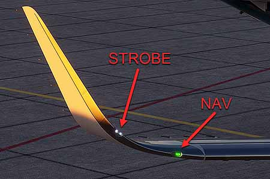{loading=lazy}

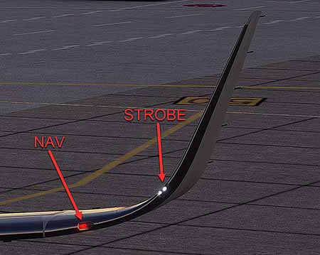{loading=lazy}

### BEACON

This switch turns on and off the two flashing red lights, one on top and one on the bottom of the fuselage.

This signals the ground crew that the engines are about to start or still running.

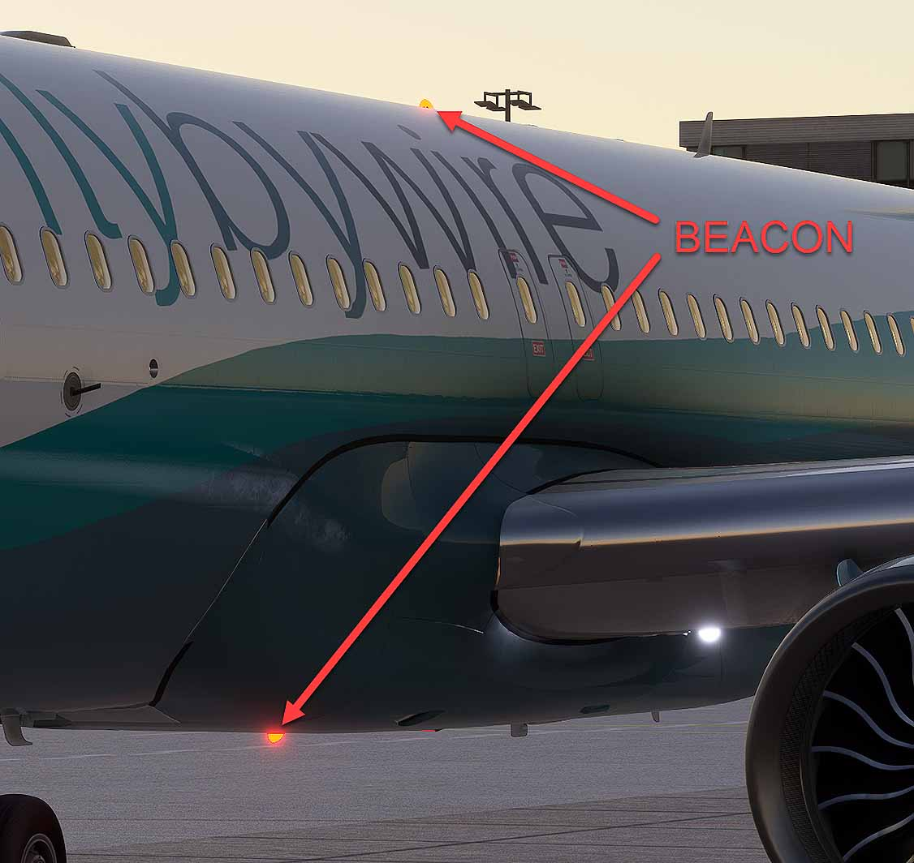{loading=lazy}

### WING

Illuminate the leading edge of the wing and the engine air intake to show if ice is accumulating there.

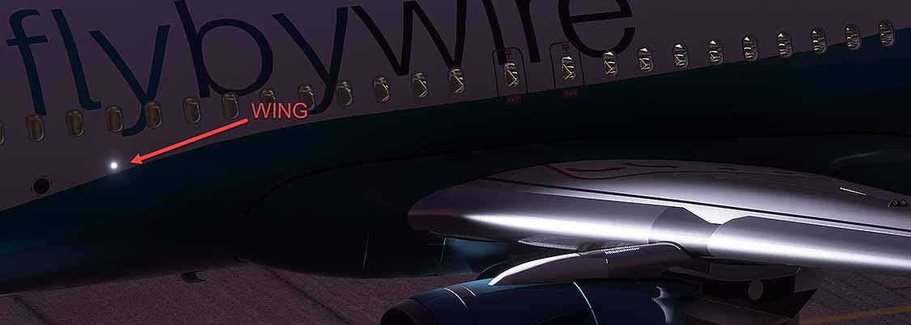{loading=lazy}

### NAV & LOGO

This switch turns the navigation lights on and off.

There are dual navigation lights on each wing tip and in the APU tail cone.

Logo lights are installed in the upper surface of each horizontal stabilizer to illuminate the company logo on the vertical stabilizer, provided the main gear struts are compressed, or the slats are extended.

- 1:
    - Turns on the logo lights and the first set of navigation lights.
- 2:
    - Turns on the logo lights and the second set of navigation lights.
- OFF:
    - All lights are off.

NAV & LOGO are turned on when the aircraft is powered up (EXT PWR or APU or ENG).

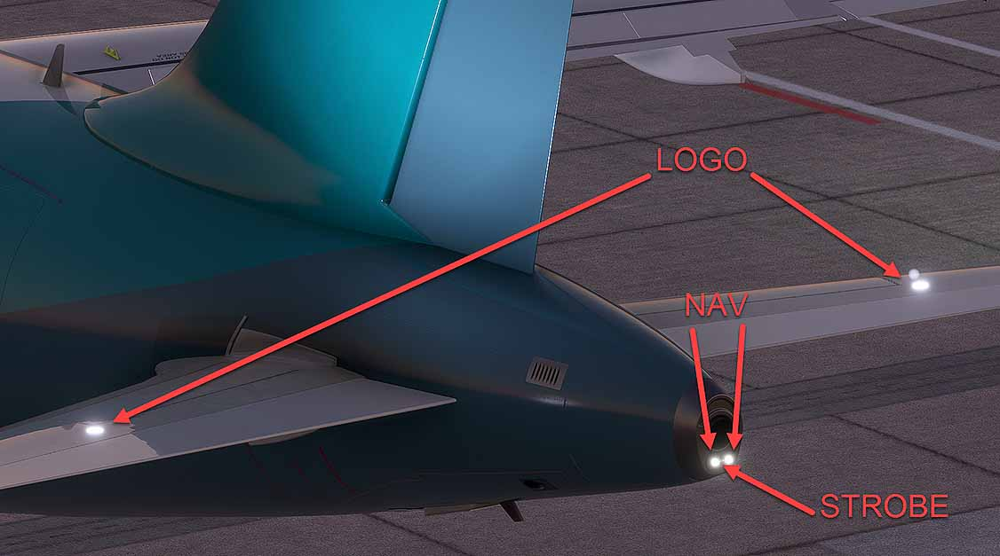{loading=lazy}

!!! info ""
    Currently, the FlyByWire A32NX only has two settings for NAV & LOGO lights (2 or OFF / 1 is not available).

### RWY TURN OFF

This switch turns the runway turn-off lights on and off.

These lights go off automatically when the landing gear is retracted.

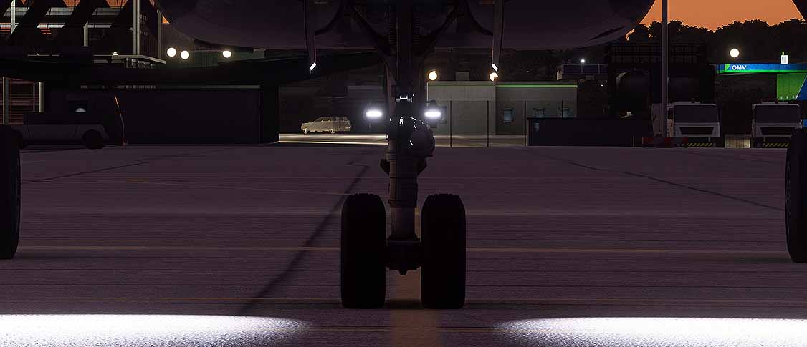{loading=lazy}

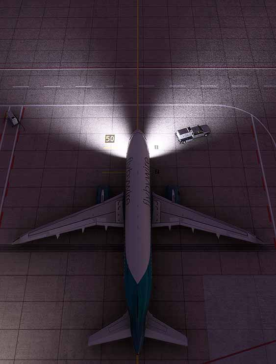{loading=lazy}

### LAND L + R

Landing light switches for left and right under wing landing light.

- ON:
    - Extends and turns on the landing light after the lights have been fully extended.
- OFF:
    - Landing lights shut off but stay extended.
- RETRACT:
    - Landing lights are shut off and retracted.

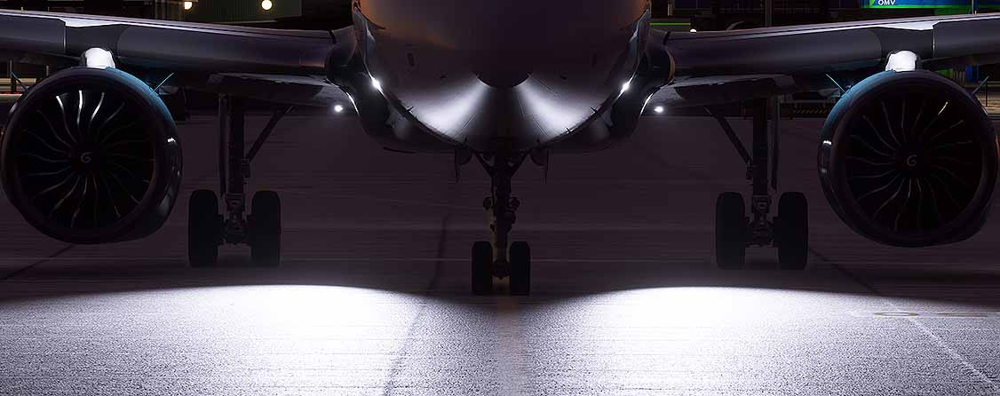{loading=lazy}

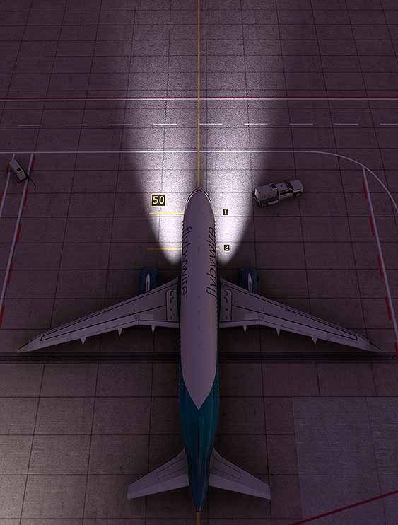{loading=lazy}

### NOSE

Turns the taxi and nose takeoff lights on and off.

- T.O.:
    - Turns on both taxi and takeoff lights.
- TAXI:
    - Turns on only taxi light.
- OFF:
    - Taxi and takeoff lights off.

Note: These two lights, attached to the nose gear strut, go off automatically when the landing gear is retracted.

#### TAXI

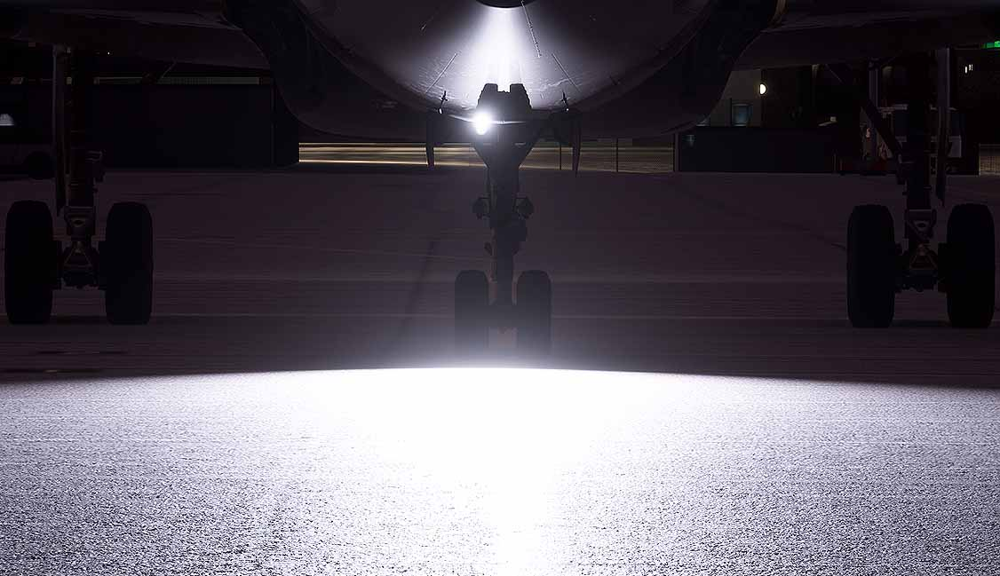{loading=lazy}

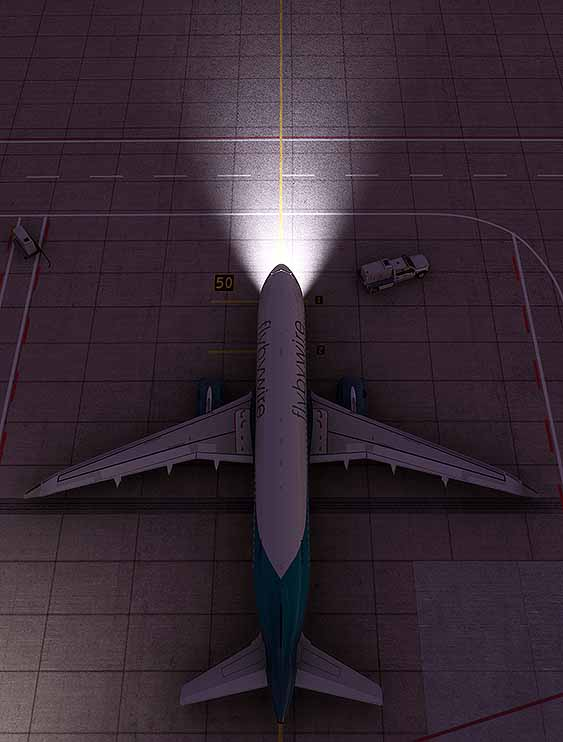{loading=lazy}

#### T.O.

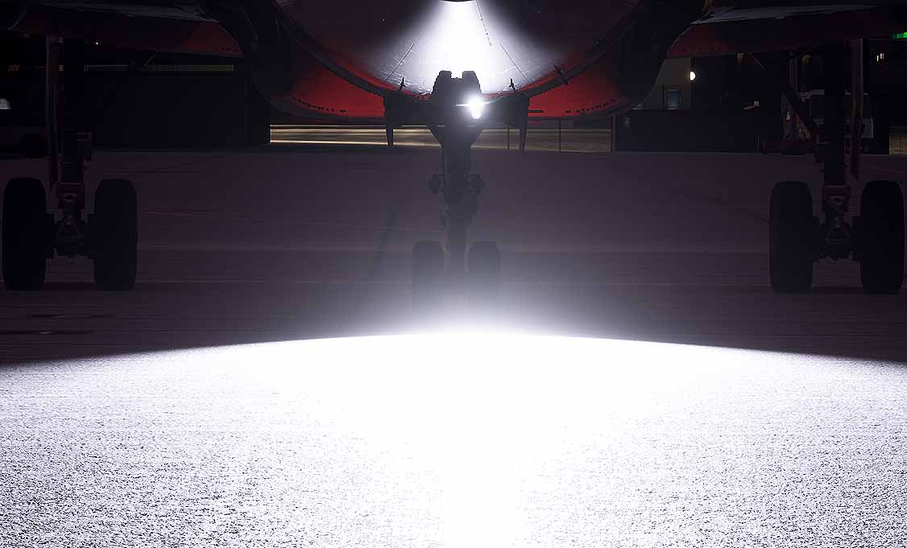{loading=lazy}

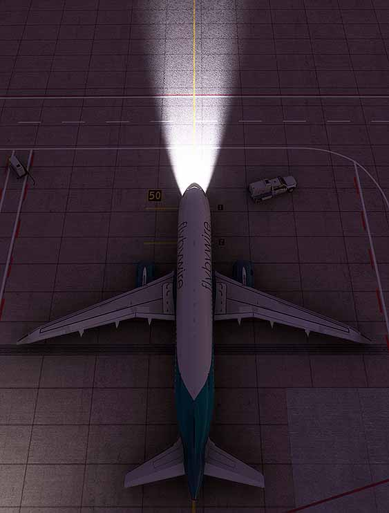{loading=lazy}

---

[Back to Flight Deck](../index.md){ .md-button }

