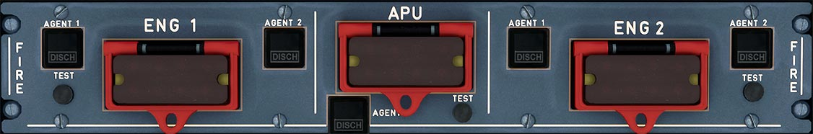

# Fire Control Panel

---

[Back to Flight Deck](../index.md){ .md-button }

---

!!! note "API Documentation: [Fire Panel API](../../../../../aircraft/a32nx/a32nx-api/a32nx-flightdeck-api.md#fire-panel)"

## Description

The A320's fire and smoke detection system consists of:

- fire and overheat detection for both engines and APU.
- smoke detection is installed in the cargo compartment, the lavatories, and the avionics bay.
- fire extinguishing for the engines, the APU and the cargo compartment.

## Usage

### ENG 1 + 2 FIRE

This button's default position is pushed in and guarded.

To release it, the crew pushes it in, and it pops out. This sends a signal to the respective engine to:

- stop aural fire warning.
- arm the fire extinguisher squibs.
- close low-pressure fuel valve, hydraulic fire shut off valve, engine bleed valve, pack flow control valve.
- cut off the FADEC power supply.
- deactivate the IDG.

The button's red light turns on, independent of the pushbutton's position, as soon as the fire warning for the corresponding engine is activated.

### ENG 1 + 2 AGENT 1 + 2

- "SQUIB":
    - This button activates and lights up in white after the crew has pushed the ENG FIRE button. Pushing it will discharge the respective fire bottle.
- "DISCH":
    - lights up amber when its fire extinguisher bottle was used and has lost pressure.

### ENG 1 + 2 TEST

Used to test the operation of the fire detection and extinguishing system.

When presses, there is a continuous repetitive chime sound, the MASTER WARN lights flash and the ENG FIRE warning appears on ECAM.

On the FIRE panel, the ENG FIRE pushbutton lights up red, and the SQUIB lights come on white if discharge supplies are available. The DISCH lights come on amber.

On the ENG panel (pedestal) on the pedestal, the FIRE lights come on red.

### APU FIRE

This button's default position is pushed in and guarded.

To release it, the crew pushes it in, and it pops out. This sends a signal to the APU to:

- shut down the APU.
- stop aural fire warning.
- arm the fire extinguisher squibs.
- close low-pressure fuel valve and turn off APU fuel pump.
- close the APU bleed valve and the x-bleed valve.
- shut off the APU generator.

The button's red light turns on, independent of the pushbutton's position, as soon as the fire warning for the corresponding engine is activated.

### APU AGENT

- "SQUIB":
    - This button activates and lights up in white after the crew has pushed the APU FIRE button. Pushing it will discharge the respective fire bottle.
- "DISCH":
    - lights up amber when its fire extinguisher bottle was used and has lost pressure.

### APU TEST

Used to test the operation of the fire detection and extinguishing system.

When pressed, there is a continuous repetitive chime sound, the MASTER WARN lights flash and the APU FIRE warning appears on ECAM.

On the APU FIRE panel, the APU FIRE pushbutton lights up red, and the SQUIB lights come on white if discharge supplies are available. The DISCH lights come on amber.

---

[Back to Flight Deck](../index.md){ .md-button }
