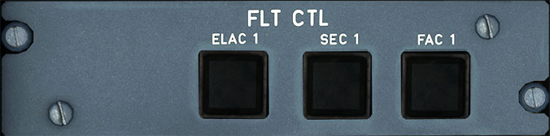
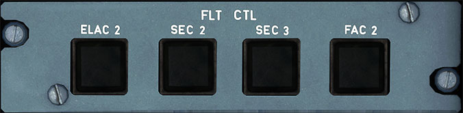

# Flight Control Panels

---

[Back to Flight Deck](../index.md){ .md-button }

---

!!! note "API Documentation: [Flight Control Panel API](../../../../../aircraft/a32nx/a32nx-api/a32nx-flightdeck-api.md#flight-control-panel)"

## Description

- ELAC (Elevator Aileron Computer)
    - Normally, ELAC 1 commands the operation of the ailerons and ELAC 2 commands the operation of the elevators and horizontal stabilizer. ELAC 1 and 2 perform the following:
        - Normal pitch and roll, normal LAF (Load Alleviation Function).
        - Alternate pitch, alternate LAF.
        - Direct pitch and roll.
        - Aileron droop.
        - Abnormal attitude.
        - Acquisition of autopilot orders.
- SEC (Spoiler Elevator Computer)
    - The Spoiler Elevator Computers 1, 2, and 3 command spoiler operation. The SECs control the following.
        - Normal roll by controlling the spoilers.
        - Speed brakes and ground spoilers.
        - Alternate pitch (SEC 1 and SEC 2 only).
        - Direct pitch (SEC 1 and SEC 2 only).
        - Alternate LAF.
        - Abnormal attitude.
        - Direct roll.
- FAC (FlIGHT Augmentation Computer)
    - The Flight Augmentation Computers have three main functions:
        - Rudder trim.
        - Rudder travel limits.
        - Yaw damping inputs.
        - Alternate yaw.
        - Flight envelope and speed computations.
        - Wind shear detection.

## Usage

- ON:
    - When the associated flight control computer switch is ON, it engages the computer and lights are extinguished. This is the normal position.

- OFF:
    - When selected to OFF, the OFF light illuminates white and disengages the associated computer.

- RESET:
    - You can reset a computer by turning the computer OFF then ON.

- FAULT:
    - The associated FAULT Light illuminates amber:
        - When a failure is detected.
        - During computer's power-up test (8-second duration). This test occurs for each flight control computer upon electrical power application or after electrical transient/interruption.
        - The FAULT light extinguishes when OFF is selected or at completion of satisfactory power-up test.

---

[Back to Flight Deck](../index.md){ .md-button }
