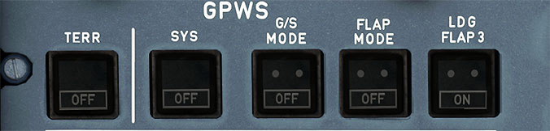

# Ground Proximity Warning Panel

---

[Back to Flight Deck](../index.md){ .md-button }

---

## Description

There are two systems controlled by this panel.

- GPWS - Above 30 feet and below 2450 feet RA, GPWS monitors for hazardous flight path conditions and provides visual and aural warnings, alerts, or advisories when such conditions are encountered. The GPWS does not provide an alert for flight toward vertically sheer terrain or slow descents into terrain while in the landing configuration. False GPWS warnings may occur due to heavy rain, hail, or system malfunctions.
    - Mode 1: Excessive descent rate
    - Mode 2: Excessive terrain closure rate
    - Mode 3: Altitude loss after takeoff or go-around
    - Mode 4: Unsafe terrain clearance when not in the landing configuration
    - Mode 5: Too far below the glideslope

- EGPWS - This uses an onboard world-wide terrain database, FMGC 1 position, and airplane altitude and flight path to display the proximity of surrounding terrain on the ND. The information is provided in a color scheme which references the terrain to airplane altitude. Caution and warning alerts, both aural and visual, are given if the airplane approaches threatening terrain. (This system does not currently account for man-made obstructions.) The terrain alerting functions of the EGPWS are independent of the current GPWS functions. Failure of the additional terrain features does not affect operation of the basic functions of the GPWS.

## Usage

### Terrain:

- Terrain Awareness Display (TAD) and Terrain Clearance Floor (TCF) is inhibited. (This does not affect basic GPWS modes 1 to 5). ECAM caution NAV GPWS TERR DET FAULT is displayed.
- Fault Light: The amber FAULT light illuminates along with an ECAM caution if the TAD or TCF mode fails.

### SYS:

- All basic GPWS alerts are inhibited (Modes 1 through 5).
- Fault Light: An amber FAULT light will illuminate, along with an ECAM caution, in the event of a GPWS mode 1 to 5 malfunctions.

### G/S MODE:

- Glideslope mode (mode 5) is inhibited.

### FLAP MODE:

- Flap mode (mode 4) is inhibited.

### LDG FLAP 3:

- Flap mode (mode 4) is inhibited when in FLAPS CONFIG 3, FLAPS...3 displays on the ECAM under LDG MEMO. (Avoids warnings when landing with flaps 3).

---

[Back to Flight Deck](../index.md){ .md-button }
