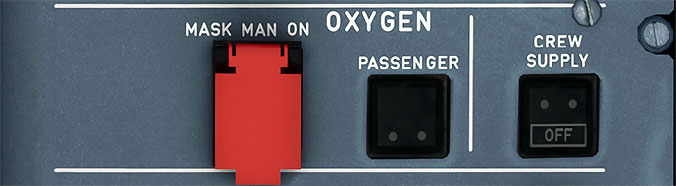

# Oxygen Panel

---

[Back to Flight Deck](../index.md){ .md-button }

---

!!! note "API Documentation: [Oxygen Panel API](../../../../../aircraft/a32nx/a32nx-api/a32nx-flightdeck-api.md#oxygen-panel)"

## Usage

### MASK MAN ON:

- AUTO:
    - This is the normal position for this switch. The cabin oxygen mask doors will open automatically when the cabin altitude exceeds 14 000 feet.
- ON:
    - The cabin oxygen mask doors open regardless of cabin altitude when the Oxygen Mask Manual on switch is selected to on.

### PASSENGER SYS ON:

- This illuminates in white when the oxygen mask doors are actuated. It remains on until the OXYGEN TIMER RESET switch is pushed on the overhead maintenance panel.

### CREW SUPPLY:

- OFF:
    - When the OXYGEN CREW SUPPLY switch is selected OFF, the OFF light illuminates white, and the oxygen supply valve is closed.
- ON:
    - When the OXYGEN CREW SUPPLY switch is selected ON, the OFF light extinguishes, and the cockpit oxygen supply valve is open. Low-pressure oxygen is supplied to the masks.

---

[Back to Flight Deck](../index.md){ .md-button }
