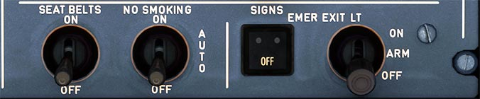

# Signs Panel

---

[Back to Flight Deck](../index.md){ .md-button }

---

!!! note "API Documentation: [Signs Panel API](../../../../../aircraft/a32nx/a32nx-api/a32nx-flightdeck-api.md#signs-panel)"

## Usage

### EMER EXIT LT

- ON:
    - Turn on Overhead Emergency Lights, EXIT signs and proximity marking system (floor light band).
- OFF:
    - Turn off Overhead Emergency Lights, EXIT signs and proximity marking (floor light band) system.
- ARM:
    - Emergency lighting and proximity marking turn on, when normal aircraft electrical power system fails or DC SHED ESS BUS fails or AC BUS 1 fails.
    - Exit signs turn on when normal aircraft electrical power system fails or DC SHED ESS BUS fails.

### EMER EXIT LT

- OFF Lt:
    - Amber light when the EMER EXIT LT selector is selected OFF.

###  SEAT BELTS

- ON:
    - Turn on FASTEN SEAT BELT and RETURN TO SEAT signs. A low tone chime is played in the passenger compartment.
- OFF:
    - Turn signs off and chime sounds.

!!! note ""
    Chime is barely audible in the cockpit with the cockpit door closed.

### NO SMOKING

- ON:
    - NO SMOKING and EXIT signs come on together with a low tone chime.
- AUTO:
    - NO SMOKING and EXIT signs come on when landing gear is extended and go off when landing gear is retracted. Low tone chime sounds when the lights go on or off.
- OFF:

!!! note ""
    Chime is barely audible in the cockpit with the cockpit door closed.

---

[Back to Flight Deck](../index.md){ .md-button }
