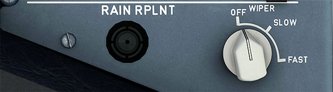

# Wiper Panels

---

[Back to Flight Deck](../index.md){ .md-button }

---

!!! note "API Documentation: [Wiper Panel](../../../../../aircraft/a32nx/a32nx-api/a32nx-flightdeck-api.md#wiper-panel)"

## DESCRIPTION

Each windshield is provided with two-speed electric wipers that are controlled by individual WIPER selectors. A rain repellent system is installed, but is deactivated by some airlines.

## Usage

### WIPER SELECTOR:

- OFF:
    - Wiper is stowed out of view at the base of the window.
- SLOW:
    - Wiper operates at low speed.
- FAST:
    - Wiper operates at high speed.

### RAIN RPLNT

- When the button is pushed, the timer applies a measured quantity of rain repellent to the applicable windshield. To repeat the cycle, the push button must be pushed again.
- This function is inhibited when the aircraft is on the ground and the engines are not running.

!!! info ""
    Currently not available or INOP in the FBW A32NX for Microsoft Flight Simulator.

---

[Back to Flight Deck](../index.md){ .md-button }
