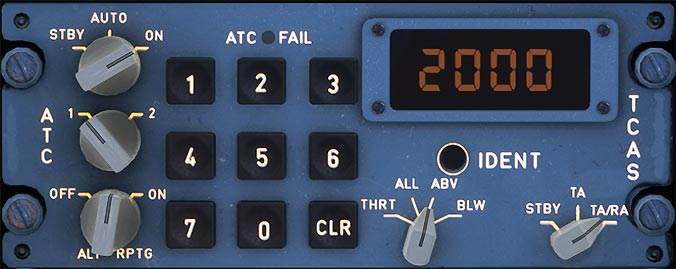

# ATC TCAS Panel

---

[Back to Flight Deck](../index.md){ .md-button }

---

!!! note "API Documentation: [ATC TCAS Panel](../../../../../aircraft/a32nx/a32nx-api/a32nx-flightdeck-api.md#atc-tcas)"

## Description

The aircraft has two ATC transponders (XPDR) which are controlled by a control panel (ATC/TCAS) on the center pedestal.

Only the selected XPDR operates.

The XPDR automatically responds to requests:

- From the ATC, to ensure effective air traffic surveillance.
- From other aircraft that have a TCAS, to ensure that traffic alerts are triggered.

The XPDR is capable of elementary surveillance (ELS) and enhanced surveillance (EHS). It transmits the following data to the ATC center:

- Supplied by the ADRs:
    - The aircraft 24 bit address
    - The aircraft altitude
    - The flight number
    - The RA report
    - The indicated airspeed
    - The Mach number
    - The barometric vertical speed
- Supplied by the IRs:
    - The magnetic heading
    - The roll angle
    - The ground speed
    - The track angle
    - The track angle rate
    - The inertial vertical speed
- The selected altitude and barometric reference settings supplied by the FCUs.

## Usage

###  Mode Selector

- STBY:
    - Both XPDR are electrically supplied but do not operate.
- ON:
    - Selected XPDR operates.
- AUTO:
    - In flight : Selected XPDR operates.
    - On ground : Selected XPDR only operates in mode S (Selective aircraft interrogation mode).

### XPDR Selector

This switch selects XPDR 1 or 2.

!!! info ""
    Currently, only 1 is available in the FBW A32NX for Microsoft Flight Simulator.

### ALT RPTG Switch

- ON:
    - The XPDR sends barometric standard altitude data.
- OFF:
    - No altitude data transmission. If the TCAS is installed, the upper ECAM displays "TCAS STBY" in green.

### IDNT Switch

- The flight crew presses this button to send the aircraft identification signal.

### Code Display

- The window displays the selected code.

### Keypad

- The flight crew uses the keypad to set the code assigned by ATC.

### CLR Key

- The flight crew uses this key to clear the code display.
- Note: As long as the four figures of the new code are not entirely written, the previous code remains.

### ATC FAIL Light

- This light comes on if the selected XPDR fails.

### TCAS Mode

TCAS knows the following threat categories:

- Other intruders - white outlined diamond
- Proximate intruders - white diamond
- Traffic Advisory (TA) - amber circle
- Resolution Advisory (RA) - red square

TCAS mode selector:

- TA/RA:
    - If the ALT RPTG switch is ON and the transponder is not on STBY RAs, TAs and proximate intruders are displayed. Default position.
- TA:
    - TCAS only provides Traffic Advisory. Used in case of degraded aircraft performance (engine failure, landing gear extended, or approach on parallel runways).
    - All RAs are converted into TAs. TAs, proximate and intruders are displayed if the ALT RPTG switch is ON and the transponder is not on STBY.
    - "TA ONLY" memo is displayed on the NDs.
- STBY:
    - TCAS is on standby.

### TCAS TRAFFIC

- THRT:
    - Proximate and other intruders are displayed only if a TA or RA is present, and they are within 2700 ft above and 2700 ft below the aircraft.
- ALL:
    - Proximate and other intruders are displayed even if no TA or RA is present (full time function).
    - The altitude range is – 2700 ft to + 2700 ft.
- ABV:
    - Same as ALL, except that the other intruders are displayed if within 9900 ft above and 2700 ft below the aircraft.
- BLW:
    - Same as ALL, except that the other intruders are displayed if within 9900 ft below and 2700 ft above the aircraft.

---

[Back to Flight Deck](../index.md){ .md-button }
