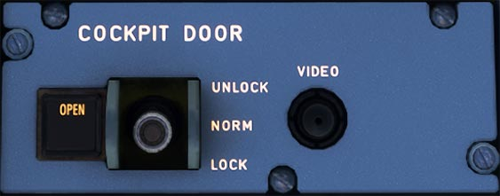

# Cockpit Door Panel

---

[Back to Flight Deck](../index.md){ .md-button }

---

!!! note "API Documentation: [Cockpit Door Panel](../../../../../aircraft/a32nx/a32nx-api/a32nx-flightdeck-api.md#cockpit-door)"

## Description

A forward-opening, bulletproof and decompression safe door to the cockpit protects the cockpit from unwanted intruders.

In normal circumstance, this door is always closed and the cockpit crew controls access.

## Usage

### COCKPIT DOOR toggle switch

- UNLOCK position:
    - Used to enable the cabin crew to open the door. In the real aircraft, this switch must be pulled and maintained in the unlock position until the door is pushed open.

    !!! note ""
        In the FlyByWire A32NX, it is sufficient to pull back the switch once to unlock the door. You hear the door unlock.

- NORM position:
    - All latches are locked.

- LOCK position:
    - Once the button has been moved to this position, the door is locked.

    !!! note ""
        In the FlyByWire A32NX, it is sufficient to push the switch forward once to lock the door. You hear the door lock.

### COCKPIT DOOR Fault Open indicator

- OPEN light ON:
    - The door locks are open.
- OPEN light flashes:
    - Cabin crew has started an emergency access procedure. If there is no reaction from the flight crew, the door will unlock at the end of the adjustable time delay.
- FAULT:
    - This light comes on when a system failure has been identified.

---

[Back to Flight Deck](../index.md){ .md-button }
