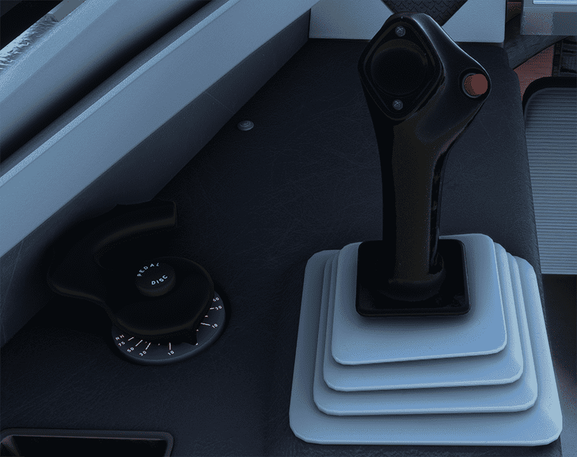

# Flightstick and Tiller

---

[Back to Flight Deck](../index.md){ .md-button }

---

!!! note "API Documentation: [Sidestick](../../../../../aircraft/a32nx/a32nx-api/a32nx-flightdeck-api.md#side-stick)"

## Sidesticks

The sidesticks are the pilots' primary control for manual flight. 

They are spring-loaded and automatically return to the neutral position. They do not receive any feedback from the control surfaces, as Airbus uses the fly-by-wire system without force feedback.

When the autopilot is engaged, the sidsticks are locked in neutral position. 

If the pilot applies a force above a given threshold:

- The sidesticks unlock
- The autopilot disengages
- The AUTO FLT AP OFF alert triggers

Each sidestick has two controls:

- The Radio Push To Talk switch
- The sidestick pb, for autopilot disengagement, or sidestick priority

At all times, only one flight crew member should fly the aircraft. However, if both flight crew members use their sidesticks simultaneously, their orders are algebraically added. The flight control laws limit the combined order to the equivalent of the full deflection of one sidestick. In this case, the two green SIDE STICK PRIORITY lights on the glareshield come on and "DUAL INPUT" voice message is activated.

A flight crew member can deactivate the other sidestick and take full control, by pressing and keeping pressing the sidestick pb. To deactivate the other sidestick, the flight crew member must press their sidestick pb for 40s. The other sidestick is permanently deactivated, until any flight crew member presses their sidestick pb. If both flight crew members press their sidestick pb, the last pilot to press gets the priority. If one sidestick was deactivated on ground, the CONFIG L(R) SIDESTICK FAULT alert is triggered at takeoff power application, or during the TO CONFIG test.

!!! info ""
    Sidestick priority is currently not available or INOP in the FBW A32NX for Microsoft Flight Simulator.

## Steering Handwheels (Tiller)

The steering handwheels, also called tillers, which are interconnected, can steer the nose wheel up to 75° in either direction. 

After takeoff, the steering system centers the nose wheel automatically.

The center button on either handwheel removes control of nose wheel steering from the rudder pedals until the button is released.

See [Nose Wheel and Tiller Operation](../../../../../aircraft/a32nx/feature-guides/nw-tiller.md)

---

[Back to Flight Deck](../index.md){ .md-button }
