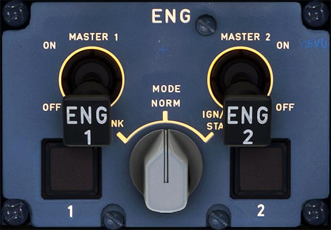

# Engine Panel

---

[Back to Flight Deck](../index.md){ .md-button }

---

!!! note "API Documentation: [Engine Panel](../../../../../aircraft/a32nx/a32nx-api/a32nx-flightdeck-api.md#eng-panel)"

## Description

The Engine Panel is used to control and start the engines.
It contains Master Switches for each engine and also an Ignition Mode Switch for starting or cranking the engine.

## Controls

### ENG MODE selector

- NORM:
    - Normal operation mode.
- IGN START:
    - Starts the automatic or manual start sequences when on ground.
    - When in flight, it initiates continues ignition as required.
- CRANK:
    - The start valve opens, if the [ENG MAN START](../ovhd/eng-man.md) pushbutton switch is ON. Ignition does not fire.

    !!! info ""
        Currently not available or INOP in the FBW A32NX for Microsoft Flight Simulator.

### ENG MASTER 1 + 2

- ON:
    - Depending on the [ENG MAN START](../ovhd/eng-man.md), this tells the FADEC to start the automatic or manual start sequences.

    !!! info ""
        Manual start is currently not available in the FBW A32NX for Microsoft Flight Simulator.
- OFF:
    - Shuts down the engine or aborts the start sequence of this engine.

### FIRE and FAULT Light:

- The fire light comes on when a fire is detected in the engine.
- The fault light comes on when either the HP fuel shutoff valve is in an abnormal position or the automatic start sequence is aborted, or there is a malfunction in the thrust control.

---

[Back to Flight Deck](../index.md){ .md-button }

