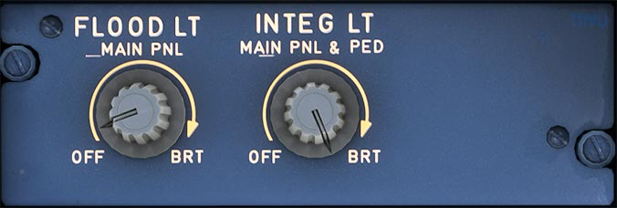

# Lighting Pedestal Captain Side

---

[Back to Flight Deck](../index.md){ .md-button }

---

!!! note "API Documentation: [Lighting Pedestal Cpt. Side Panel API](../../../../../aircraft/a32nx/a32nx-api/a32nx-flightdeck-api.md#lighting-pedestal-captain-side-panel)"

## Usage

### FLOOD LT MAIN PNL knob

- Brightness of the floodlighting for the center instrument panel.

### INTEG LT MAIN PNL and PED knob

- Brightness of integral lighting for the main panel and pedestal.

---

[Back to Flight Deck](../index.md){ .md-button }
