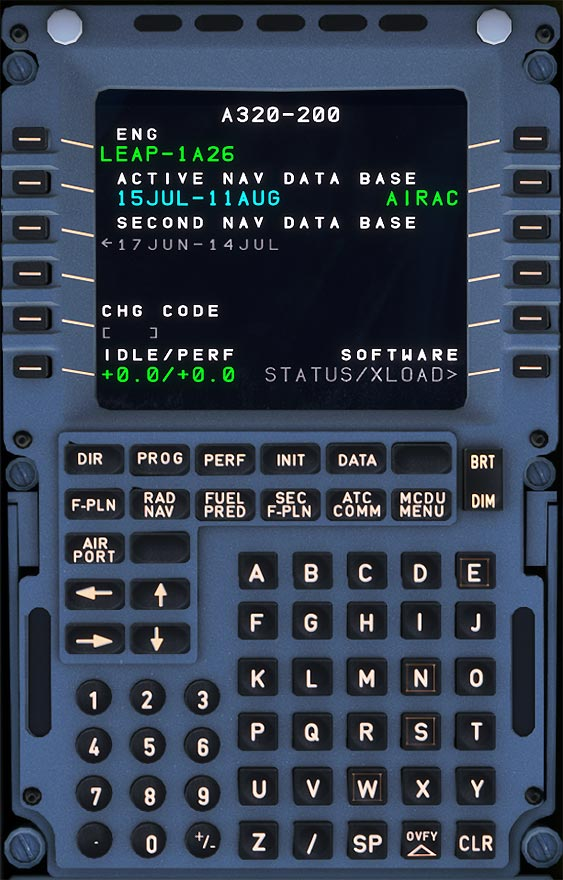

# Multipurpose Control and Display Unit

---

[Back to Flight Deck](../index.md){ .md-button }

---

!!! note "API Documentation: [MCDU Panel API](../../../../../aircraft/a32nx/a32nx-api/a32nx-flightdeck-api.md#mcdu)"

## Description

The MCDU is the main interface for the flight crew to the FMGC (Flight Management Guidance Computer). There are two MCDUs installed in the A320.

Typical usage is the definition and selection of a flight plan for lateral and vertical navigation during various flight phases.

After entry or selection of the flight plan and other required performance data into the MCDU, the FMGS generates the climb and descent profiles for departure and arrival, provides automatic airplane guidance, and computes current and predicted progress along the flight plan.

## Additional Guides and Information

Learn how to set up the MCDU for flight here: [Preparing MCDU](../../../a32nx-beginner-guide/preparing-mcdu.md)

See our in-depth MCDU documentation here: [MCDU Documentation](../../mcdu/index.md)

---

[Back to Flight Deck](../index.md){ .md-button }
