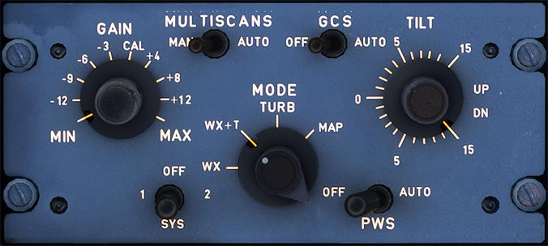

# WX Radar Panel

---

[Back to Flight Deck](../index.md){ .md-button }

---

!!! note "API Documentation: [Radar Panel](../../../../../aircraft/a32nx/a32nx-api/a32nx-flightdeck-api.md#wx-radar)"

## Description

The A320 is fitted with a weather radar system which includes a Predictive Windshear System (PWS) and a weather hazard prediction function.

The weather radar data can be displayed on the NDs in ARC or ROSE mode.

!!! info ""
    In Microsoft Flight Simulator, the system is limited by what the simulator provides, which currently is only precipitation.

## Usage

### Radar

- ON:
    - Set the switch to position 1 or 2 to turn on system 1 or 2.
- OFF:
    - Set the switch to position OFF (middle) to turn off the system.

### GAIN

- This knob adjusts the sensitivity of the radar.

!!! info ""
    Currently not available or INOP in the FBW A32NX for Microsoft Flight Simulator.

### MODE - Display mode selector

- WX:
    - Weather mode: Intensity of precipitation (black for the lowest intensity, green, amber, and red indicate progressively higher intensity).
- WX+T:
    - Weather and Turbulence mode: WX plus turbulence areas are displayed in magenta.
- TURB:
    - Turbulence mode: Only turbulence areas.
- WX+T+HZD:
    - Weather, Turbulence, and Hazard mode (recommended position): WX+T and hazard prediction risk areas
- MAP:
    - Map mode: No weather display but ground information: Black for water, green for ground, and amber for cities and mountains.

!!! info ""
    Weather is currently not available or INOP in the FBW A32NX for Microsoft Flight Simulator. We are awaiting Asobo API implementation. See [Custom FMS Special Notes](../../../../../aircraft/a32nx/feature-guides/cFMS.md#special-notes)

###  TILT

This allows tilting the radar antenna when MULTISCAN is MAN. Zero uses the horizon reference from the IRS.

!!! info ""
    Currently not available or INOP in the FBW A32NX for Microsoft Flight Simulator.

### MULTISCAN

- AUTO:
    - Controls radar antenna tilt, automatically combining two scans from different angles to optimize weather detection and minimize ground clutter.
- MAN:
    - Manually adjust radar antenna tilt using the TILT knob.

!!! info ""
    Currently not available or INOP in the FBW A32NX for Microsoft Flight Simulator.

### GCS (Ground Clutter Suppression)

- AUTO:
    - Normal radar use if MULTISCAN is on AUTO. Ground Clutter is not displayed.
    - GCS has no utility if MUTLISCAN is on MAN. Ground clutter is visible.
- OFF:
    - Ground clutter is visible.

!!! info ""
    Currently not available or INOP in the FBW A32NX for Microsoft Flight Simulator.

### PWS

- AUTO:
    - Predictive WindShear is on when conditions are met.
- OFF:
    - The Predictive WindShear function is off.

!!! info ""
    Currently, not available or INOP in the FBW A32NX for Microsoft Flight Simulator.

---

[Back to Flight Deck](../index.md){ .md-button }

