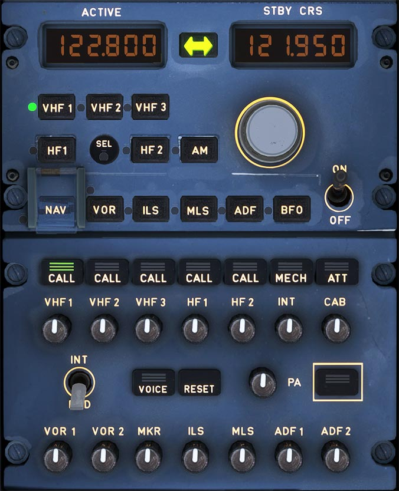
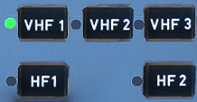
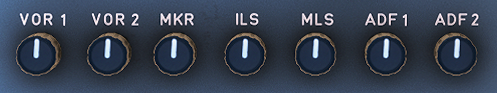

# Radio Management and Audio Control Panel

---

[Back to Flight Deck](../index.md){ .md-button }

---

!!! note "API Documentation: [RMP Panel](../../../../../aircraft/a32nx/a32nx-api/a32nx-flightdeck-api.md#rmp)"

## Description

Communication in the A320 is done via these subsystems:

- VHF/HF transceivers.
- Radio tuning systems (Radio Management Panels - RMP).
- Audio integrating system (Audio Management Unit - AMU, Audio Control Panels - ACP).

To tune the transceivers, any of the Radio Management Panels (RMPs) can be used.

The interface to the RMPs is the Audio Control Panel (ACP) where the pilot selects the VHF or HF system to transmit.

Identical RMPs (Radio Management Panels):

- Control of all VHF radio communication systems.
- FMGC's backup for controlling radio navigation systems.
- Three RMPs - two on the pedestal and one on the overhead panel.
- Each VHF transceiver can be tuned by any RMP. RMP1 and RMP2 are tuning the transceivers directly. RMP3 is connecting via RMP1 or 2.
- Each RMP is updated when a change or selection in the other RMPs is done.
- In EMER ELEC CONFIG, only RMP1 functions.

## Usage

### Frequency displays

- ACTIVE display: The active frequency of the currently selected radio. The currently selected radio is identified by a green light on the selection key.
- STBY/CRS (standby/course) display: Standby frequency, which can be changed by the frequency change knobs and transferred to the active window by pressing the Transfer Key.

###  Transfer key

- Tunes the selected receiver to the new active frequency and exchanges the displayed frequency between ACTIVE and STBY windows.

### Radio com selection keys

- Pressing one of these keys :
    - The ACTIVE window shows the frequency set on that radio.
    - The STBY/CRS window shows the selected standby frequency or course.
    - The selected key shows a green monitor light.

### Frequency selector knobs

Turning these knobs selects the STBY frequency or CRS.

### AM

Used to select AM mode if the aircraft has a VH transceiver.

!!! info ""
    Currently not available or INOP in the FBW A32NX for Microsoft Flight Simulator.

### SEL indicator

The SEL indicator glows white on both RMPs when a transceiver normally associated with one RMP is tuned by another:

- VHF1 tuned by RMP2 or RMP3,
- VHF2 tuned by RMP1 or RMP3.
- VHF3, HF1, HF2 (/41) tuned by RMP1 or RMP2.

### NAV (with transparent switch guard)

This is used as a backup to select navigation aids and coursed via the RMP.

### Radio navigation selection keys

Selects a navigation radio to control through this RMP. The green monitor light in the key illuminates.

### ON/OFF

Power supply to the RMP.

!!! info ""
    Note: RMP3 is able to control VHF and HF transceivers through RMP1 and RMP2 even when they are OFF.

### Tansmission Keys

!!! info ""
    Currently only the VHF1-3 channels are available in the FBW A32NX for Microsoft Flight Simulator.

- Pressed:
    - Channel selected for transmission.
    - Green lines come on.
    - Deselecting by pressing the pushbutton again, through selecting another channel.
- CALL:
    -  When the [SELCAL](https://skybrary.aero/articles/selective-calling-system-selcal){target=new} system detects a call, the legend flashes amber (and buzzer sounds).
- MECH:
    - When called from the nose gear bay, the legend flashes amber (and buzzer sounds). If it is not reset, the MECH light goes off after 60 seconds.
- ATT:
    - When called by a cabin attendant, the legend flashes amber (and buzzer sounds). If it is not reset, the ATT light goes off after 60 seconds.

### Reception Knobs

!!! info ""
    Currently, only the VHF2-3 channels are available for selection in the FBW A32NX for Microsoft Flight Simulator. VHF1 is always selected, although not lit.

These knobs are used to allow the flight crew to activate a channel for reception and to adjust volume.

- Pushing the knob to "knob out" selects the channel for reception. The integral white light comes on. Rotating the knob adjusts the volume.
- Pushing the knob (knob stays in) deselects the channel for reception.

### RESET

Extinguishes CALL, MECH, and ATT lights.

!!! info ""
    Currently not available or INOP in the FBW A32NX for Microsoft Flight Simulator.

### VOICE

Inhibit the audio navigation signals (VOR, ADF) and filters out ident signals and turns on the green ON light.

!!! info ""
    Currently not available or INOP in the FBW A32NX for Microsoft Flight Simulator.

### INT/RAD

Press-to-talk switch for boom mike or oxygen mask mike.

!!! info ""
    Currently not available or INOP in the FBW A32NX for Microsoft Flight Simulator.

### PA (Passenger Address)

Passenger Address is used by the flight personnel to make passenger announcements through loudspeakers in the cabin.

!!! info ""
    Currently not available or INOP in the FBW A32NX for Microsoft Flight Simulator.

#### PA transmission key

Pressed and held: To make an announcement, a boom, mask, or hand mike is used

!!! info ""
    Currently not available or INOP in the FBW A32NX for Microsoft Flight Simulator.

#### PA reception knob

- Pressed and released (knob out):
    - The message goes to the loudspeakers and the integral white light comes on. The flight crew can rotate the knob to adjust the volume.
- Pressed (knob in):
    - The PA system is disconnected. The white light goes out.

!!! info ""
    Currently not available or INOP in the FBW A32NX for Microsoft Flight Simulator.

---

[Back to Flight Deck](../index.md){ .md-button }
