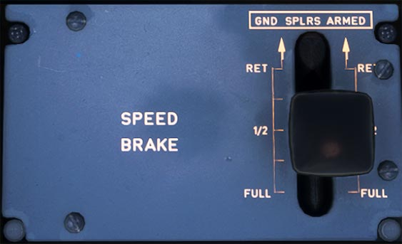

# Speed Brake

---

[Back to Flight Deck](../index.md){ .md-button }

---

!!! note "API Documentation: [Speed Brake Panel](../../../../../aircraft/a32nx/a32nx-api/a32nx-flightdeck-api.md#speed-brake)"

## Usage

### SPEED BRAKE

- The speed brake surfaces can be controlled with the SPEED BRAKE lever.
- To set speedbrake surfaces to a required position, the lever has to be pushed down and set to the required position.
- A detent is provided at "½" SPEED BRAKE position.
- The ground spoilers can be armed via the SPEED BRAKE lever. The lever must be pulled up when in the RET position to achieve this.
- When the lever is armed (or reverse thrust is selected), all spoiler's surfaces will automatically extend at landing, or in case of a rejected takeoff.

---

[Back to Flight Deck](../index.md){ .md-button }

