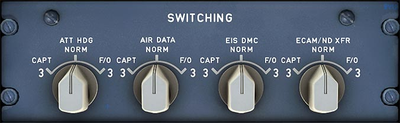

# Switching Panel

---

[Back to Flight Deck](../index.md){ .md-button }

---

!!! note "API Documentation: [Switching Panel](../../../../../aircraft/a32nx/a32nx-api/a32nx-flightdeck-api.md#switching-panel)"

## Description

To have maximal redundancy, A320 pilots can switch backup computers or data sources to be used for either the Captain's or First Officer's displays.

## Usage

### ATT HDG Selector

- NORM:
    - IR 1 supplies data to PFD 1 ND 1, and Digital Distance and Radio Magnetic Indicator (DDRMI)/VOR DME.
    - IR 2 supplies data to PFD 2 and ND 2.
- CAPT 3:
    - IR 3 replaces IR 1 and supplies data to PFD 1, ND 1, and DDRMI/VOR DME.
- F/O 3:
    - IR 3 replaces IR 2 and supplies data to PFD 2 and ND 2.

### AIR DATA Selector

- NORM:
    - ADR 1 supplies data to PFD 1 and ND 1.
    - ADR 2 supplies data to PFD 2 and ND 2.
- CAPT 3:
    - ADR 3 replaces ADR 1 and supplies data to PFD 1, and ND 1.
- F/O 3:
    - ADR 3 replaces ADR 2 and supplies data to PFD 2 and ND 2.

### EIS DMC Selector

- NORM:
    - DMC 1 supplies data to PFD 1, ND 1, and the upper ECAM DU.
    - DMC 2 supplies data to PFD 2, ND 2, and the lower ECAM DU.
- CAPT 3:
    - DMC 3 replaces DMC 1.
- F/O 3:
    - DMC 3 replaces DMC 2.

!!! info ""
    Note: If a DMC fails, each of its associated DUs displays an “INVALID DATA” message.

!!! info ""
    Currently not available or INOP in the FBW A32NX for Microsoft Flight Simulator.

### ECAM/ND XFR Selector

- NORM:
    - The System Display (SD) appears on lower ECAM.
- CAPT:
    - Transfers the System Display to Captain's ND.
- F/O:
    - Transfers the System Display to First Officer's ND.

!!! info ""
    Currently not available or INOP in the FBW A32NX for Microsoft Flight Simulator.

---

[Back to Flight Deck](../index.md){ .md-button }
