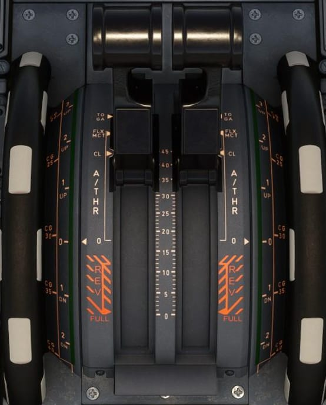
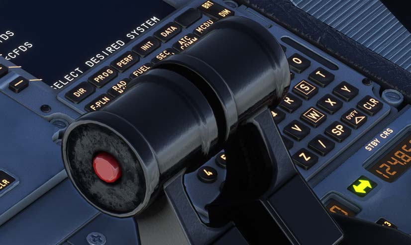

# Thrust Lever and Pitch Trim

---

[Back to Flight Deck](../index.md){ .md-button }

---

!!! note "API Documentation: [Thrust Lever Panel](../../../../../aircraft/a32nx/a32nx-api/a32nx-flightdeck-api.md#thrust-lever-and-trim-wheel)"

## Description

The A320 has so called FADECs which stands for Full Authority Digital Engine Control and is responsible to ensure the engine to perform at maximum efficiency for the given condition.

As one FADEC dedicated to each engine controls the engines' operation, the pilots or the FMGS can set the thrust. The pilot uses the thrust levers when in manual mode and the FMGS sets the thrust in automatic mode (A/THR aka Autothrust).

The thrust levers in the A320 can only be moved manually and are not moved by an autothrottle system as it does in Boeing aircraft.

The FADEC controls and limits thrust not to exceed the limit set via the thrust lever position in both manual and automatic modes.

The FADEC receives the current thrust lever position and computes the thrust rating limit and the N1 for that Thrust Lever Angle (TLA).

If the thrust lever is between two detents, the FADEC will select the rating limit of the higher detent.

### Manual Thrust Control

When the auto-thrust (A/THR) mode is not armed or not active (levers in wrong position) the engines are in manual mode.

The thrust lever position controls thrust for the corresponding engine in this case.

By moving the thrust lever, the pilot can set the thrust level, which corresponds to a N1 between the IDLE and TOGA positions.

FLX/MCT detent:

- On the ground, the engine will produce the Maximum Continuous Thrust (MCT) if the crew did not set a valid FLEX take off temperature. It needs to be higher than the current Total Air Temperature (TAT) to have any effect.

- After takeoff with FLEX thrust, the pilot can, by moving the thrust lever to TOGA or CL, chose MCT thrust. It is not possible to go back to FLEX thrust.

    !!! info ""
        Note: Setting the thrust lever out of FLX/MCT detent without reaching TOGA or CL detent has no effect.

MAX TO thrust can always be achieved by pushing the thrust lever all the way forward.

### Automatic Thrust Control

In autothrust mode (A/THR function active), the FMGC computes the thrust. Thrust is limited by the thrust lever position (except when in alpha-floor mode).

#### A/THR Instinctive Disconnect Push Button

Each thrust lever has a so-called "A/THR Instinctive Disconnect" push button in red. Pressing it disconnects the A/THR.

!!! warning "If the flight crew pushes and holds one instinctive disconnect pb for more than 15 s, the A/THR system is disconnected for the remainder of the flight. All A/THR functions including ALPHA FLOOR are lost, and they can be recovered only at the next FMGC power-up (on ground)."

### PITCH TRIM wheel

The A320 has a feature called "Autotrim", which makes it unnecessary to hold the sidestick or use the trim wheel for holding the current pitch.

The "Autotrim" is using a load-factor demand mode which means in level flight the system maintains 1g and no input is needed from the pilots to correct for speed, turns or configuration.

This system is always active, even when the Autopilot is off (in Normal Law, which means under normal circumstances with a fully functional aircraft).

Nevertheless, the pitch trim wheels in the cockpit provide mechanical control of the Trimmable Horizontal Stabilizer (THS) and have priority over electrical control. The Autopilot is disconnected when a pilot uses the trim wheel during flight.

See our [Preparing MCDU: PERF](../../../a32nx-beginner-guide/preparing-mcdu.md#perf) guide for additional info about trimming.

!!! info ""
    Note: Pilot's use of the pitch trim wheel does not disconnect the ELACs to make sure that the computers remain synchronized with the manually selected position.

---

[Back to Flight Deck](../index.md){ .md-button }
