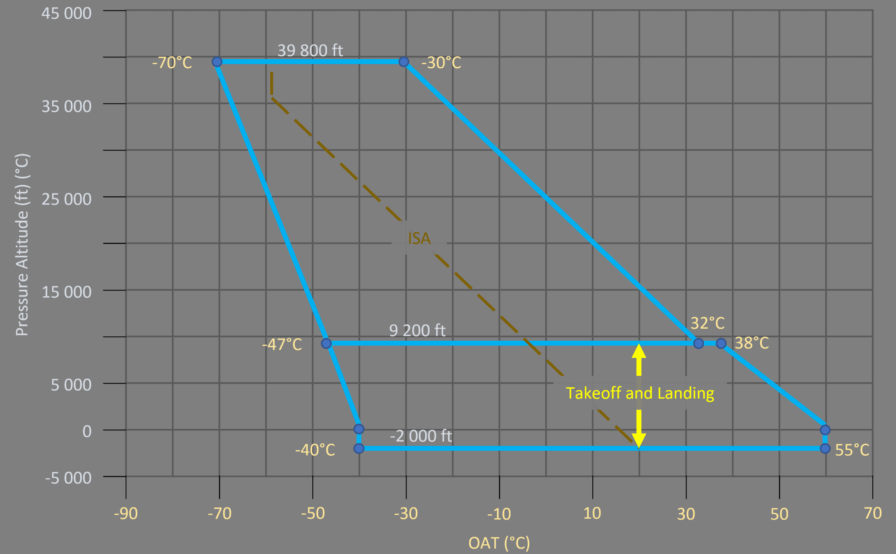
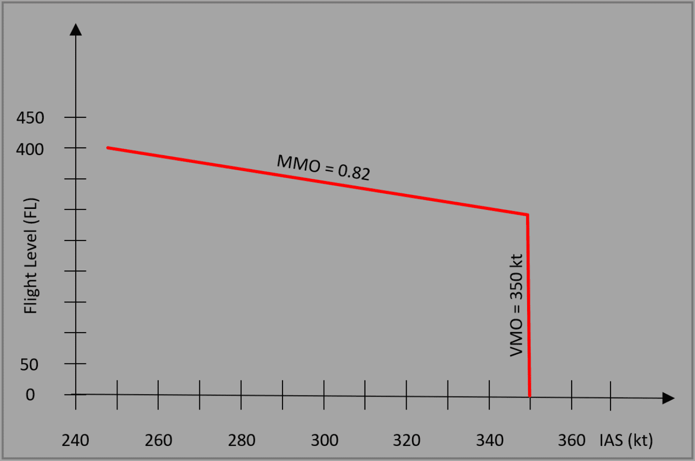

# Aircraft Limitations

The page describes various operational limitations of the currently simulated aircraft model of the A32NX. Other variations of the A320 might have different limitations and characteristics.

This list is incomplete, but should mention the most important operational limitations for flight simulation.

## Aircraft General

### Flight Maneuvering Load Acceleration Limits

- Clean configuration: - 1.0*g* to + 2.5*g*
- Other configurations: 0*g* to + 2*g*

### Environmental Envelope

### Airport Operations and Wind Limitations

| Parameter                                  | Value              |
|--------------------------------------------|--------------------|
| Runway altitude                            | 9 200 ft           |
| Runway slope                               | +- 2 % (mean)      |
| Nominal Runway Width                       | 45 m               |
|                                            |                    |
| Maximum certified crosswind for takeoff    | 35 kt (incl. gust) |
| Maximum demonstrated crosswind for landing | 38 kt (incl. gust) |
| Maximum tailwind for takeoff               | 15 kt              |
|                                            |                    |

!!! note
    For landing with a tailwind greater than 10 kt, FLAPS FULL is recommended.

### Speeds

#### Maximum Flaps/Slats Speeds

| Position | Slats ° | Flaps ° | ECAM  | Max Speed  | Phase                 |
|:--------:|:-------:|:-------:|:-----:|:----------:|:----------------------|
|    0     |    0    |    0    |       |            | CRUISE                |
|    1     |   18    |  0/10   | 1/1+F | 230/215 kt | HOLD / TAKE OFF       |
|    2     |   22    |   15    |   2   |   200 kt   | TAKE OFF / APPR       |
|    3     |   22    |   20    |   3   |   185 kt   | TAKE OFF / LDG / APPR |
|   FULL   |   27    |   40    | FULL  |   177 kt   | LDG                   |

#### Maximum Operating Speeds

| Parameter | Description                      | Value  |
|-----------|----------------------------------|--------|
| VMO       | Maximum operating speed in Knots | 350 kt |
| MMO       | Maximum operating speed in Mach  | M 0.82 |

#### Landing Gear

| Parameter      | Description                                              | Value           |
|----------------|----------------------------------------------------------|-----------------|
| VLE            | Maximum Speeds with the Landing Gear Extended            | 280 kt / M 0.67 |
| VLO extension  | Maximum speed at which the landing gear may be extended  | 250 kt / M 0.60 |
| VLO retraction | Maximum speed at which the landing gear may be retracted | 220 kt / M 0.54 |

| Parameter            | Description     | Value  |
|----------------------|-----------------|--------|
| Maximum ground speed | Tire protection | 195 kt |

#### Minimum Control Speeds

| Parameter | Description                         | Value           |
|-----------|-------------------------------------|-----------------|
| VMCL      | Minimum control speed for landing   | 116 kt          |
| VMCA      | Minimum control speed in the air    | see table below |
| VMCG      | Minimum control speed on the ground | see table below |

| Altitude  | VMCA       | VMCG / >CONF 1 |
|-----------|------------|----------------|
| - 2000 ft | 115 kt IAS | 117 kt IAS     |
| 0 ft      | 114 kt IAS | 116 kt IAS     |
| 2000 ft   | 114 kt IAS | 116 kt IAS     |
| 4000 ft   | 113 kt IAS | 115 kt IAS     |
| 6000 ft   | 112 kt IAS | 114 kt IAS     |
| 8000 ft   | 109 kt IAS | 112 kt IAS     |
| 10 000 ft | 106 kt IAS | 109 kt IAS     |
| 12 000 ft | 103 kt IAS | 106 kt IAS     |
| 14 100 ft | 99 kt IAS  | 102 kt IAS     |
| 15 100 ft | 97 kt IAS  | 101 kt IAS     |

#### Taxi Speed

| Parameter          | Description                                  | Value               |
|--------------------|----------------------------------------------|---------------------|
| Maximum taxi speed | When takeoff weight > 76 000 kg (167 550 lb) | 20 kt during a turn |

### Weight Limitations

| Parameter | Description              | Value                  |
|-----------|--------------------------|------------------------|
| MTXW      | Maximum Taxi Weight      | 79 400 kg (175 047 lb) |
| MTOW      | Maximum Takeoff Weight   | 79 000 kg (174 165 lb) |
| MLW       | Maximum Landing Weight   | 67 400 kg (148 591 lb) |
| MZFW      | Maximum Zero Fuel Weight | 64 300 kg (141 757 lb) |
|           | Minimum Weight           | 40 600 kg (89 508 lb)  |

!!! note
    In exceptional cases (in flight turn back or diversion), an immediate landing at weight above maximum landing weight is permitted, provided the pilot follows the overweight landing procedure.

## Cabin Pressure

| Parameter                              | Value     |
|----------------------------------------|-----------|
| Maximum positive differential pressure | 9.0 psi   |
| Maximum negative differential pressure | - 1.0 psi |
| Safety relief valve setting            | 8.6 psi   |

## Autoflight

### Autopilot

| Parameter                           | Value                                 |
|-------------------------------------|---------------------------------------|
| At takeoff / manual go-around       | 100 ft AGL and min. 5 s after liftoff |
| Approach with FINAL APP, V/S or FPA | 250 ft AGL                            |
| Circling Approach                   | 500 ft AGL                            |
| ILS CAT1                            | 160 ft AGL                            |
| ILS CAT2 or CAT3                    | 0 ft AGL if Autoland                  |
| All other modes                     | 500 ft AGL                            |

!!! note
    The AP or FD in OP DES or DES mode can be used in approach. However, its use is only permitted if the FCU selected altitude is set to, or above, the higher of the two: MDA/MDH or 500 ft AGL.

See also [Autoland](../a32nx-advanced-guides/flight-guidance/autoland.md#aircraft-limitations)

## Engines

| Parameter                       | Description             | Value                                 |
|---------------------------------|-------------------------|---------------------------------------|
| N1                              | Max                     | 101 %                                 |
| N2                              | Max                     | 116.5 %                               |
| Takeoff and Go-around           | All engines operative   | Time Limit: 5 min / EGT Limit 635 °C  |
| Takeoff and Go-around           | One engines inoperative | Time Limit: 10 min / EGT Limit 635 °C |
| Maximum Continuous Thrust (MCT) |                         | Time: Not limited / EGT Limit 610 °C  |
| Starting                        |                         | EGT Limit 635 °C                      |
| Engine start max crosswind      |                         | 45 kt                                 |
| Engine takeoff max crosswind    |                         | 35 kt (incl. gust)                    |

!!! note
    The N1 limit depends on the ambient conditions and on the configuration of the engine air bleed. These parameters may limit N1 to a value that is less than the above-mentioned N1 value.

### Engine Anti-Ice

The engine anti-ice must be ON during all ground and flight operations when icing conditions exist or are anticipated, except during climb and cruise when the temperature is below -40 °C SAT.
The engine anti-ice must be ON before and during descent in icing conditions, including temperatures below -40 °C SAT.

!!! note
    Do not rely on airframe visual icing cues to turn engine anti-ice on. Use the temperature and visual moisture criteria specified in the icing conditions definition. Delaying the use of engine anti-ice until buildup is visible from the cockpit may result in severe engine damage and/or flameout.

!!! note "Definition of Icing Conditions"
    - Icing conditions exist when the OAT (on ground or after takeoff) or the TAT (in flight) is at or below 10 °C and visible moisture in any form is present (such as clouds, fog with visibility of 1600 m(1 sm) or less, rain, snow, sleet or ice crystals).
    - Icing conditions also exist when the OAT on the ground and for takeoff is at or below 10 °C and operating on ramps, taxiways, or runways where surface snow, standing water or slush may be ingested by the engines, or freeze on engines, nacelles, or engine sensor probes.

## Flight Controls

| Parameter                                                   | Value     |
|-------------------------------------------------------------|-----------|
| Maximum operating altitude with slats and/or flaps extended | 20 000 ft |

## Fuel

| Parameter               | Value             |
|-------------------------|-------------------|
| Minimum fuel at takeoff | 1500 kg (3307 lb) |

## Landing Gear

### Braking System

The braking system is not designed to hold the aircraft in a stationary position when a high thrust
level is applied on at least one engine.

During ground procedures that require a thrust increase with braking, the flight crew must ensure that
the aircraft remains stationary, and must be ready to immediately retard the thrust levers to IDLE.

| Parameter                             | Value  |
|---------------------------------------|--------|
| Maximum brake temperature for takeoff | 300 °C |

## Navigation

### IR Ground Alignment

Possible only between 82° North and 82° South.

### Magnetic Reference 

In NAV mode, the IR will not provide valid magnetic heading and magnetic track angle:
 
- North of 73° North, between 90° West and 120° West (magnetic polar region), and
- North of 82° North, and
- South of 60° South.

Flying at latitudes beyond these limits is prohibited.

