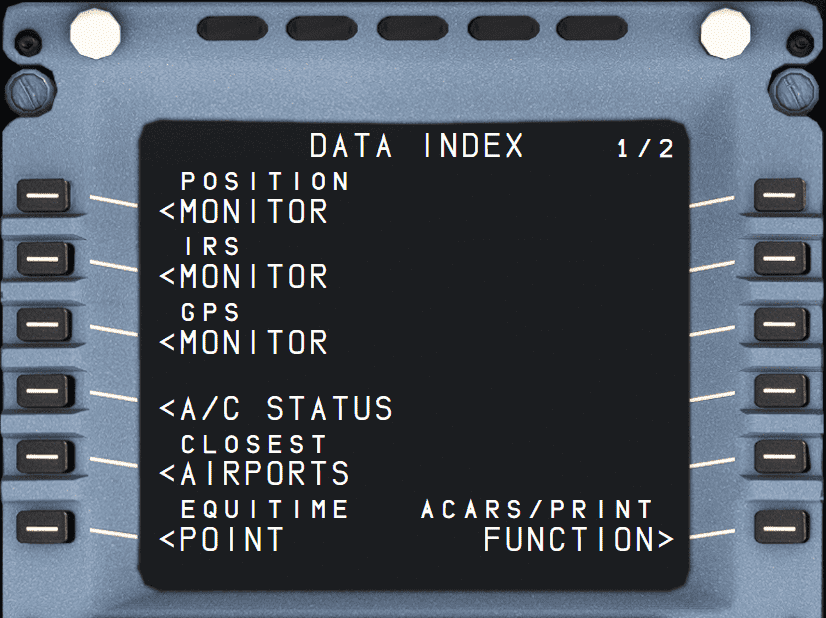
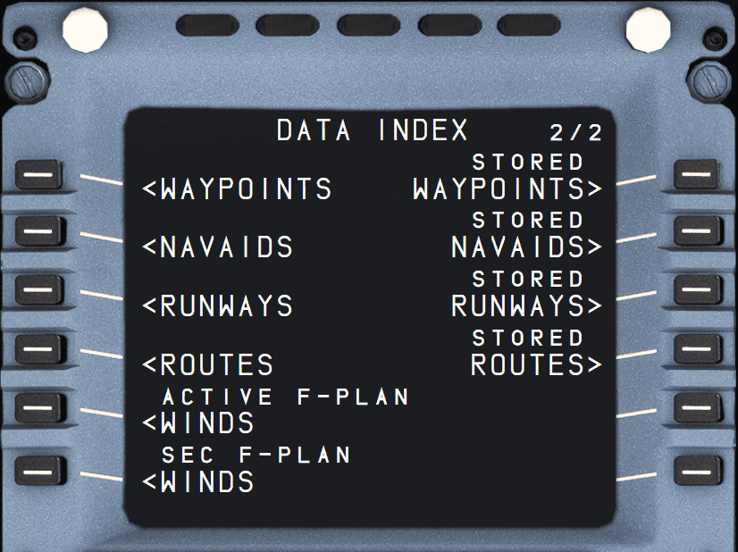
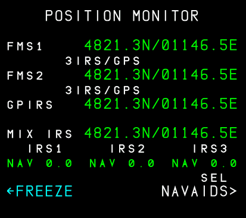
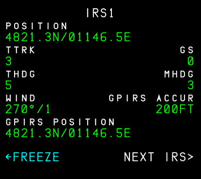
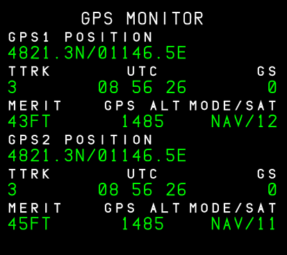
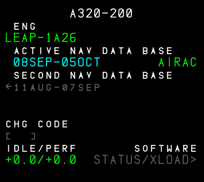
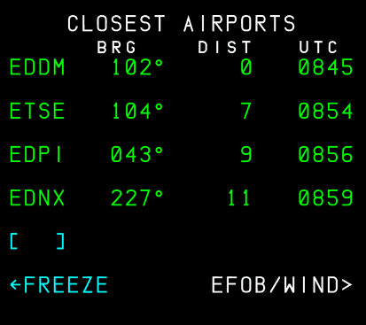
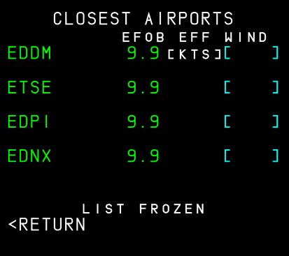

# DATA: Data Index Page

!!! block ""

    {loading=lazy align=center width=49%}
    {loading=lazy align=center width=49%}

## Description

The DATA INDEX pages provide access to various systems and databases in the aircraft.

PAGE 1 is dedicated to navigation systems and corresponding sub-pages.

PAGE 2 is dedicated to navigation data that is entered or stored in the FMGS.

!!! info ""
    This section will not cover all DATA INDEX pages, as most are not useful in a simulation or not implemented yet in the FlyByWire A32NX.

## DATA INDEX Page 1

### POSITION MONITOR

{loading=lazy}

List of all FMGC computed positions using various methods. The positions of the different methods should be nearly identical.

- FMS 1 (1L)
    - FMGC 1 calculated latitude and longitude, and the methods used by the FMGC for the calculation (Example: “3 IRS/DME/DME”).
- FMS 2 (2L)
    - FMGC 2 calculated latitude and longitude, and the methods used by the FMGC for the calculation.
- RADIO or GPS or GPIRS (3L)
    - Onside FMGC calculated latitude and longitude, calculated from selected radio NAVAIDs 
    - (Example: DME/DME, VOR/DME, or LOC) or from GPS or GPIRS.
- MIX IRS (4L)
    - Onside FMGC calculated latitude and longitude, of the weighted mean inertial reference system (IRS) calculated from the available IRSs.
- IRS 1,2,3 (5L)
    - Deviation in nautical miles of each IRS position from the onside FMGC position.
    - Displays the IRS mode, which can be INVAL, ALIGN, NAV or ATT.

        !!! note ""
            Displayed INVAL when an ADIRS has failed, or the IRS position is not refreshed.

- FREEZE/UNFREEZE (6L)
    - To freeze (or unfreeze) all the data displayed on the page.
    - When frozen, the title of the page specifies the time at which it was frozen.

- SEL NAVAIDS (6R)
    - Access to selected NAVAIDs page.

### IRS MONITOR

{loading=lazy}

Displays the IRS parameters for IRS 1, 2 and 3.

- TITLE
    - Displays the selected IRS in large white font. When frozen, IRS is replaced by “IRS FROZEN AT” and the time at which the pilot has frozen the display.

- POSITION (1L)
    - Latitude/longitude given by the selected IRS.

- TTRK (2L)
    - True track

- THDG (3L)
    - True heading

- WIND (4L)
    - True wind direction/velocity

- GPIRS (5L)
    - GPS/IRS hybrid position of the IRS

- FREEZE/UNFREEZE (6L)
    - Allows to freeze or unfreeze all data displayed on all three IRS pages. When frozen, the title of the page specifies the time at which it was frozen. It is automatically unfrozen when exiting the page.

- GS (2R)
    - Ground speed

- MHDG (3R)
    - Magnetic heading

- GPIRS ACCUR (4R)
    - GPS/IRS Figure of Merit (meters or feet)

- NEXT IRS (6R)
    - This prompt calls up the next IRS page

### GPS MONITOR

{loading=lazy}

- GPS 1,2 POSITION (1L, 4L)

- TTRK GPS 1, 2 (2L, 5L)
    - true track

- MERIT GPS 1, 2 (3L, 6L)
    - figure of merit (meters or feet)

- GS GPS 1, 2 (2R, 5R)
    - ground speed

- MODE/SAT (3R, 6R)
    - Mode of GPS 1, 2 and number of satellites tracked.
        - INIT: System initialization
        - ACQ: Satellite acquisition
        - NAV: Normal mode
        - TEST: System test
        - FAULT: Invalid system
        - ALTAID/AIDED: Degraded modes. GPS uses aircraft inputs for computation purposes.

- UTC (2, 5)
    - GPS 1, 2 UTC

- GPS ALT (3, 6)
    - GPS altitude is displayed for information purposes. It is not used by the FMGS.

### A/C STATUS

{loading=lazy}

Automatically displayed this page at power up.  Pilots may also call it up by pressing the DATA key on the MCDU console.

- TITLE
    - Aircraft Type

- ENGINE TYPE (1L)
    - Used to calculate predictions.

- ACTIVE DATABASE (2L)
    - Validity period and part number (large font).

- SECOND DATABASE (3L)
    - Validity period in small font.
    - A press of the 3L key switches the second database as the active database.

    !!! info ""
        Currently not available or INOP in the FBW A32NX for Microsoft Flight Simulator.

- CHG CODE (5L)
    - Entry of code to change the IDLE and/or PERF factor, displayed in 6L.
    - Displayed in the PREFLIGHT and DONE phases.
    - Label is displayed in small white font.
    - The brackets, or the entered value, is displayed in large blue font.

    !!! info ""
        Currently not available or INOP in the FBW A32NX for Microsoft Flight Simulator.

- IDLE/PERF (6L)
    - Aircraft must be on the ground to enter values.
    - FMS displays default values from the Airline Modifiable Information (AMI) file if nothing is entered.
    - Default values are displayed in small font.
    - Manually entered values are displayed in large font.
    - When it is necessary to modify the IDLE or the PERF factor:
        - ENTER the change code in the CHG CODE field (5L).
        - Default value for the code is "ARM" but can be modified in the Airline Modifiable Information (AMI) file.
        - With a valid code, the IDLE and PERF factors are displayed in blue.
        - ENTER the new IDLE and/or PERF factor(s) in the scratchpad.
        - PRESS the (6L) key to insert the new IDLE and/or PERF factor.
        - The new IDLE and/or PERF factors are displayed in large blue font.

    !!! info ""
        Currently not available or INOP in the FBW A32NX for Microsoft Flight Simulator.

- STATUS/XLOAD (6R)
    - Calls up the P/N STATUS and P/N XLOAD pages.

    !!! info ""
        Currently not available or INOP in the FBW A32NX for Microsoft Flight Simulator.

### CLOSEST AIRPORTS 1

{loading=lazy}

Automatically loads the closest 4 airports from the current position. The pilots can add a 5th airport with a manual entry.

Page 1 displays the bearing, distance, and time to go to each airport.

- (1L - 4L)
    - Closest four airports from the database, ordered by distance from the current position.
- BRG
    - Current bearing to the airport.
- DIST
    - Current great-circle distance to the airport.
- UTC
    - Predicted time to the airport
    - Computed using the current wind or a wind vector entered on page 2, and the speed according to the current mode (managed or selected).
    - This is only computed in cruise phase.

- (5L)
    - A 5th airport ICAO can be entered.
    - Can be modified at any time, even when “LIST FROZEN” is displayed.
    - WHen ICAO is not in the database, then “NOT IN DATABASE” appears in the scratchpad.

- EFOB/WIND (6R)
    - Gives access to page 2.
    - Automatically freezes the list of the four closest airports when pressed.

### CLOSEST AIRPORTS 2

{loading=lazy}

Page 2 displays the EFOB and allows the crew to enter an effective wind to be flown to each airport.

!!! info ""
    Currently, not fully available or INOP in the FBW A32NX for Microsoft Flight Simulator.

- AIRPORTS (1-5)
    - EFOB at each airport.
    - EFOB is only computed in cruise phase.
    - Enter an anticipated headwind or tailwind along the bearing to the airport. If entry is preceded by +, T, or TL, a tailwind is assumed.
    - If the entry is preceded by -, H, or HD, a headwind is assumed.
    - Default value may be displayed, based on the current wind.
    - Used to compute the EFOB and time to the airport.

## DATA INDEX Page 2

{loading=lazy}

- WAYPOINTS (1L)
- NAVAIDS (2L)
- RUNWAYS (3L)
- ROUTES (4L)

These keys call up details of waypoints, NAVAIDs, runways, and routes
stored in the database.

!!! info ""
    Currently, not all of these are available in the FBW A32NX for Microsoft Flight Simulator.

- STORED WAYPOINTS (1R)
    - See [Stored Waypoints Guide](../../a32nx-advanced-guides/data-management.md#stored-waypoints).

- STORED NAVAIDS (2R)
- STORED RUNWAYS (3R)
- STORED ROUTES (4R)

These keys call up waypoints, NAVAIDs, runways, and routes that the pilot has stored, to review and store them in, or delete them from, the database. The airline can choose to have all pilot-stored data automatically erased in the done phase.

!!! info ""
    Currently, not all of these are available in the FBW A32NX for Microsoft Flight Simulator.
