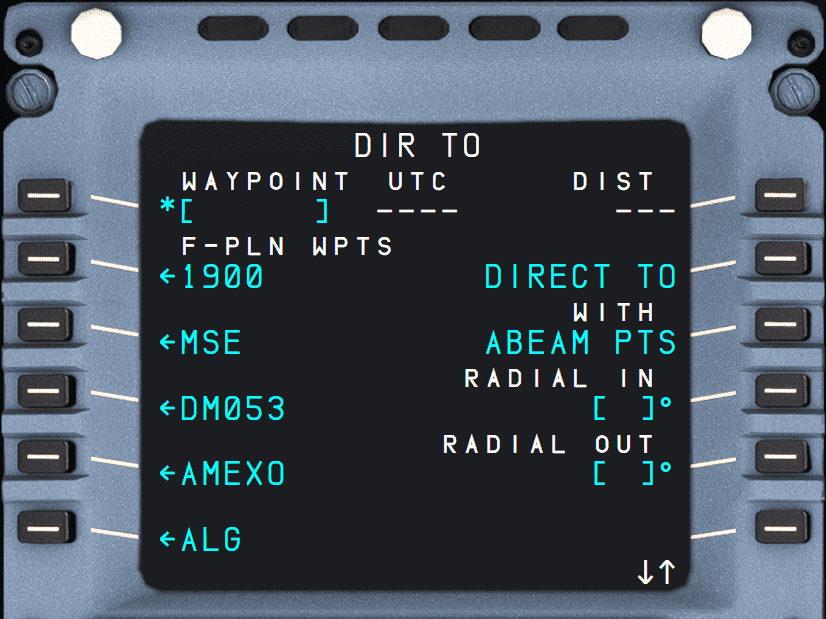

# DIR: Direct To page

{loading=lazy}

## Description

The DIR TO page is used by the flight crew to select waypoints from the flight plan or to enter new waypoints to modify the current active flight plan by creating a direct leg to the selected/entered waypoint.

When in NAV mode, this changes the currently active leg and waypoint. In HDG mode, activation of a DIR TO will switch to NAV mode for a direct course to the new waypoint.

See our [DIRECT-TO page](../../a32nx-advanced-guides/flight-planning/direct.md) on how to use this page.

## Usage

### DIR TO (1L)

The entry field can be filled manually or by selecting a flight plan waypoint from 2L to 6L.

When data is entered, two amber functions appear in 6L and 6R to either erase the entry or to confirm the insertion of the direct leg to this waypoint.

### LSK 3L to 6L

These lines on the left list the flight plan waypoints for the flight crew to select from.

### ERASE (6L)

{loading=lazy}

After selecting a waypoint (now in 1L data field) an amber ERASE functions appears in 6L.

Pressing ERASE clears the selected DIR TO waypoint in 1L.

### DIRECT (6R)

{loading=lazy}

After selecting a waypoint (now in 1L data field) an amber DIRECT function appears in 6R.

Pressing DIRECT inserts the selected DIR TO waypoint in 1L into the flight plan as the active leg and next waypoint. 
The aircraft immediately starts turning towards the waypoint.

### DIRECT TO (2R)

This is the default direct-to mode. With ABEAM PTS, RADIAL IN/OUT are the other modes - see below.  

### ABEAM PTS (3R)

!!! warning "Not Yet Implemented"
    Below is a quick explanation of what this functionality entails. It is not yet implemented in the FlyByWire A32NX.

There may be instances where the flight crew would not want existing waypoints to be deleted from the flight plan when performing a direct. By selecting the `WITH ABEAM PTS` option on the DIR TO page, this would insert and display the previous waypoints "abeam" their original counterparts.

!!! tip "Defining Abeam"
    On the beam; at a right angle to the center line or keel of a vessel or aircraft; being at a bearing approximately 090 degrees or 270 degrees relative.
    

    Source [Wikipedia](https://en.wiktionary.org/wiki/abeam){target=new}.

This is useful when pilots would want to check fuel, time, or other actions after inserting the direct to waypoint. 
The abeam waypoints would be prefaced with `AB` on both the Navigation Display and the F-PLN page.

### RADIAL IN/OUT (4R/5R)

!!! warning "Not Yet Implemented"
    Below is a quick explanation of what this functionality entails. It is not yet implemented in the FlyByWire A32NX.

This feature allows the flight crew to enter a specific radial to intercept a waypoint. Another way to describe this is programming a specific direction from which to approach or leave a waypoint.

This is useful when ATC provides instructions such as *"Intercept the 214 radial to WAYPOINT"*.

By setting a RADIAL INBOUND/OUTBOUND, it would allow the aircraft to be flying a specific heading towards the INTCEPT point calculated by the FMS to the waypoint instructed by ATC.  
