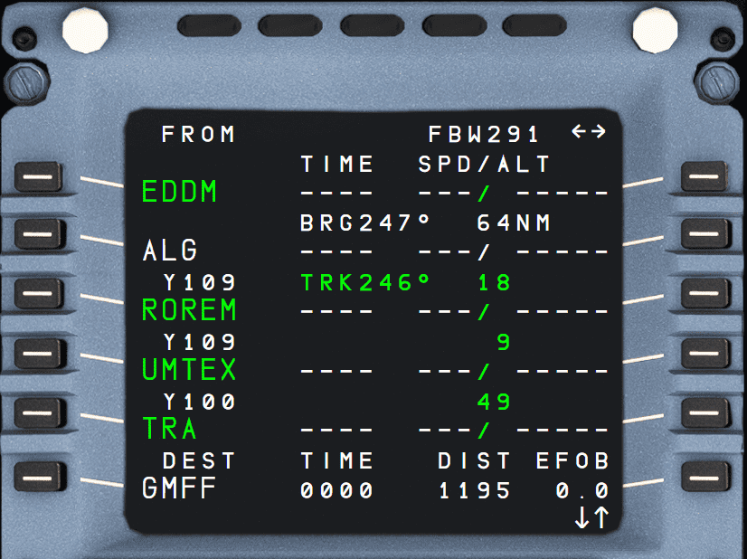
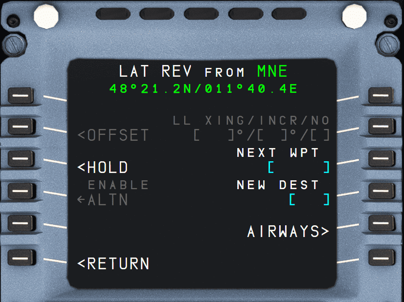
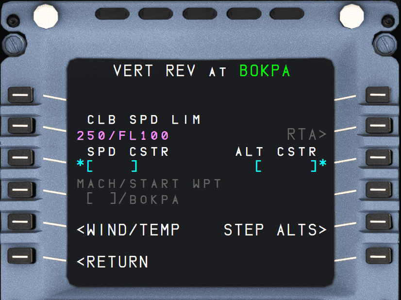
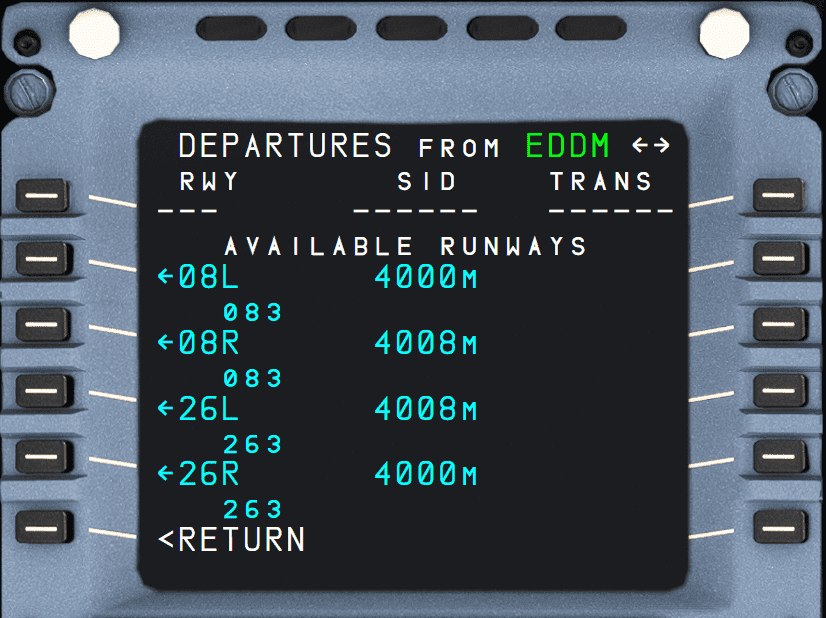
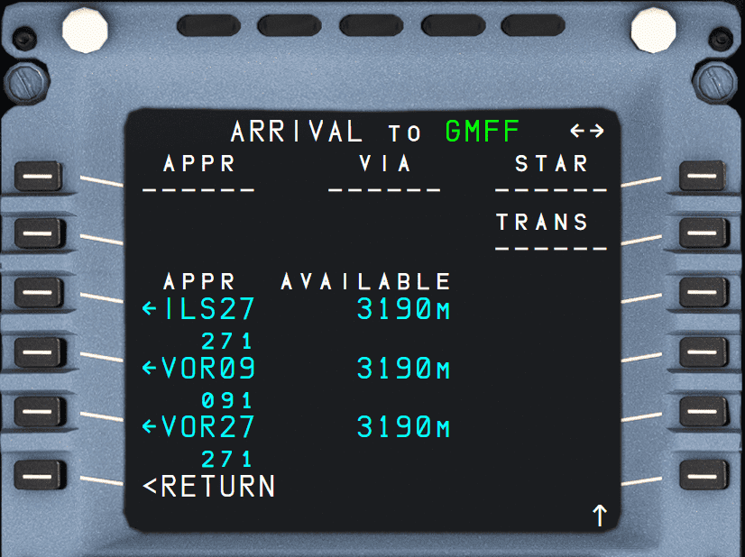
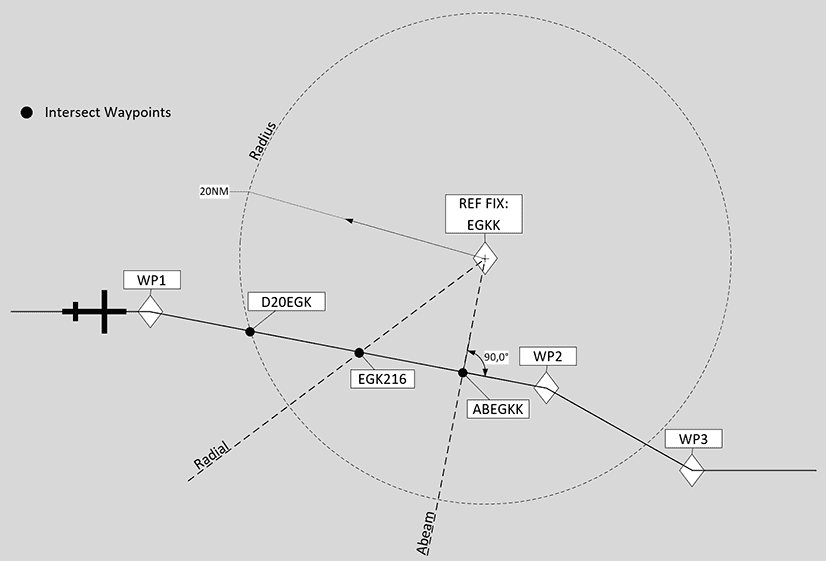

# F-PLN: Flight Plan Page

## Description

The MCDU F-PLN page is actually a series of pages for the management of the aircraft's active flight plan.

Revisions to the lateral and vertical flight plans can be made from these pages. For lateral revision press the left LSK and for vertical revision press the right LSK.

## Flight Plan A Page

!!! tip "Additional Resources"
    Also see the following resources for further feature information when utilizing the F-PLN page:

    - [MCDU Setup Procedure](../../beginner-guide/preparing-mcdu.md) in our [Beginner Guide](../../beginner-guide/overview.md).
    - Advance Flight Planning Guides
        - [Direct To (DIR TO)](../../advanced-guides/flight-planning/direct.md)
        - [Discontinuities](../../advanced-guides/flight-planning/disco.md)
        - [Fix Info](../../advanced-guides/flight-planning/fixinfo.md)
        - [Holds](../../advanced-guides/flight-planning/holds.md)
        - [Leg Types](../../advanced-guides/flight-planning/leg-types.md)

{loading=lazy}

### General

The flight plan page A lists all waypoints of the active flight plan in sequence, providing time, speed, and altitude predictions.

The FROM waypoint (last waypoint overflown) is listed at the top, and the TO waypoint is listed in white as the second entry. This FROM-TO is called the active leg.

To scroll through the flight plan, the vertical slew keys can be used. To return to the beginning of the flight plan page, the F-PLN key can be pressed.

The AIRPORT key serves as a fast slew key. It can be pressed to call up the next airport (DEST, ALTN, ORIGIN) to be displayed on the flight plan page.

Between two waypoints, the display shows:

- Name of the leg
- Bearing from the aircraft position to the TO waypoint
- Distance between the waypoints
- During an approach, this in-between line also defines the angle of the final descent path. For example, “2 - 3°” indicates that the leg is two nautical miles long, and the flight path angle is - 3°.
- Shows track (TRK) between the waypoints in lines 2 and 3. This is the outbound track of the next leg.

If the route contains a published missed approach procedure, it is shown in blue after the destination runway. It turns green when the go-around phase becomes active. After the last waypoint of the missed approach, the display shows the alternate flight plan in NAV mode.

In NAV mode, the TO waypoint can only be cleared by using the DIR key.

#### Predictions

Predictions for all waypoints are calculated based on the current and predicted winds and displayed.

#### Constraints

For the climb, descent, and approach phases, the nav database might define constraints for altitude and speed. 
Constraints can also be manually added by the flight crew (except at origin, destination, FROM, and pseudo-waypoints).

Constraints are displayed in magenta, as long as predictions are not completed.

Once predictions are calculated, constraints are replaced by speed and altitude predictions, preceded by asterisks. If the asterisk is magenta, the system predicts that the aircraft will match the constraint (altitude within 250 ft, speed not more than 10 kt above the constraints). If the asterisk is amber, the system predicts that the aircraft will miss the constraint and the MCDU displays: “SPD ERROR AT WPT”.

!!! note
    SPD and ALT CSTR may either be entered on the VERT REV page or directly on the F-PLN A page, whereas TIME CSTR may only be entered from the RTA page.

!!! info ""
    Currently TIME CSTR is not available or INOP in the FBW A32NX for Microsoft Flight Simulator.

#### Pseudo Waypoints

Pseudo waypoints are FMS-generated waypoints inserted into the flight plan to indicate a vertical event.

Pseudo waypoints are:

- Speed limit (SPD LIM)
- Top-of-climb (T/C)
- Top-of-descent (T/D)
- Step climb point (S/C)
- Step descent point (S/D)
- Deceleration point (DECEL),
- Time markers (UTC/HHMM).

Pseudo waypoints are displayed in parentheses.

### F-PLN Page Elements

- TITLE FLIGHT NUMBER
    - If no flight number has been entered, this is blank.
    - May display:
        - TMPY in yellow if a temporary flight plan exists
        - OFST in white, if a lateral offset is flown; or,
        - OFST in yellow, if a lateral offset revision is pending.

- Line 1 to Line 5 WPT, UTC, SPD, ALT
    - Display consecutive waypoints with associated predictions of time, speed, or Mach and altitude.
    - Before takeoff TIME is displayed, and after takeoff UTC. UTC is displayed, if the pilot enters an estimated takeoff time (ETT).
    - The FROM waypoint (first line of the flight plan) displays values that the system memorized at waypoint sequencing.

- SPD/ALT (1R)
    - The field dedicated to SPEED or MACH is blank at the FROM waypoint, except at the departure airport. V1, associated with runway elevation, is displayed.
        
        !!! note 
            The predicted altitude at a waypoint is related to the QNH below the transition altitude, and is given as a flight level above the transition altitude.

- DEST UTC/TIME DIST, EFOB (6)
    - DIST: Distance to destination along the displayed flight plan (track miles).
    - EFOB: Estimated fuel on board at destination. EFOB at destination will turn to amber, if it becomes less than the MIN DEST FOB value.
    - Line is permanent and displayed in white font once predictions are available. Not visible when a TMPY F-PLN is displayed or in some cases when an ALT CSTR is entered (“*CLB or DES*” prompt appears).

## Flight Plan B Page

!!! info "F-PLN B"
    Currently not available or INOP in the FBW A32NX for Microsoft Flight Simulator.

## Lateral Revision Pages

{loading=lazy}

A lateral revision is a change or changes made to the lateral flight plan. The waypoint from which the change origins is the revise waypoint. To enter the Lateral Revision page, the pilots push the LSK left of the waypoint in the F-PLN page.

There are 4 different types of lateral revisions:

- Adding or removing a waypoint directly on the F-PLN page.
- Using the LAT REV page.
- DIR-TO with abeams and radial in or out.
- Using the FIX INFO page and adding radial, radius and abeam intercept points.

There are 4 types of LAT REV pages:

- FROM Origin page:
- FROM Destination page:
- FROM Waypoint page
- FROM Present Position page

SID revisions are done only at the origin airport (Origin page).

STAR revisions are done only at a destination airport (Destination page).

### LAT REV Page Elements

- TITLE 
    - The ident of the waypoint or airport selected for revision, along with its latitude and longitude.
    - If the selected waypoint is the FROM waypoint, the title omits the aircraft latitude and longitude, and instead displays the “PPOS” (present position) instead.
  
- DEPARTURE (1L)
    - Used for selecting the departure runway and procedure.
    - Only available on origin airport.
  
- FIX INFO (1R)
    - Used for entering radial, radius and abeam intercept points.
    - Only available on the current FROM waypoint (first waypoint when opening the F-PLN page). 
    - See the [FIX INFO Guide](../../a32nx-advanced-guides/flight-planning/fixinfo.md) for more information.
  
- ARRIVAL (1R)
    - Used for selecting the arrival runway and procedures (STAR, APPR, TRANS, etc.)
    - Only available on the destination airport.
    - See [ARRIVAL Page](#arrival-page)
  
- OFFSET (2L)
    - Used to enter an offset from the direct route between two waypoints, defined as a distance to the left or right of the direct line between the waypoints.
    - Only available on waypoint or present position
    
    !!! info ""
        Currently not available or INOP in the FBW A32NX for Microsoft Flight Simulator.
  
- LL XING/INCR/NO (2R)
    - The pilot can create latitude or longitude crossing points by entering a starting lat or long, an increment (in degrees), and the number of crossing points desired in 2R
    - Only available on origin, ppos and waypoint.
    
    !!! info ""
        Currently not available or INOP in the FBW A32NX for Microsoft Flight Simulator.
  
- HOLD (3L)
    - Used to set up a hold pattern at the present position or waypoint.
    - Only available on ppos and waypoint.
    - See [HOLD Page](#hold-page) for more information.
  
- NEXT WPT (3R)
    - A new waypoint after the selected one can be entered into this field.
    - If it is a waypoint already in the flight plan after the current waypoint, then all intermediate waypoints are removed.
    - If it is a new waypoint, a [discontinuity](../../a32nx-advanced-guides/flight-planning/disco.md) is created.
    - Only available on departure, waypoint, and destination.
  
- ENABLE ALTN (4L)
    - Used to enable the alternate flight plan.
    - Will create a temporary flight plan.
    - Only available on departure, waypoint, and destination.
  
- NEW DEST (4R)
    - Used to change the destination airport.
    - Will create a temporary flight plan direct to the new destination.
    - Clears all waypoints between the current waypoint and the new destination.
    - Creates a [discontinuity](../../a32nx-advanced-guides/flight-planning/disco.md).
    - Only available on departure, waypoint.
  
- ALTN (5L)
    - Used to display a list of alternate airports from the database.
    - Only available on the destination airport.
  
    !!! info ""
        Currently not available or INOP in the FBW A32NX for Microsoft Flight Simulator.
  
- AIRWAYS (5R)
    - Displays the [AIRWAYS](#airways-page) page.
    - Used to select airways to enter into the flight plan.
    - Only available on waypoint.

!!! note
    Any lateral revision done with a LAT REV page creates a temporary flight plan. Lateral revisions done directly on the F-PLN pages do not result in a temporary flight plan.

## Vertical Revision Pages

{loading=lazy}

A vertical revision is a change or changes made to the vertical flight plan. The waypoint from which the change origins is the revise waypoint. To enter the Vertical Revision page, the pilots push the LSK right of the waypoint in the F-PLN page.

Vertical revisions have an immediate or future impact on the flight profile. The flight profile is the desired aircraft trajectory, thrust settings, and speed on the vertical path of the flight plan.

Changes made on the VERT REV page are:

- Speed limits for CLIMB, CRUISE, and DESCENT flight phase.
- Speed constraints for CLIMB or DESCENT flight phase.
- Altitude constraints for CLIMB or DESCENT flight phase.
- Altitude steps.
- Waypoint winds.
- Destination QNH.
- Constant Mach segment.

Any change to the vertical revision page causes a complete recalculation of the vertical flight plan profile and invalidates all performance predictions.

A vertical revision is rejected by the FMS, and NOT ALLOWED is displayed in the scratchpad, if it is not meeting certain criteria.

### VERT REV Page Elements

- TITLE 
    - “VERT REV AT (location)”
  
- CLB/DES SPD LIM (2L)
    - CLB SPD is shown in the CLIMB phase, DES SPD in the DES phase
    - The speed limit is either a system default, a NAV database airport default, or a pilot entry.
  
- SPD CSTR (3L)
    - Used to enter a speed constraint for this waypoint.
    - Will be displayed in large magenta font until predictions are calculated.
    - After predictions are available, it will show the predicted speed or constraint speed, whichever is lower.
    - An asterisk is displayed in amber if the constraint is predicted to be missed, or in magenta if the constraint is predicted to be met.
  
- MACH/START WPT (4L - only on cruise waypoints)
    - Used to enter start point for a Constant Mach Segment (CMS).
    
    !!! info ""
        Currently not available or INOP in the FBW A32NX for Microsoft Flight Simulator.
  
- QNH (4L - only on destination waypoint)
    - Used to enter the QNH for the destination.
    - When entered, it is also shown on the APPROACH page.

- WIND (5L)
    - Calls the [WIND page](#wind-page).
    - True wind vectors are entered into the [WIND page](#wind-page) to update the flight plan wind model.
  
- RTA (2R)
    - Calls [Required Time of Arrival page](#rta-page)
  
    !!! info ""
        Currently not available or INOP in the FBW A32NX for Microsoft Flight Simulator.
  
- ALT CSTR (3R)
    - Used to enter an altitude constraint for this waypoint.
    - Preceded with a + indicates AT OR ABOVE.
    - Preceded with a - indicates AT OR BELOW.
    - During TAKEOFF and CLIMB, only "AT" or "AT OR ABOVE" constraints are restrictive.
    - During DESCENT and APPROACH, only "AT" or "AT OR BELOW" constraints are restrictive.
    - A yellow * indicates the constraint will be missed.
    - A magenta * indicates the constraint will be met.
    - Could contain a “window” constraint. The altitude window consists of two altitudes within which the aircraft should fly. The crew cannot manually enter a “window” constraint. It is in yellow when a temporary flight plan exists.
      
- GS INTCPT (3R - only on destination waypoint)
    - Shows glideslope intercept altitude when approach is ILS (MLS, GLS).
    - It cannot be changed by the flight crew.
  
- END WPT (4R - only on cruise waypoints)
    - Used to enter end point for a Constant Mach Segment (CMS).
    - Only for cruise waypoints.
  
    !!! info ""
        Currently not available or INOP in the FBW A32NX for Microsoft Flight Simulator.
  
- ALT ERROR (4R)
    - During CLIMB and DESCENT, this shows how far the corresponding constraint will be missed (estimation).
    - When estimated miss is > 250 ft.
  
- STEP ALTS (5R)
    - Calls the [STEP ALTS page](#step-alts-page).
    - Only shown once a cruise alt has been entered.
    - Not shown in DESCENT, APPROACH, or GO-AROUND phases
  
- \*CLB OR DES* (6L, 6R)
    - Shown if the system can't determine climb or descent after a constraint has been entered.

!!! note
    Altitude and speed constraints may apply to the climb, descent, or approach phase, but never to the cruise phase.
    The 6L/6R fields display “CLB/DES” when the revised waypoint is a cruise phase waypoint, and the FMGS needs to know if the new constraint is to be applied in climb or descent phase. The FMGS will modify the cruise phase accordingly. These 2 prompts also display “CLB/DES” when the predictions are not computed. (Top of climb and top of descent are not yet defined).

## DEPARTURE Page

{loading=lazy}

The flight crew can use the DEPARTURE pages to review departure procedures (RWY, SID, TRANS), and enter them into the temporary flight plan.

When the display shows the lateral revision page for the origin, the flight crew calls it up by pressing
the 1L key.

The RWY, SIDS and TRANS (if any) pages are available.

The flight crew sequentially calls up the SIDs and TRANS (if any) pages by selecting a runway on the RWY page. The flight crew can also scroll between the RWY, SIDs and TRANS (if any) pages by pressing the "←" or "→" key on the MCDU console.

- Line 1 RWY, SID TRANS (1L, 1M, 1R)
    - This line displays the RWY, SID, and TRANS in green after they have been inserted into the active flight plan, or in yellow if a temporary is created or updated.
    - If nothing has been selected or inserted, the line displays dashes.
    - “NONE” is displayed in the SID or TRANS field, if no SID or TRANS exists, or NO SID or NO TRANS was selected by the crew.

- RWY/SIDs (2L to 5L)
    - These fields display selectable and selected RWYs or SIDs.
    - The pilot can scroll each list.
    - Selectable RWYs and SIDs are displayed in blue with an arrow.
    - Once a RWY or SID is selected, the arrow disappears.
    - A RWY or SID, already inserted in the flight plan, is displayed in green.
    - When a runway is selected, a temporary flight plan is created or modified, and the DEPARTURE page 2 for SID selection is automatically displayed.
    - The display shows the length, course and, if available, the MLS ident and frequency for each runway.

- TRANS (2R to 5R)
    - This field displays the selectable and selected en route transitions in blue and green, respectively.
    - They are blank if there are no transitions.
    - When a TRANS is selected, a temporary flight plan is created or updated (if one already exists).

## ARRIVAL Page

{loading=lazy}

These pages enable the pilot to select a runway with its associated final, and to review arrival procedures (approaches, VIAs, STARs, TRANS) and enter them into the active flight plan. The pilot calls them up from the [LAT REV page](#lat-rev-page-elements) for the destination.

Three lists APPR, STAR, and TRANS are available, along with a fourth, APPROACH VIAS if there are any transitions.

The pilot sequentially calls up each page, either by selecting a data item (such as APPR) or by pressing the "→" or "←" keys on the MCDU console.

When an approach is selected, it is inserted in a temporary fight plan and the ARRIVAL page 2 or APPROACH VIA page is automatically displayed.

- Line 1 APPR, VIA, STAR, and TRANS (1L, 1M, 1R, 2R)
    - This line displays the APPR, VIA, STAR, and TRANS in green, if they have been inserted in the flight plan, and in yellow, as a temporary flight plan, if they have been selected but not yet inserted.
    - It displays dashes or "NONE", if nothing has been selected or inserted.

- APPR VIAS (2L)
    - The pilot presses this key to call up transitions from the last point of the STAR to the first point of the approach.

- 3L to 5L
    - These fields list selectable and selected APPRs, STARs, and VIAs. The flight crew can scroll the pages, when necessary. Selectable APPRs, STARs, and VIAs are displayed in blue with an arrow.
    - Once the pilot has selected an APPR, STAR, or VIA, a temporary F-PLN is created. After the APPR, STAR, or VIA is inserted into the flight plan, it is displayed in green.
    - For each approach, the display shows runway length, heading, and the frequency and identifier of the ILS when ILS is available.
    - In case there are multiple approaches for the same runway, the ILS is identified with the runway plus the multiple indicator (i.e., ILS33L-S)

- 3R to 5R
    - These fields either display:
        - The ident and the frequency of the NAVAID specified for the approach, or
        - The en route transitions compatible with the selected STAR. The active selected TRANS is in green, the remaining TRANS are in blue.

## FIX INFO Page

The FIX INFO pages are used to create waypoint intersections of the flight plan with radials, radii, and abeam intercept points associated with a waypoint.

!!! info ""
    Currently, only partly implemented in the FBW A32NX for Microsoft Flight Simulator.

See [Feature Guide: Fix Info](../../a32nx-advanced-guides/flight-planning/fixinfo.md)

The FIX INFO pages can be accessed from the LAT REV page of the FROM waypoint.

- REF FIX (1L)
    - When the FIX INFO page is first accessed, amber boxes are displayed in 1L for the pilot to enter a waypoint identifier.
    - Once the waypoint identifier is entered, the FIX INFO page is displayed
- RADIAL (2L, 3L)
    - Used to create an intercept waypoint with the radial line from the REF FIX.
- RADIUS (4L)
    - Used to create intercept waypoints with the radius circle around the REF FIX.
- ABEAM (5L)
    - Used to create an intersection waypoint with the perpendicular line from the REF FIX and the flight plan leg.

Visual example for intersections:

{loading=lazy}

## HOLD Page

The HOLD page is used to enter a holding pattern for a waypoint. The HOLD page can be accessed from the LAT REV page of the FROM waypoint.

See or guide for [HOLDS](../../a32nx-advanced-guides/flight-planning/holds.md#programming-holds).

## AIRWAYS Page

The flight crew can use the AIRWAYS page to select up to five airways, and string them into the flight plan, after the revised waypoint.

The crew calls up this page, by pressing the AIRWAYS key (5R) on the [LAT REV page](#lat-rev-page-elements).

- TITLE
    - “AIRWAYS from XXX”, XXX: Revised waypoint ident (large green font).

- VIA (1L to 5L)
    - Displays empty brackets for the flight crew to enter the airway identifier, or
    - Displays an already entered airway identifier.

- TO (1R to 5R)
  - Displays empty brackets for the flight crew to enter an end point of the corresponding airway, or
  - Displays an already entered end point of the corresponding airway.

!!! note
    If the flight plan shows `DCT` (direct) between two waypoints, then enter the next waypoint directly on the flight plan page or the [LAT REV page](#lat-rev-page-elements) with the `NEXT WPT` key.

## STEP ALTS Page

!!! info ""
    Currently, not fully implemented in the FBW A32NX for Microsoft Flight Simulator.
    

    Steps Alts are also currently not considered in the flight planning in the FBW A32NX for Microsoft Flight Simulator.

This page enables the pilot to insert up to four geographic step points and one optimal step point into the flight plan. This page also displays the fuel/time savings associated with the optional step.
The crew calls it up from the vertical revision page.

- TITLE
    - STEP ALTS followed by the current cruise altitude.
     
- ALT/WPT Lines (1L to 4L)  
    - The waypoint identifier, as well as the altitude to step, can be entered in this field. Both are displayed in large font. When an entry is made, a temporary F-PLN is created.

- DIST/TIME (1R to 4R)
    - Displays the distance to go, and time in UTC from the present aircraft position, along the flight plan to the step point.

    !!! note
        The following messages may be displayed in the DIST/TIME field:
        
        - “ABOVE MAX”, if the step altitude exceeds the Max altitude.
        - “IGNORED”, if the end step point is less than 50 NM from the top of descent or if the step climb is located before the top of climb or after the top of descent.
        - “STEP AHEAD”, when the aircraft is within 20 NM of the start step point.
        - “NO OPTIMAL STEP” if the FMS is not able to compute an optimal step for the corresponding altitude.
        - "NO OPTIMAL” if an inserted optimal step is not optimal any longer.

## WIND Page

!!! info ""
    The WIND Pages are currently implemented in a simplified manner in the FBW A32NX for Microsoft Flight Simulator.

Winds in climb, cruise, descent, and approach are necessary to provide the flight crew with reliable predictions and performance. Wind pages enable the flight crew to enter and/or review the winds propagated by the FMGS or sent by ACARS for the various flight phases.

!!! note
    1. On the WIND pages, wind direction is always true-referenced.
    2. On the WIND pages, pending wind data exists as soon as a wind entry or a modification is performed on any of the WIND pages and until WIND/TEMP UPDATE or WIND/TEMP CANCEL is selected.

### CLIMB WIND

- TITLE 
    - "CLIMB WIND" is displayed in large white font.
  
- WIND/ALT (1L to 5L)
    - This field displays the winds, entered at various climb altitudes:
    - before the climb phase, in yellow when pending wind data exist, and blue otherwise. 
    - after the climb phase activation in green. 
    - This field may also display history winds. 
    - Large blue brackets are displayed before any wind entry. 
    - Flight crew-entered winds are displayed in large blue font. 
    - History wind data is displayed in small green font.
    - Upon sequencing the top of climb, the climb winds are deleted.

- HISTORY WIND (1R) 
    - This key calls up the history wind page and is only displayed in the preflight phase. It cannot be modified (white font), but can be inserted into the CLIMB WIND page by using the 6R key and modified accordingly.

    !!! info ""
        Currently, only partly implemented in the FBW A32NX for Microsoft Flight Simulator.

- WIND REQUEST (3R)
    - Pressing this key sends a request for AOC winds.

    !!! note 
        The A32NX uses this key to load the winds provided by the imported SimBrief data. 

### CRZ WIND

- TITLE
    - "CLIMB WIND" is displayed in large white font.

- WIND/ALT (1L to 4L)
    - These fields display the entered winds at various altitudes.

- SAT/ALT (5L) 
    - This field enables the crew to enter a temperature at a given flight level, or it displays a propagated value.
    - The flight crew must enter both temperature and altitude at the first entry. 
    - They can then modify the temperature or the altitude independently. 
    - SAT and Altitude are displayed in yellow when pending winds exist and in blue otherwise.

    !!! info ""
        Currently not available or INOP in the FBW A32NX for Microsoft Flight Simulator.

### DESCENT WIND

- TITLE 
    - "DESCENT WIND" is displayed in large white font.

- WIND/ALT (1L to 5L)
    - These fields display the entered winds at various altitudes.

- ALTN WIND (1R) 
    - This field is only displayed when an alternate is defined. 
    - The flight crew-entered or uplinked value is displayed in large yellow font when pending data exists, and in blue otherwise. 
    - It can always be modified by the pilot.

- FLXXX (2R label) 
    - This field displays an uplinked alternate cruise altitude in the label line. 
    - If no uplink is done, this field displays the FMS alternate cruise flight level in small green font.

## RTA Page

!!! info "RTA Page"
    Currently not available or INOP in the FBW A32NX for Microsoft Flight Simulator.

The Required Time of Arrival (RTA) is a time constraint that must be respected at the revised waypoint.

On the RTA page, the flight crew can insert, modify or delete an RTA at a waypoint.

The RTA page allows the entry and display of a waypoint identifier, with associated time constraints and its accuracy. The page also allows the entry or display of the following data:

- Estimated Takeoff Time (ETT)
- Predicted ETA at the time-constrained waypoint
- Performance adjusted SPD target
- RTA error (in case of RTA missed)
- Distance to time constrained waypoint
- Maximum allowable RTA speed schedule (VMAX)
- Reliable RTA interval.

The flight crew calls up this page with the RTA prompt from the vertical revision page.
