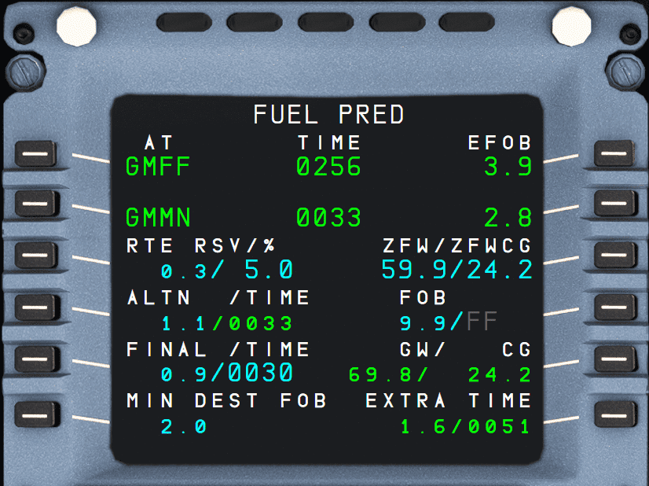

# FUEL PRED: Fuel Prediction Page

## Description

The FUEL PRED page displays fuel prediction information at destination and alternate, as well as fuel management data after the engines are started. The flight crew accesses the FUEL PRED page, by pressing the FUEL PRED key on the MCDU.

!!! note
    The flight crew can also call up this page by pressing the “→” key on the MCDU when on the INIT A page.

!!! info ""
    Fuel prediction in the A32NX is not yet accurate.

## Usage

!!! note
    All fields are dashed before engines are started.

- AT/UTC-TIME/EFOB (1L, 1M, 1R)
    - Display time and fuel predictions to the primary destination. TIME is displayed before takeoff. UTC predictions are displayed after takeoff. If the flight crew has entered an Estimated Takeoff Time (ETT), the UTC is displayed.
    - The EFOB at destination will turn to amber if it becomes less than the MIN DEST FOB value.

- AT/UTC-TIME/EFOB (2L, 2M, 2R)
    - These lines display time and fuel predictions to the alternate airport.

- RTE RSV / % (3L)
    - Before departure, this field displays the route reserve fuel and the corresponding percentage of trip fuel. 
    - It may be equal to 0.0 if such is the policy of the operator. The crew can either enter a fuel quantity or a percentage. 
    - After takeoff, it is dashed, and the corresponding fuel is added to the EXTRA fuel.

- ALTN / TIME (4L)
    - Displays alternate trip fuel and time, assuming that the Cost Index = 0 and that the aircraft flies at the default cruise flight level.  
    - The flight crew can modify the alternate fuel as required. In this case, alternate time will be dashed.

- FINAL/TIME (5L)
    - Displays the final reserve fuel and time calculated at the alternate airport (or destination airport, if selected in the “airline fuel policy” section of the AMI). 
    - The flight crew may enter a final fuel or time, and the system will compute associated holding time/fuel available.
    - The system assumes a holding pattern at 1 500 ft AGL, with the aircraft in CONF1 at maximum endurance speed (racetrack pattern, altitude and selected airport can be modified through the “airline fuel policy” section of the AMI).

- MIN DEST FOB (6L) 
    - Displays the expected Minimum Fuel at Destination. 
    - It is equal to the FINAL + ALTN fuel. 
    - The field can be modified directly by the flight crew, and is also impacted by the modification of the ALTN and/or the FINAL fuel.

- ZFW/ZFWCG (3R)
    - Displays the Zero Fuel Weight (ZFW) and Zero Fuel Weight Center of Gravity (ZFWCG) values, as entered before engine start on the INIT B page. 
    - The flight crew can re-enter or modify these values after engine start on the FUEL PRED page. 
    - If at engine start no ZFW or ZFWCG values have been entered, amber boxes are displayed in the corresponding field. The crew must enter the ZFW/ZFWCG values to obtain a speed profile and predictions.

- FOB (4R)
    - Displays the Fuel On Board (FOB) calculated by the FMGS and/or the following fuel sensors:
        - Fuel flow and fuel quantity sensors (/FF+FQ)
        - Fuel flow sensors only (/FF)
        - Fuel quantity sensors only (/FQ).
    - The flight crew can modify the FOB value in flight, or modify the
      sensors used by entering “/FF”, “/FQ” or “/FF+FQ”, as required.

        !!! info ""
            Changing sensors is not yet supported by the A32NX. 

- GW/CG (5R)
    - The FMS continuously updates the Gross Weight (GW) and Center of Gravity (CG) during the flight. 
    - The field displays dashes, as long as the system is not calculating the Fuel On Board, or ZFW has not been entered by the flight crew. 
    - If after engine start ZFW and FOB are defined but GWCG cannot be computed (ZFWCG missing), 25 % is used as a default value and is displayed in amber small font. "INITIALIZE WEIGHT/CG" amber message is triggered on MCDU scratchpad and the crew must enter ZFWCG in (3R). 
    - The field cannot be modified.

- EXTRA/TIME (6R)
    - Displays the amount of extra fuel, and the resulting time available for holding over the primary destination.
    - EXTRA FUEL = FOB - (TAXI + TRIP + RSV + MIN DEST FOB). 
    - This field displays its information in small green font, and it cannot be modified by the flight crew.
