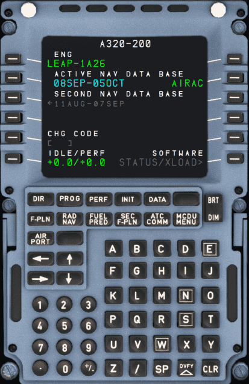

# Multipurpose Control and Display Unit

## Chapters

!!! block ""

    {loading=lazy width=50% align=left}

    | Page                             | 
    |----------------------------------|
    | [MCDU Interface](interface.md)   | 
    | -------------------------------- |   
    | [DIR](dir.md)                    | 
    | [PROG](prog.md)                  | 
    | [PERF](perf.md)                  | 
    | [INIT](init.md)                  | 
    | [DATA](data.md)                  | 
    | [F-PLN](f-pln.md)                | 
    | [RAD NAV](rad-nav.md)            | 
    | [FUEL PRED](fuel-pred.md)        | 
    | [SEC F-PLN ](sec-f-plan.md)      | 
    | [ATC COMM](atc-comm.md)          | 
    | [MCDU MENU](mcdu-menu.md)        | 
    | -------------------------------- | 
    | [MCDU Messages](messages.md)     | 

## Description

The Multipurpose Control and Display Unit (MCDU) is the main interface for the flight crew to interact with the Flight Management Guidance Computer (FMGC). There are two independent MCDUs installed in the A320.

!!! warning "Currently the A32NX only has one mirrored MCDU. This will be split into two in the future."

Typical usage is the definition and selection of a flight plan for lateral and vertical navigation during various flight phases.

After entry or selection of the flight plan and other required performance data into the MCDU, the Flight Management Guidance System (FMGS) generates the climb and descent profiles for departure and arrival, provides automatic airplane guidance, and computes current and predicted progress along the flight plan.

This section describes the MCDU in detail, covering each page and also the standard process for setting up a flight.

!!! tip "Additional Resources"
    Also see the following resources for further feature information:

    - [MCDU Setup Procedure](../../beginner-guide/preparing-mcdu.md) in our [Beginner Guide](../../beginner-guide/overview.md).
    - Advance Flight Planning Guides
        - [Direct To (DIR TO)](../../advanced-guides/flight-planning/direct.md)
        - [Discontinuities](../../advanced-guides/flight-planning/disco.md)
        - [Fix Info](../../advanced-guides/flight-planning/fixinfo.md)
        - [Holds](../../advanced-guides/flight-planning/holds.md)
        - [Leg Types](../../advanced-guides/flight-planning/leg-types.md)

