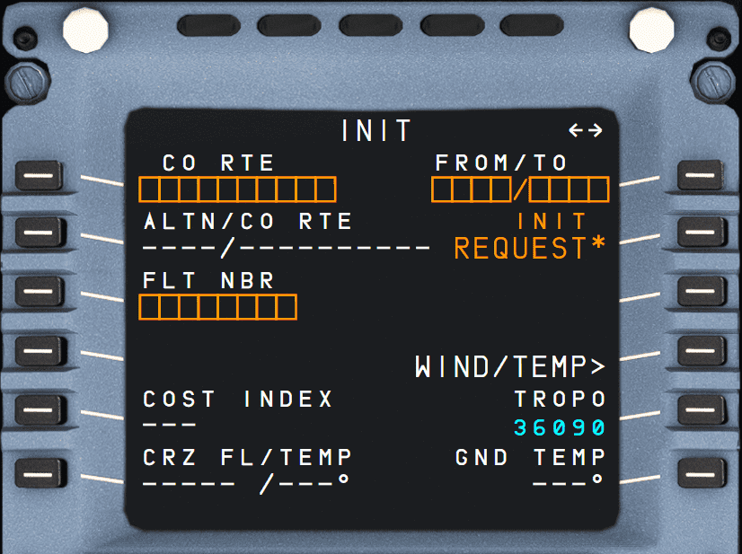
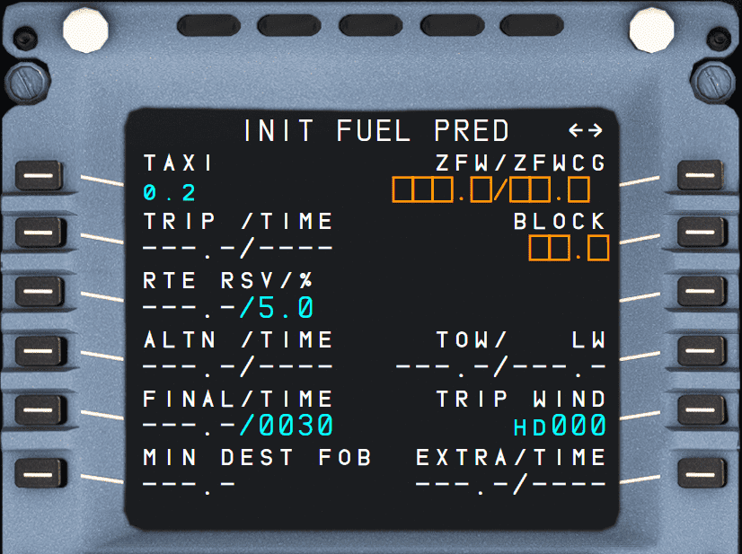

# INIT: Initialization Page

## INIT A

{loading=lazy}

### Description

The INIT A page is used by the flight crew to initialize the flight plan and align the inertial reference system.

### Usage

- CO RTE (1L):
    - A company route ID can be entered in this field and all data associated with that route.

    !!! info ""
        Currently, not available or INOP in the FBW A32NX for Microsoft Flight Simulator.

- ALTN/CO RTE (2L):
    - This field is dashed, until a primary destination is entered in the 1R field.
    - If a preferred alternate is associated with the primary destination, it is displayed in this field with the company route identification.
    - The crew may manually enter an alternate and company route.

    !!! info ""
        Currently, CO RTE is not available in the FBW A32NX for Microsoft Flight Simulator.

- FLIGHT NUMBER (3L):
    - Flight number associated with the company route or from the OFP
    - Can be modified.

- COST INDEX (5L):
    - Stored in the database along with the company route or taken from the OFP.
    - Can be modified.

- CRZ FL/TEMP (6L):
    - Usually stored in the database with the company route or taken from the OFP. If not, it has to be entered manually.
    - When not entered, the system will not provide predictions, while the aircraft is on the ground.
    - Used to enter the temperature at cruise flight level to refine the predictions. If not provided manually, these are computed for ISA conditions.

- FROM/TO (1R):
    - ICAO codes for airport of origin and destination must be entered here.
    - Automatically deletes any previously entered route and calls up the route selection page.
    - If one airfield of the pair is not in the database, the display changes to the NEW RWY page.

        !!! info ""
            Currently the "NEW RWY page" is not available or INOP in the FBW A32NX for Microsoft Flight Simulator.

- INIT REQUEST (2R):
    - Shown if no flight plan is entered or the origin/destination pair is changed.
    - Selecting this prompt sends the ground a request for active flight plan initialization (downlink message). 
      When the star is not displayed, a downlink message cannot be sent.
    - The uplink flight plan is automatically inserted in the active flight plan, before engine start, provided an active flight plan does not exist. After engine start, the uplink flight plan is sent to the secondary flight plan and manually inserted or rejected.

    !!! info ""
        In the FlyByWire A32NX, this function is implemented differently and loads a flight plan from SimBrief.
        

        Make sure to **not** have set a destination in the MSFS World Map. Otherwise the INIT REQUEST prompt will not show. 

- IRS INIT (3R):
    - Calls the IRS INIT page to allow aligning the IRS to the origin airport's coordinates.

- WIND/TEMP (5R):
    - Enters the wind pages
    - Winds in climb, cruise, descent, and approach are required to provide the pilot with reliable predictions and performance.
    - Wind pages allow the flight crew to enter and/or review the winds propagated by the FMGS or sent by ACARS for the various flight phases.
    
    !!! tip 
        "It is possible to import the wind data from the SimBrief OFP by pressing `WIND REQUEST` on the wind pages."

- TROPO (6R):
    - Default tropopause altitude is 36 090 ft.
    - Can be modified up to 60 000 ft maximum.
  
    !!! tip
        Learn more here: [Tropopause](https://skybrary.aero/articles/tropopause){target=new}

## INIT B

### Description

This page is used to initialize the gross weight and center of gravity of the aircraft before starting the engines.

This page automatically switches to the FUEL PRED page after the start of the first engine. From that moment on, the FMGC will use the FOB to compute its predictions.

### Usage

- TAXI (1L):
    - Estimated taxi fuel. Defaults to a preset value, usually 200 kg or 400 lb.
    - Can be adjusted in this field.

- TRIP/TIME (2L):
    - Displays trip fuel and time in green when predictions become available.
    - Cannot be modified.

- RTE RSV/% (3L):
    - Displays the contingency fuel for the route and the corresponding percentage of trip fuel in blue.
    - It may be 0.0, if operator's policy.
    - Pilots can either enter a fuel quantity, or a percentage.

- ALTN/TIME (4L):
    - Alternate trip fuel and time in blue and green (assuming Cost Index = 0 and default cruise flight level).
    - Can be modified as required. In this case, alternate time will be dashed.

- FINAL/TIME (5L):
    - Final reserve fuel and time calculated at the alternate airport or destination airport (in blue), depending on the “airline fuel policy” section of the AMI (Airline Modifiable Information).
    - FINAL is dashed and FINAL TIME defaults to the value specified in the AMI file (typically 30 min) before any entry is made.
    - Pilots may enter final fuel or time, causing the system to compute associated holding time/fuel available.
    - Holding patterns are assumed at 1500 ft AGL, with the aircraft in CONF 1 at maximum endurance speed (racetrack pattern, altitude and selected airport can be modified through the “airline fuel policy” section of the AMI).

- MIN DEST FOB (6L):
    - Expected minimum fuel at destination in blue. By default, equal to the ALTN + FINAL fuel.
    - Flight crew can modify this directly.
    - Is impacted by the modification of ALTN and/or FINAL fuel.

    !!! note ""
        If pilot entry of MIN DEST FOB is lower than ALTN + FINAL fuel, the message “CHECK MIN DEST FOB” is triggered on the MCDU.

- ZFW/ZFWCG (1R):
    - Shows the Zero Fuel Weight (ZFW) and Zero Fuel Weight CG (ZFWCG) in blue.
    - Must be entered to receive a speed profile and predictions.

    !!! note 
        “ENTRY OUT OF RANGE” message appears when entry is beyond acceptable values.

    !!! tip
        The FlyByWire A32NX can calculate these values for you. Press the corresponding LSK 1R once to get the computed values in the scratchpad, and press the LSK 1R again to save the values in this field.

- BLOCK (2R)
    - Block fuel is a mandatory entry.
    - When entered, the page title changes to INIT FUEL PREDICTION.

    !!! tip
        Block fuel is the total fuel required for the flight and is the sum of the Taxi fuel, the Trip fuel, the Contingency fuel, the Alternate fuel, the Final Reserve fuel, the Additional fuel and any Extra fuel carried. 
        It is usually provided in the SimBrief flight plan.  
        See [SimBrief Documentation](https://www.simbrief.com/system/guide.php#dosummary){target=new}. 
  

- FUEL PLANNING (3R)
    - Amber color.
    - Starts a fuel computation by the FMGC based on the current hypothesis and zero (0) extra.
    - When selected, FUEL PLANNING becomes green, and the BLOCK field is dashed during FMGC computation. The page title is changed to INIT FUEL PLANNING, and the FUEL PLANNING prompt is replaced by BLOCK CONFIRM*, once the block fuel is computed by the FMGC.
    - Computation automatically restarts if parameters used to compute the prediction are modified before confirmation.

    !!! info ""
        Currently, fuel prediction is not yet accurate in the FBW A32NX for Microsoft Flight Simulator.

- TOW/LW (4R)
    - Shows in green the computed Takeoff Weight (TOW) and Landing Weight (LW) at the primary destination.
    - Cannot be modified.

- TRIP WIND (5R)
    - Field (blue) for the entry of an average/mean wind component of the full trip (origin to destination). 
      Defaults to HD000 (small font) after entry of a FROM/TO or CO RTE.
    - An entry starting with –, H, HD is considered a headwind
    - An entry starting with +, T, TL is considered a tailwind.
    - A manually entered wind speed is shown in a large blue font.
    - When a wind in entered on the CLIMB, CRUISE or DESCENT WIND page, or on the PERF APP page, the system does not 
      use the trip wind any longer, and the corresponding field is dashed.

- EXTRA/TIME (6R)
    - Displays in green extra fuel and the resulting time available for holding over the primary destination.
    - Calculated as: EXTRA FUEL = BLOCK – (TAXI + TRIP + RSV + MIN DEST FOB).
    - Cannot be modified.
