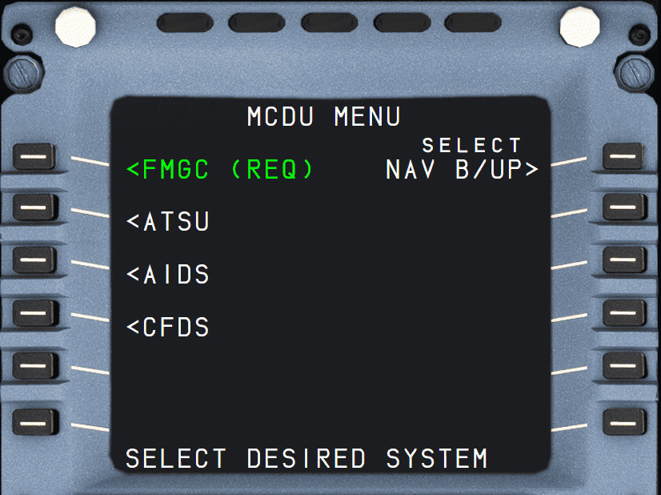
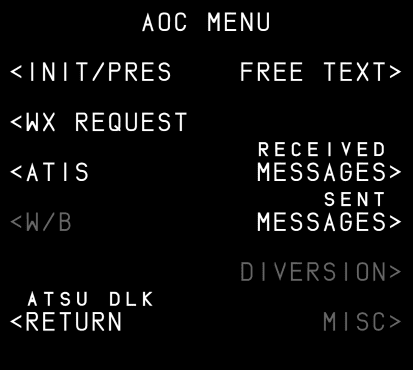
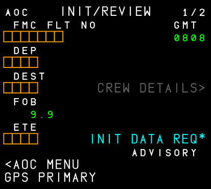
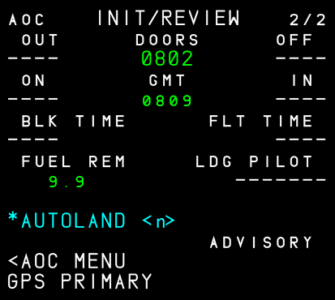
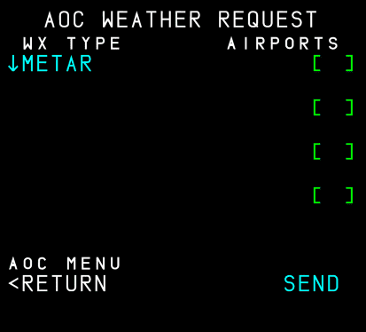
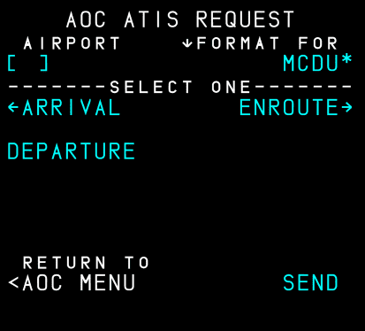

# MCDU MENU: MCDU Menu Page

## Description

This page lists the various systems which are accessible via the MCDU. The system automatically displays this page at power up.

## Usage

- FMGC (REQ) (1L)
    - Brings up the DATA A/C STATUS page.

- ATSU (2L)
    - ATSU interface enables the following AOC capabilities.
        - F-PLN initialization (flight plan and performance data)
        - Takeoff data
        - Wind data
        - Flight reports
        - Broadcast data
    - ATC MENU
        - Brings up the ATC COMM page.
    - AOC MENU
        - The FMS AOC function gives an interface between a ground station and one onboard FMGC, allowing data transmission between these two computers via the ACARS Management Unit or the ATSU. 
        - See below for details on this page [AOC MENU Page](#aoc-menu-page)
    - DATALINK STATUS
        - Shows the DATALINK STATUS page with information about the state of the various data link options.   
    - COMM MENU
  
        !!! info ""
            Currently not available or INOP in the FBW A32NX for Microsoft Flight Simulator.
 
- AIDS (3L)

    !!! info ""
        Currently not available or INOP in the FBW A32NX for Microsoft Flight Simulator.

- CFDS (4L)

    !!! info ""
        Currently not available or INOP in the FBW A32NX for Microsoft Flight Simulator.

- NAV B/UP (1R)
    - The MCDU NAV B/UP allows to link a MCDU to its associated IRS in order to allow the flight crew to monitor the navigation and to be provided with some basic flight planning functions in case of FM 1 + 2 failure.
    
    !!! info ""
        Currently not available or INOP in the FBW A32NX for Microsoft Flight Simulator.

### AOC MENU Page

- INIT/PRES (1L) --> See [INIT/PRES](#initpres-page)
- WX REQUEST (2L) --> See [WX REQUEST](#wx-request-page)
- ATIS (3L) --> See [ATIS](#atis-page)
- FREE TEXT (1R) --> See [Free Text Guide](../../../../aircraft/a32nx/feature-guides/freetext.md) 
- RECEIVED MESSAGES (3R)
    - Shows list of received messages (WX, ATIS, Free Text).
    - Press the LSK left of the `<` to read the full message
- SENT MESSAGES (4R)
    - Shows list of sent messages (Free Text).
- DIVERSION (5R)

    !!! info ""
        Currently not available or INOP in the FBW A32NX for Microsoft Flight Simulator.

- MISC (6R)

    !!! info ""
        Currently not available or INOP in the FBW A32NX for Microsoft Flight Simulator.

### INIT/PRES Page

!!! block ""
    {loading=lazy align=center width=49%}
    {loading=lazy align=center width=49%}

This page is used to initialize the FMS with the flight plan from SimBrief. 

Press `INIT DATA REQ*` to start the SimBrief import. 

Also see [SimBrief Integration](../../../../aircraft/a32nx/feature-guides/simbrief.md) for more details.

The rest of these two pages is for reviewing the imported data. The second page also provides some information about various times for events like doors closed, takeoff, etc. Some of these are only available after the flight. 

### WX REQUEST Page

This page is used to request weather data from the 
[configured data source](../../../../aircraft/a32nx/feature-guides/flypados3/settings.md#atsuaoc).

- WX TYPE (1L) 
    - Change the requested data between METAR and TAF.
- AIRPORT ICAO (1R-4R)
    - Enter the ICAO code of the airport for which the weather is requested.
- SEND
    - Send the request to the configured data source.
    - The data will be received and displayed on the [RECEIVED MESSAGES](#aoc-menu-page) page.

### ATIS Page

This page is used to request ATIS data from the
[configured data source](../../../../aircraft/a32nx/feature-guides/flypados3/settings.md#atsuaoc).

- AIRPORT ICAO (1L)
    - Enter the ICAO code of the airport for which the ATIS is requested.
- Select one of (2L, 3L, 2R)
    - ARRIVAL (2L)
    - DEPARTURE (3L)
    - ENROUTE (2R)
    - The selected type of ATIS will **not** have an arrow next to it.
- SEND
    - Send the request to the configured data source.
    - The data will be received and displayed on the [RECEIVED MESSAGES](#aoc-menu-page) page.

