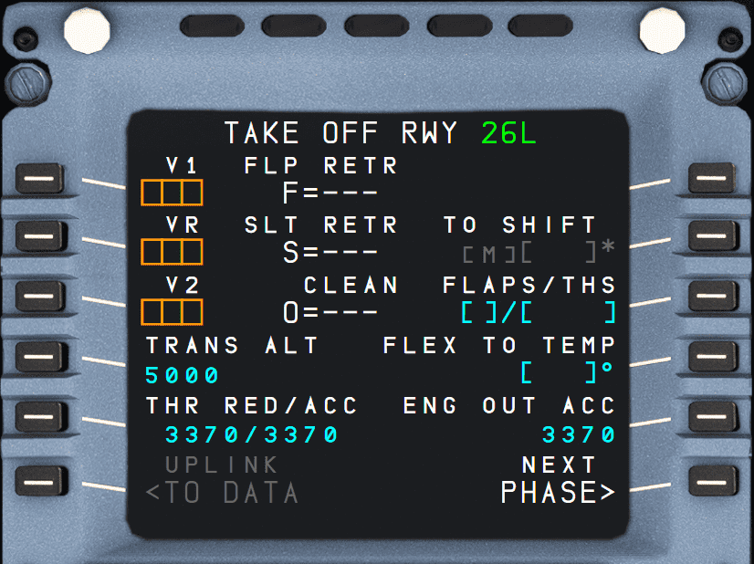
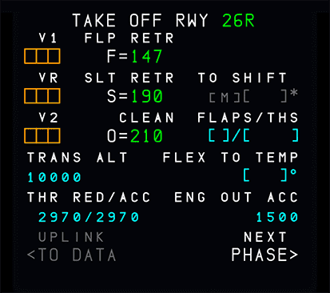
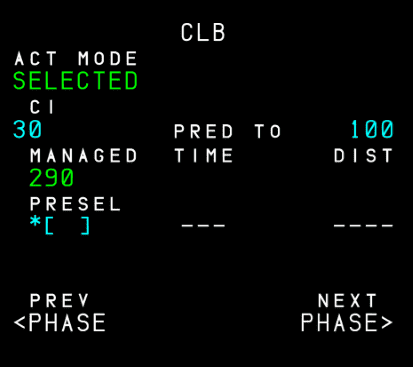
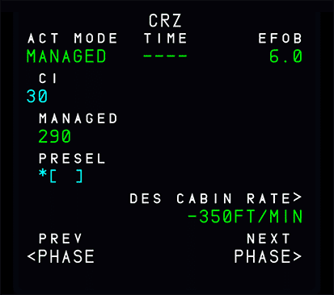
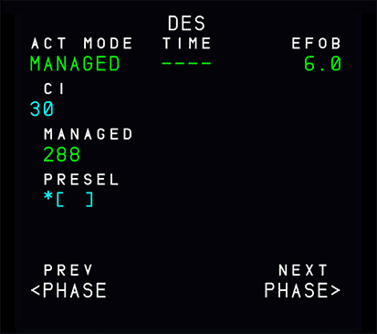
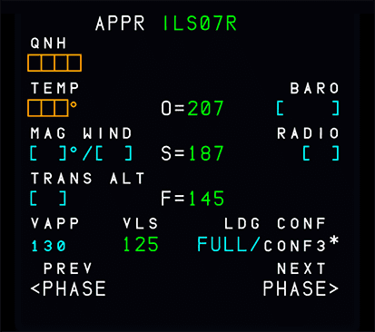
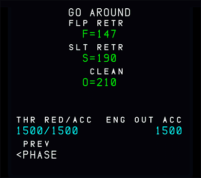

# PERF: Performance Page

{loading=lazy}

## Description

The Airbus A320neo divides each flight into these flight phases:

`PREFLIGHT`, `TAKEOFF`, `CLIMB`, `CRUISE`, `DESCENT`, `APPROACH`, `GO-AROUND`, `DONE`.

Except for the `PREFLIGHT` and `DONE` phases, each flight phase has a performance page. These pages display performance data, speeds related to the various phases, and predictions. When pressing the `PERF` key, the page for the currently active phase is brought up. Pages for already completed flight phases are not available anymore. In the `PREFLIGHT` and `DONE` phases, pressing the `PERF` key brings up the takeoff performance page.

Prompts on each PERF page:

- PREV PHASE (6L):
    - To switch to the page for the previous phase. Not available on the takeoff performance page or already completed phases.
- ACTIVATE APPR PHASE (6L):
    - Replaces the PREV PHASE prompt when the current phase is active.
    - Push to activate the APPR phase (needs a second push for confirmation).

    !!! note ""
        Note: If the pilots activate the approach phase inadvertently, they can reselect the cruise flight level into the progress page to reactivate the cruise phase.
- NEXT PHASE (6R):
    - To review the performance page for the next phase.

## TAKE OFF

{loading=lazy}

- TITLE TAKE OFF:
    - Green when active, white when inactive.

- V1 (1L) VR (2L) V2 (3L):
    - The boxes remain amber, as long as the pilot did not make entries in them. The pilot can modify any entry, as long as the takeoff phase is not active.

        !!! note 
            If the pilot does not enter V2, the SRS mode will not be available at takeoff.

        !!! note 
            If the takeoff shift (see below) or the runway is changed after V1, V2 or VR insertion, but the origin airport remains the same, the MCDU message “CHECK TAKEOFF DATA” is displayed, but all takeoff parameters are retained.
    
    !!! tip
        In the FlyByWire A32NX, pilots can calculate takeoff performance data via the flyPad. Visit our flyPad Performance Page guide for more information.

        [flyPad Performance Page](../../../fbw-a32nx/feature-guides/flypados3/performance.md){target=new .md-button}

        !!! warning "Not Available in the Stable Version; you can instead click on the LSK next to V1, VR and V2 to let the aircraft calculate the V-Speeds for you."
        

- TRANS ALT (4L)
    - This field displays the navigation database default transition altitude (if defined) once the origin airport is entered. The pilot can modify it.

- THR RED (5L)
    - The thrust reduction altitude is the altitude at which the pilot should reduce the thrust from TOGA/FLX to MAX CLIMB (CL detent).
    - The thrust reduction altitude defaults to 1500 ft above the runway elevation, or to the altitude set by the airline.
        
    !!! tip 
        The default value can be changed in the EFB Aircraft Options settings page.

    - The pilot can modify this altitude: The minimum is 400 ft above the runway elevation.

- ACC (5L)
    - The acceleration altitude is the altitude at which the climb phase is activated and the target speed is changed to the initial climb speed.
    - The default value is 1500 ft above runway elevation.

        !!! tip 
            The default value can be changed in the EFB Aircraft Options settings page.
  
  - The flight crew can modify the value. The minimum value is 400 ft above runway elevation, though it is always higher than, or equal to, THR RED.
    
    !!! note
        - A clearing action reverts both values to the default values.
        - When the flight crew selects an altitude on the FCU that is below THR RED, it brings THR RED and ACC down to this altitude. (The 400 ft minimum still applies).

- UPLINK TO DATA (6L)
    - This key calls up the UPLINK TO DATA REQ page. It is only displayed in the preflight and done phases.

    !!! info ""
        Currently not available or INOP in the FBW A32NX for Microsoft Flight Simulator.

- TO SHIFT (2R)
    - Distance in meters or feet between the beginning of the runway and the aircraft's takeoff position. The flight crew should insert this value when taking off from an intersection to ensure a correct update of the FM position.
      The takeoff shift value must be positive, and cannot be greater than the runway length.

    !!! info ""
        Currently not available or INOP in the FBW A32NX for Microsoft Flight Simulator.

- FLAPS/THS (3R)
    - Positions of the flaps and the trimmable horizontal stabilizer (THS) at takeoff to be entered by the crew.
    - Can be edited until takeoff, by entering “UP X.X” or “X.X UP”, or “DN X.X” or “X.X DN” for the THS.
    - See also the [Beginner Guide PERF TAKEOFF THS](../../a32nx-beginner-guide/preparing-mcdu.md#perf)

- FLX TO TEMP (4R)
    - Flight crew inserts the FLX TO temperature in Celsius for FLX takeoff setting purposes. It can only be entered during preflight. This value will be sent to the FADEC and displayed on the upper ECAM display.
    - See also the [Beginner Guide PERF TAKEOFF Flex Temp](../../a32nx-beginner-guide/preparing-mcdu.md#flex-temp)    

- ENG OUT ACC (5R)
    - Engine-out acceleration altitude, as defined in the database, or manually entered by the flight crew. 
    - This is for display only, as a reminder. It cannot be cleared. The above ACC altitude rules of (5L) apply to this field.

## CLIMB

{loading=lazy}

- TITLE CLB:
    - Green when active, white when inactive.

- ACT MODE (1L):
    - Displays the preselected or active speed mode: SELECTED or MANAGED. 
    - Can't be modified from this field.

- CI (2L):
    - Cost index, as initialized either on the INIT A page, defaulted from the database, or inserted in this field by the pilot.

- MANAGED (3L):
    - This field displays the FMGS computed ECON speed/Mach.
    - Before the CLIMB phase is active, a star is displayed next to the MANAGED speed, if the preselected speed mode is SELECTED. 
    - Pressing the 3L key in this case preselects MANAGED speed, and 4L reverts to brackets.
    
        !!! info ""
            Currently not available or INOP in the FBW A32NX for Microsoft Flight Simulator.

- PRESEL or SELECTED (4L):
    - Climb phase not active:
        - As long as the climb phase is not active, this field displays PRESEL. A preselected speed can be entered.
  
    - Climb phase active:
        - Filed title becomes SELECTED.
        - Displays selected (or preselected) SPD or MACH target.
        - Cannot be modified directly in this field, but it will update when the SPD/MACH is changed using the selection knob on the FCU.
        - If the FCU SPD/MACH selection knob is pushed it reverts to managed speed and the system selects/re-selects ECON SPD/MACH and (4L) is blank.

- Blank or EXPEDITE (5L):
    - Blank as long as the aircraft is in preflight.
    - Displays this legend when the takeoff or climb phase is active.
    - The flight crew cannot engage EXPEDITE from this field. It indicates the time and distance required to reach the altitude displayed in the 2R field, in case of climb at green dot.

    !!! info ""
        Currently not available or INOP in the FBW A32NX for Microsoft Flight Simulator.

- EO CLR (1R):
    - The system displays the EO CLR prompt in case of engine out in climb.

    !!! info ""
        Currently not available or INOP in the FBW A32NX for Microsoft Flight Simulator.

- PRED TO... (2R):
    - This field displays the target altitude for the predictions shown in 3R, 4R, or 5L. It defaults to FCU altitude, but the pilot can modify it to any altitude below CRZ FL.

    !!! info ""
        Currently not available or INOP in the FBW A32NX for Microsoft Flight Simulator.

- (3R) (4R) (5R):
    - These fields show time and distance predictions for the target altitude selected in (2R), computed for the current vertical mode and speed mode (MANAGED, SELECTED). These fields are displayed only while the takeoff, or climb phase is active.

    !!! info ""
        Currently not available or INOP in the FBW A32NX for Microsoft Flight Simulator.

## CRUISE

{loading=lazy}

- TITLE CRZ:
    - Green when active, white when inactive.

- ACT MODE (1L):
    - Displays the preselected or active speed mode: SELECTED or MANAGED. Can't be modified from this field.

- CI (2L):
    - Cost index, as initialized either on the INIT A page, defaulted from the database, or inserted in this field by the pilot.

- MANAGED (3L):
    - This field displays the FMGS computed ECON speed/Mach.
    - Before the CRUISE phase is active, a star is displayed next to the MANAGED speed, if the preselected speed mode is SELECTED. 
    - Pressing the 3L key in this case preselects MANAGED speed, and 4L reverts to brackets.

        !!! info ""
            Currently not available or INOP in the FBW A32NX for Microsoft Flight Simulator.

- PRESEL (4L)
    - Cruise phase not active:
        - A preselected speed or Mach number can be entered.
    - Cruise phase active:
        - This field is blank.

- TIME/UTC DES EFOB (1M/1R)
    - Before takeoff: Displays the flight time to destination and the predicted remaining fuel on board. If an estimated takeoff time has been entered, the field displays automatically the predicted arrival time (UTC) at the destination.
    - After takeoff: Displays the predicted arrival time at destination (UTC) and the remaining fuel on board.
    - EO CLR is displayed when an engine out is detected.

    !!! info ""
        Currently not available or INOP in the FBW A32NX for Microsoft Flight Simulator.

- STEP TO FL XX, DRIFT DOWN TO FLxxx, or TO T/D (2R):
    - The field, in combination with 3R, displays the predictions for the step point and the step altitude, the drift down altitude, or the Top of Descent.

    !!! info ""
        Currently not available or INOP in the FBW A32NX for Microsoft Flight Simulator.

- TIME/UTC and DIST (3R):
    - This field displays the time and distance to go to the various points identified (2R).

    !!! info ""
        Currently not available or INOP in the FBW A32NX for Microsoft Flight Simulator.

- DES CABIN RATE (4R)
    - This field displays MAX (computed DES cabin rate, maximum descent cabin rate). 
    - The pilot may modify the value
        - The FM then recomputes the top of descent in order to match this value. 
        - If the FM cannot match the pilot entry, the FM computed value overwrites the pilot entry. A clear action reverts to the default value (- 350 ft/min). DES CAB RATE being a negative value, 'minus” is not a necessary entry.

    !!! info ""
        Currently not available or INOP in the FBW A32NX for Microsoft Flight Simulator.
 
- STEP ALTS (5R)
    - This key calls up the STEP ALTS page.
    
    !!! info ""
        Currently not available or INOP in the FBW A32NX for Microsoft Flight Simulator.

## DESCENT

{loading=lazy}

- TITLE DES:
    - Green when active, white when inactive.

- ACT MODE (1L):
    - Displays the preselected or active speed mode: SELECTED or MANAGED. Can't be modified from this field.

- CI (2L):
    - Cost index, as initialized either on the INIT A page, defaulted from the database, or inserted in this field by the pilot.

- MANAGED (3L):
    - If the descent phase is not active:
        - Before the flight crew makes any entry. This field displays MANAGED in white, with the associated ECON descent Mach or speed in blue. The crew may overwrite the ECON descent Mach or speed by entering a Mach number or a  speed in this field. The system uses the pilot entry to compute the descent profile. The descent may be flown in managed using this new pilot entry.
        - The entry is modifiable. It can be cleared to revert to ECON speed/Mach.
    - If the descent phase is active:
        - The flight crew cannot make an entry in this field.
        - The field displays the ECON speed/Mach or the speed/Mach value previously entered by the pilot.

- Blank or SELECTED (4L):
    - If the descent phase is not active, or the descent phase is active but the active speed mode is MANAGED:
        - This field is blank.
    - If the descent phase is active and the active speed mode is SELECTED:
        - The field displays the speed or Mach target manually selected by the pilot.
          “SELECTED” is displayed in the (1L) field.
        - To modify the field value, the pilot will use the SPD/MACH selector knob of the FCU. (4L) field and FCU window will display the same value.
        - Pushing in the FCU speed selector knob activates the managed SPD/MACH target displayed in the (3L) field.

- Blank or EXPEDITE (5L):
    - If the descent phase is not active, this field is blank.
    - Displays this legend if the descent phase is active.
    - It indicates the time and distance required to reach the altitude displayed in the 2R field at M~MO~/V~MO~ speed. The pilot cannot select the EXPEDITE mode through this field.

- TIME/UTC DES EFOB (1M/1R)
    - Before takeoff: Displays the flight time to destination and the predicted remaining fuel on board. If an estimated takeoff time has been entered, the field displays automatically the predicted arrival time (UTC) at the destination.
    - After takeoff: Displays the predicted arrival time at destination (UTC) and the remaining fuel on board.
    - EO CLR is displayed when an engine out is detected.

    !!! info ""
        Currently not available or INOP in the FBW A32NX for Microsoft Flight Simulator.

- PRED TO... (2R)
    - This field displays the target altitude for the predictions in (3R), (4R) or (5R)
    - The display defaults to the altitude selected on the FCU. The flight crew can modify it to any altitude lower than present altitude.

    !!! info ""
        Currently, not available or INOP in the FBW A32NX for Microsoft Flight Simulator.

- (3R),(4R) or (5R)
    - These fields display time and distance predictions down to the target altitude selected in (2R), computed for the current vertical mode (DES or OP DES) and the indicated speed mode (MANAGED, SELECTED).

    !!! info ""
        Currently not available or INOP in the FBW A32NX for Microsoft Flight Simulator.

## APPROACH

{loading=lazy}

- TITLE APPR:
    - Green when active, white when inactive.

- QNH (1L)
    - \>180 NM from the destination:
        - Blue brackets are displayed
    
        !!! info ""
            Currently shows amber boxes in this case in the FBW A32NX for Microsoft Flight Simulator.
  
    - <180 NM:
        - Amber box is displayed to signify a mandatory input required.
        - Pilot must enter the QNH in hPa or in inches of mercury.

        - For hPa 3 or 4 digits
        - For inches of mercury:
            - 2 digits, or 2 digits followed by a decimal point and 2 additional digits.

        -Examples of how the system interprets input:
  
        - 1003 as 1003 hPa;
        - 29 as 29.00 in.
        - 29.92 as 29.92 in.

        !!! note 
            An erroneous entry of an OAT in QNH field, e.g., 22 °C, is accepted by the system as a QNH.
    
    - Pilots can modify this entry at any time.
    - The Cabin Pressure Controller (CPC) uses QNH to compute the cabin pressurization. Therefore, a wrong QNH entry may result in an inappropriate cabin pressurization.

- TEMP (2L):
    - Shows temperature at destination.
    - \> 180 NM from the destination:
        - Blue brackets are displayed
          
        !!! info ""
            Currently, shows amber boxes in this case in the FBW A32NX for Microsoft Flight Simulator.
  
    - < 180 NM:
        - Amber box is displayed to signify a mandatory input required.
    - Used by the FMGS to refine computation of the descent profile (ISA model).

- MAG WIND (3L)
    - Magnetic wind in knots at destination to be entered.
    - Transmitted to the vertical revision and flight plan B pages (which display wind direction as true, not magnetic).

- TRANS ALT (4L)
    - Shows transition altitude taken from the navigational database (small font) or entered by the flight crew (large font).
    - Pilots can modify it at any time.

- VAPP (5L)
    - Computed by FMGC, using the formula:
        - V~APP~ = V~LS~ + 1/3 of the headwind components (limited to V~LS~ + 5 as a minimum and V~LS~ + 15 as a maximum).
        - The flight crew can modify V~APP~.
        - A clear action reverts V~APP~ to the computed value.

        !!! note 
            V~LS~ = 1.23 V~S1G~ (Stall Speed) of the selected landing configuration (full or 3) but not less than V~MCL~.

- FINAL (1M)
    - Approach specified in the flight plan.
    - Can't be modified here.

- O, S, F, V~LS~ Speeds (2M, 3M, 4M)
    - See [Speeds](../../../airliner/abbreviations.md#additional-speeds) and [V-Speeds](../../../airliner/abbreviations.md#v-speeds) for more information.

- BARO (2R):
    - The Minimum Descent/Decision Altitude (MDA) with associated brackets, or
    - The Minimum Descent/Decision Height (MDH) with associated brackets, if the FCU setting is QFE
    - Pilots can modify this at any time.
    - If an entry in (3R) is made or changes the approach, this is cleared.

- RADIO (3R):
    - If an ILS approach is selected in the flight plan, this field shows "RADIO" and empty brackets.
    - Pilots enter decision height for CAT II or CAT III approaches.
    - The system will accept an entry of “NO", "NODH" or "NO DH".
    - If a BARO value is entered in (2R), this field is cleared.
    - The RADIO range is 0 to 700 ft.

- LDG CONF CONF3 (4R):
    - Pressed to configure a flaps 3 approach.
    - The active mode is displayed in large blue font.

## GO-AROUND

{loading=lazy}

- TITLE GO AROUND:
    - Green when active, white when inactive.

- THR RED ACC (5L):
    - Thrust reduction altitude and the acceleration altitude.
    - Thrust reduction altitude:
        - Altitude at which thrust must be reduced from takeoff/go-around thrust to maximum climb thrust.
        - “CLB” or “LVR CLB” flashing on flight mode annunciator
        - Defaults to 1500 ft above destination runway elevation, or to the altitude set by the airline.
        - Can be modified by the pilots
        - Minimum 400 ft above destination runway elevation.
    - Acceleration altitude:
        - Altitude at which target speed jumps to green-dot speed (see the note below)
        - Defaults to 1500 ft above destination runway elevation, or to the altitude set by the airline.
        - Can be modified by the pilots
        - Always equal to (or higher than) the thrust reduction altitude.

- ENG OUT ACC (5R)
    - Engine-out acceleration altitude, as defined in the database, or manually entered by the flight crew. This is for display only, as a reminder. It cannot be cleared. The above ACC altitude rules of (5L) apply to this field.

!!! note 
    When go-around is active, or if ALTN is enabled, or if a new destination is entered in the active flight plan and a new cruise flight level on the progress page, the go-around phase shifts automatically to the climb phase (target speed jumps from green dot speed to initial climb speed).
