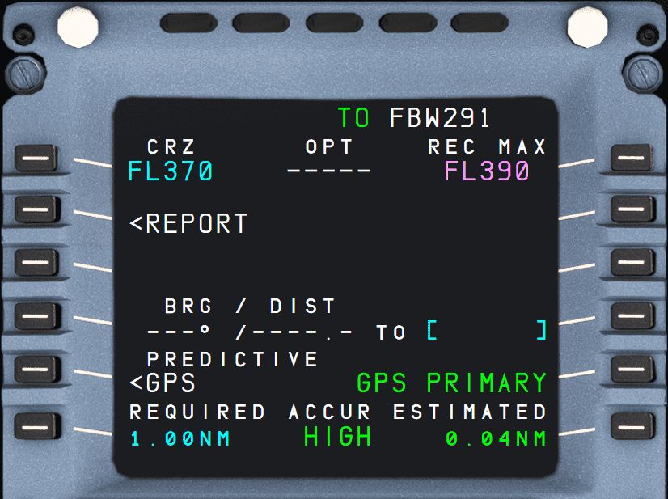

# PROG: Progress page

{loading=lazy}

## Description

The progress page has several functions:

- Change cruise flight level
- Accuracy of the Flight Management (FM) system
- Update the FM position
- Monitor the descent.

The progress page's title varies with each vertical flight phase.

## Usage

### CRZ (1L)

This data field contains the cruise flight level as entered on INIT A page or as entered into this field directly.

If the pilot enters an altitude into the FCU which is higher than this value, this value will be adjusted to the new altitude and a message appears in the Scratchpad line.

The value cannot be lower than the altitude selected in the FCU.

In the descent or approach phase, this field shows dashes.

### OPT (1M)

Displays the computed optimum flight level (in green), based on the current gross weight, cost index, temperature, wind, and a minimum estimated cruising time of 15 min.

The display flashes if an engine-out is detected.

### REC MAX (1R)

Displays the computed recommended maximum altitude (in magenta), based on the current gross weight and temperature, and assuming that the anti-ice is off.

Provides a value that allows the aircraft a 0.3 g buffet margin, a minimum rate of climb at MAX CL thrust, and level flight at MAX CRZ thrust. Limited to FL398.

If one engine is out, this field displays the computed recommended maximum engine-out altitude, based on the long-range cruise speed and assuming that anti-ice is off.

### REPORT (2L)

Opens the REPORT page.

This page displays information related to the FROM, TO, NEXT and DEST waypoints, as well as the current wind, temperature, distance, and time to the next cruise profile change.

!!! info ""
    This page is not fully implemented in the current FlyByWire A32NX.

### Position Update (3L)

!!! info ""
    Currently not available or INOP in the FBW A32NX for Microsoft Flight Simulator.

This function allows the flight crew to update the aircraft's FMS position to its actual position. The flight crew enters a navigation IDENT and presses the 3R LSK the moment the aircraft overflies this position.

### BRG/DIST (4L + 4R)

This data field (4L) shows the bearing and distance as computed by the FMGC to the navigation point entered on the right (4R).

The navigation point can be an airport, a waypoint, a NAVAID, or a runway.

This data field accepts an IDENTs, a latitude/longitude (LL), a place/bearing/distance (PBD), or a place-bearing/place-bearing (PBX).

Examples:

- IDENT: `ESSA26` ==> Runway 26 at ESSA
- LL: `5939.1N/01755.1E` ==> ESSA (as per chart)
- PBD: `ESSA/270/20` ==> 20NM West of ESSA
- PBX: `ESSA-270/ESGG-0` ==> Intersection of a line West of ESSA and North of ESGG

### Predictive GPS (5L)

Opens the PREDICTIVE GPS page.

Displays information relative to predictive availability of GPS PRIMARY at destination, and at any waypoint selected by the crew.

!!! info ""
    This page is not fully implemented in the current FlyByWire A32NX.

### GPS Source (5R)

GPS PRIMARY is displayed when the FMS navigation mode is GPS PRIMARY. When GPS PRIMARY is not available, or navigation mode is not GPS/IRS, this field is blank.

The scratchpad displays the relevant “GPS PRIMARY″ message when this prompt appears; and “GPS PRIMARY LOST”, when the field turns to blank.

### GPS Accuracy (6L + 6M + 6R)

6L REQUIRED: This field displays the default value for the required navigation accuracy level. The pilot can modify it. Provided no pilot entry has been made, the default value changes according to the actual flight area (En route, terminal, approach).

6M ACCUR HIGH/LOW: Shows the FMS's estimate of the navigational accuracy. “HIGH” when accuracy matches the criteria of the area currently flown. “LOW” when accuracy does not match the criteria of the area.

6R ESTIMATED: The current estimated navigation accuracy value (EPE) as computed by the FMS.
