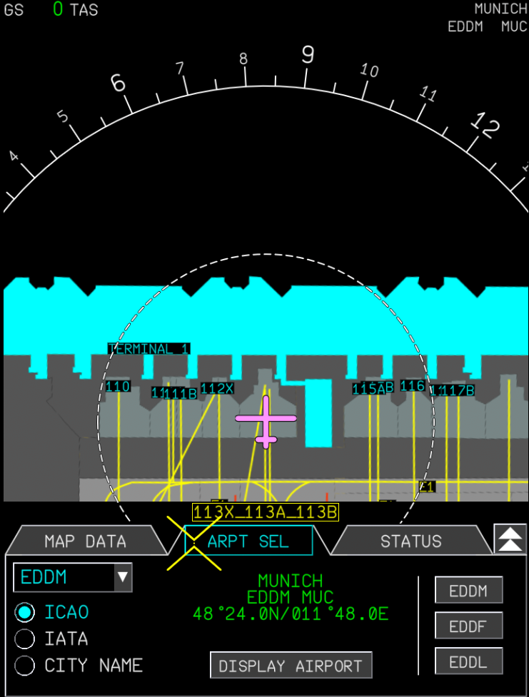
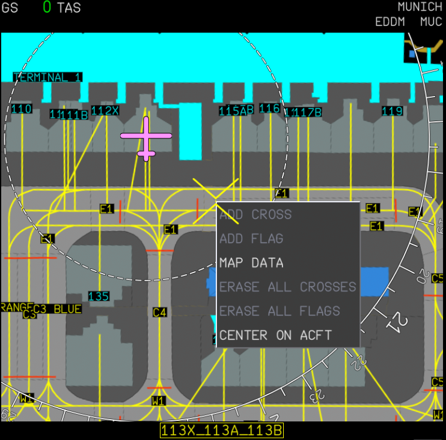
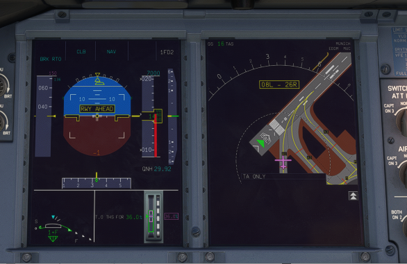
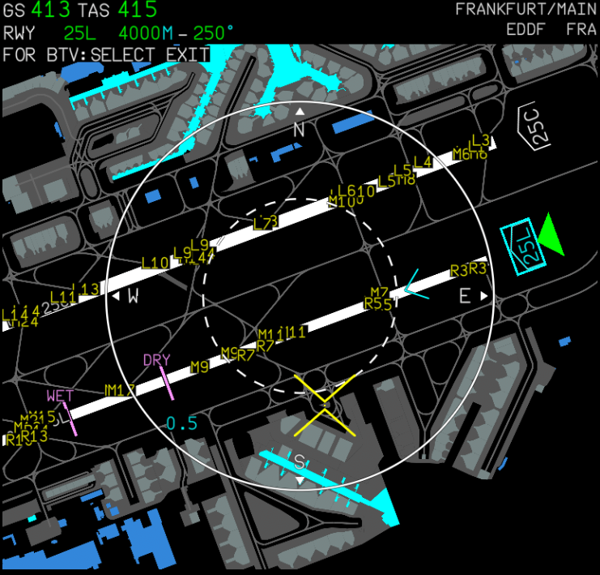
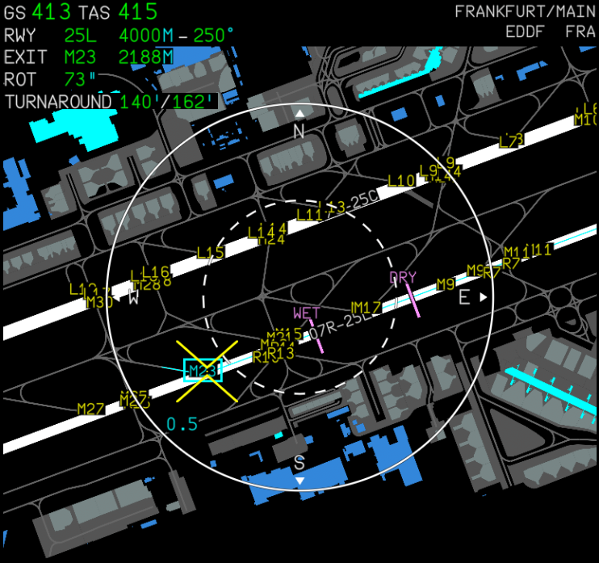
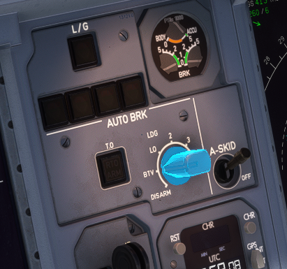
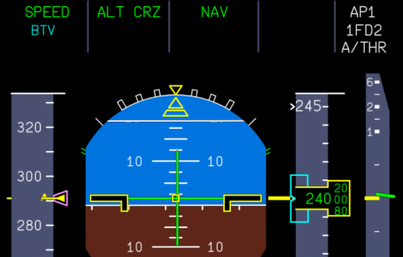
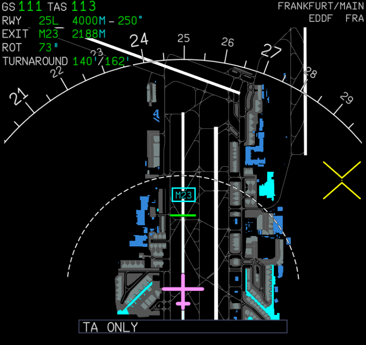

# Onboard Airport Navigation System (OANS) & Brake To Vacate (BTV)

Both the OANS (also known as Airport Navigation Function on the A350) and BTV add a high operational benefit to the A380,
simplyfing navigation on complex airports and allowing optimal turnaround times.

This advanced guide introduces the basic operation of the airport navigation function, the approaching runway advisory as
well as setup and operation of BTV.

!!! warning "Disclaimer"
    
Navigraph Ultimate subscription required

    The OANS function currently relies on data provided by Navigraph, which can only be accessed with a Navigraph Ultimate
    subscription.

    We're working on enabling OANS using the MSFS scenery data, however this is work-in-progress.

    BTV can be set up manually without the OANS airport map through the OANS control panel, this is however not explained in this guide.

---

## Airport navigation

The OANS features a moving airport map on the flight crew's navigation display (ND). Any airport contained in the Navigraph
AMDB database can be selected for display.

On the ground at the departure airport, the airport map should be loaded automatically.
Airports can be selected manually through the OANS control panel, which can be opened via the arrow button on the lower
right of the ND. After selection of an airport, a click on "DISPLAY AIRPORT" loads the airport map.

The OANS airport map is active in ROSE NAV, ARC and PLAN EFIS modes. In PLAN mode, any airport of the database can be displayed.
In all modes, the center of the map can be moved using the mouse (click and drag in the navigation display).

If you want to center the map on the aircraft again, double click on the map to open the context menu and select "CENTER ON ACFT".

## Approaching Runway Advisory

If the aircraft is on the ground and ground speed is below 40 knots, OANS continuously checks the aircraft protection area
in front of the aircraft (as wide as the wingspan, projected 7 seconds ahead) for runways. When detecting a runway inside this
area, an advisory is triggered on the PFD and ND. The advisory disappears when the above conditions aren't met anymore, or
the aircraft has entered the runway.

There is no aural warning (as RAAS).

## BTV setup

As part of the descent preparations, BTV is usually set up. After having selected the landing runway in the FMS, switch
the EFIS mode selector to PLAN, and load the destination airport using the OANS control panel. The airport map now shows
your destination airport, with the FMS landing runway marked with a green arrow in front of the runway identifier (QFU).
Clicking on the runway identifier selects this runway for BTV.

After selecting a runway, OANS displays two magenta lines projecting the required minimal stopping distance for DRY and WET
conditions. The targeted exit should be chosen after the WET line only, this provides a safety margin. To finalize the
selection, the runway exit is selected by clicking on the corresponding label.
The upper left of the ND now shows:

- The runway identifier, length and bearing
- The exit identifier, and requested stopping distance
- The runway occupancy time (ROT) in seconds
- The turnaround time in minutes, with full reverse and idle reverse during rollout

To finalize the setup, the auto brake mode selector knob is turned to the "BTV" option, which arms BTV (this should be
checked in the PFD FMA).

## BTV operation after touchdown

After touchdown of the main and nose wheels, BTV will become active and annunciated in the FMA. BTV monitors the deceleration of the aircraft with respect to the aircraft position and the exit selected and calculates when to start apply braking.

Braking with BTV is quite different to standard autobrake modes, with BTV most of the braking happens very late in the landing roll and can be a bit disconcerting initially.

This is done to minimise the energy absorbed by the brakes, lowering the brake temperatures and enabling a quicker turnaround.

A green bar indicates the predicted stopping distance.

BTV disarms, when one of these conditions apply:

- The aircraft reaches the runway exit at the release speed of 10 knots
- Flight crew applies a larger braking force through the pedals than BTV
- Auto brake mode selector is turned to the DISARM position
- A/THR instinctive disconnect push buttons (on the outside of the thrust levers) is pushed (This is the normal method of disarming, at 70kts groundspeed)

For the last three conditions, the "AUTO BRK OFF" memo and aural callout will be triggered.
