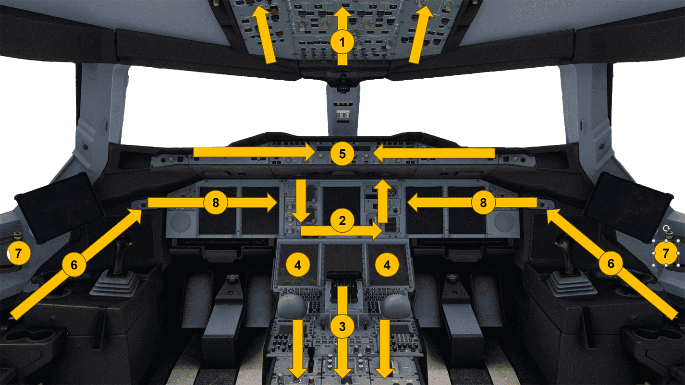

<link rel="stylesheet" href="/stylesheets/bg.css">

# Cockpit Preparation

This guide will help you with preparing and powering up the Airbus A380.  
It includes images to help you understand the locations of all buttons and switches.

!!! warning "Disclaimer"
    
This is for simulation purposes only.

    The level of detail in this guide is meant to teach an Airbus A380 beginner to start the aircraft correctly.

    A *beginner* is defined as someone familiar with flying a GA aircraft or different types of airliners. Aviation 
    terminology and know-how is a requirement to fly any airliner, even in Microsoft Flight Simulator.

    This guide simplifies the process of starting the aircraft to accomodate beginners and the fact that this is a 
    simulation. More advanced sim pilots can use the [A380X SOP](../a380x-sop.md) directly. 

    When this guide refers to ATC it is referring to any Online ATC network but **NOT** the built-in ATC in the 
    simulator as this is very unrealistic and unreliable.

    
---

## Prerequisites

This guide assumes that your aircraft is in a cold and dark state at a gate.

[Download FlyByWire Checklist](../assets/sop/FBW_A380X_Checklist.pdf){ .md-button target=new }

## Pre-checks

??? tip "What and Why"
    Before starting the aircraft, we need to ensure that all switches are in the correct position.
    This is to prevent any damage to the aircraft systems and to ensure that the aircraft is ready for flight.

    (Of course, this is not an issue in the sim, but in real life it is crucial to check this!)

`ENGINE MASTER SWITCHES (1, 2, 3, 4) .................................. OFF` 
`PARKING BRAKE (OR CHOCKS).............................................. ON` 
`SPEED BRAKE LEVER .............................................. RETRACTED` 
`FLAPS LEVER .................................................... RETRACTED` 
`WEATHER RADAR ........................................................ OFF` 
`ENGINE MODE SELECTOR ................................................ NORM` 
`THRUST LEVERS ....................................................... IDLE` 
`GEAR LEVER .......................................................... DOWN` 
`WIPERS (BOTH) ........................................................ OFF` 

??? tip "How and Where"
    [Flight Deck Overview](../../a380x-briefing/flight-deck){ .md-button }

    Use the Flight Deck Overview to locate the items mentioned above. The Flight Deck Overview is a
    clickable cockpit that will show you where each item is located.
    
    * [Engine Master Switches](../../a380x-briefing/flight-deck/pedestal/engine-master)
    * [Parking Brake](../../a380x-briefing/flight-deck/pedestal/parking-brake)
    * [Speed Brake Lever](../../a380x-briefing/flight-deck/pedestal/speed-brake)
    * [Flaps Lever](../../a380x-briefing/flight-deck/pedestal/flap-lever)
    * [Weather Radar](../../a380x-briefing/flight-deck/pedestal/surveillance)
    * [Engine Mode Selector](../../a380x-briefing/flight-deck/ovhd/eng-start)
    * [Thrust Levers](../../a380x-briefing/flight-deck/pedestal/throttle)
    * [Gear Lever](../../a380x-briefing/flight-deck/main-panel/center-right)
    * [Wipers](../../a380x-briefing/flight-deck/ovhd/wiper)

After these pre-checks, we can start the aircraft starting with the initial power up.

---

## Initial Power Up

??? tip "What and Why?"
    The initial power up is the first step in starting the aircraft. This is where we turn on the batteries and external
    power to provide power to the aircraft systems.

    The batteries are the first source of power for the aircraft. The external power is used to provide power to the
    aircraft systems when the engines are not running. The aircraft needs at least two external power units to power the 
    whole electrical network.

`ALL BATTERIES (BAT 1, ESS BAT, BAT 2, APU BAT) ........................ ON` 
`EXTERNAL POWER (2, 3, 1, 4) ........................................... ON` 
`COCKPIT LIGHTING ............................................. AS REQUIRED` 

??? tip "How and Where?"
    [Flight Deck Overview](../../a380x-briefing/flight-deck){ .md-button }

    Use the Flight Deck Overview to locate the items mentioned above. The Flight Deck Overview is a
    clickable cockpit that will show you where each item is located.
    
    * [Batteries](../../a380x-briefing/flight-deck/ovhd/elec)
    * [External Power](../../a380x-briefing/flight-deck/ovhd/elec)
    * [Cockpit Lighting](../../a380x-briefing/flight-deck/pedestal/cockpit-lighting)
    * [Glareshield Lighting](../../a380x-briefing/flight-deck/glareshield/glare-underside)

## Fire Tests and APU Startup

??? tip "What and Why?"
    The fire tests are done to ensure that the fire detection system is working correctly.

    The APU startup is done to provide power and bleed air to the aircraft systems when the engines are not running.

    Turning on and setting up the radios at this point is also important in case of any emergencies.

`RMP 1 and 2 ........................................................... ON` 
`STANDBY RADIO NAVIGATION ............................................. OFF` 
`COMMUNICATION FREQUENCIES ........................................... TUNE` 
`INTERPHONE RECEPTION ...................................... RELEASE/ADJUST` 
`APU FIRE ............................................ CHECK IN and GUARDED` 
`APU AGENT ............................................................ OFF` 
`ENGINE 1/2/3/4 FIRE.................................. CHECK IN and GUARDED` 
`ENGINE 1/2/3/4 AGENT 1 and 2 ......................................... OFF` 
`FIRE TEST .......................................................... PRESS` 
??? note "Fire Test Result"
    Verify that the fire detection systems and extinguishing systems are functional by checking the following items:

    A constant repetitive chime sound, the master warning light flashes on the glareshield, the ECAM displays the engine 
    fire alert messages (ENG 1(2)(3)(4) FIRE, APU FIRE, MLG BAY FIRE), All engine fire pushbutton and the auxiliary power 
    unit fire pushbutton displays in red, the squib light of the engine and apu agent pushbuttons are illuminated, the disch 
    light of the engine and auxiliary power unit agent pushbuttom illuminates and all fire lights on the engine master panel 
    illuminates.

`APU MASTER SWITCH ..................................................... ON` 
`APU START ............................................................. ON` 
`EXTERNAL POWER .................................................... AS REQ` 
??? note "External Power"
    It is recommended to keep the external power units to ON to reduce the APU load in hot weather conditions.

??? tip "How and Where?"
    [Flight Deck Overview](../../a380x-briefing/flight-deck){ .md-button }

    Use the Flight Deck Overview to locate the items mentioned above. The Flight Deck Overview is a
    clickable cockpit that will show you where each item is located.
    
    * [RMP 1 and 2](../../a380x-briefing/flight-deck/pedestal/rmp)
    * [Standby Radio Navigation](../../a380x-briefing/flight-deck/pedestal/rmp)
    * [Communication Frequencies](../../a380x-briefing/flight-deck/pedestal/rmp)
    * [Interphone Reception](../../a380x-briefing/flight-deck/pedestal/rmp)
    * [APU Fire](../../a380x-briefing/flight-deck/ovhd/apu-fire)
    * [Engine Fire](../../a380x-briefing/flight-deck/ovhd/eng-fire)
    * [APU Master Switch](../../a380x-briefing/flight-deck/ovhd/apu)
    * [APU Start](../../a380x-briefing/flight-deck/ovhd/apu)
    * [External Power](../../a380x-briefing/flight-deck/ovhd/elec)

## Cockpit Preparation Flow

The cockpit preparation flow is an easy way to remember the steps to startup and setup the aircraft correctly.
It follows a flow starting on the overhead panel on the left buttom moving up and then to the right.
Then it continues the flow on the main panel starting and moving to the pedestal, setting up the FMS to then continue
to the glareshield. At last the lateral consoles are checked and set up.

Normally, the flow is done by the two pilots in the cockpit. The First Officer (FO) does the overhead panel, main panel, 
pedestal, and his side of the cockpit for the glareshield, lateral consoles and his MFD. 

The Captain does his side of the cockpit for the glareshield and lateral consoles and his MFD.

In the simulator, we are usually alone, so we will do the flow on our own.

1. Overhead Panel from left to right and bottom to top - prepare
2. Main Instrument Panel - prepare
3. Pedestal - prepare
4. MFD (see [Preparing the FMS](03_preparing-fms.md))
5. Glareshield - set and crosscheck 
6. Lateral Consoles - Oxygen Mask Test
7. Windows - check closed/locked
8. PFD/ND - check

## Overhead Panel

??? tip "What and Why?"
    We scan the overhead panel from left to right and bottom to top to ensure that all switches are in the correct 
    position.

### Overhead Panel Left (bottom to top)

`ALL WHITE LIGHTS ..................................................... OFF` 
`RECORDER GROUND CTL (INOP)............................................. ON` 
`EVAC CAPT/CAPT & PURS (INOP)......................................... CAPT` 
`PROBE & WINDOW HEAT ................................................. AUTO` 
`ADIRS ALL IR MODE .................................................... NAV` 
??? note "ADIRS Alignment"
    It is recommended to align the inertial references as soon as possible. The initialization may take some time.
    It is also recommended to complete a full alignment if this is the first flight of the day, the flight crew has
    changed, the GPS is not available to all segment in the flights, or that the pilot expects long segments with low
    NAVAID coverage. It is recommended to perform a fast alignment for all other flight conditions.
`EMERGENCY LOCATOR TRANSMITTER (INOP) ............................... ARMED` 

??? tip "How and Where?"
    [Flight Deck Overview](../../a380x-briefing/flight-deck){ .md-button }

    Use the Flight Deck Overview to locate the items mentioned above. The Flight Deck Overview is a
    clickable cockpit that will show you where each item is located.
    
    * [All White Lights](../../a380x-briefing/flight-deck/overviews/ovhd)
    * [Recorder Ground Control](../../a380x-briefing/flight-deck/ovhd/rcdr-evac)
    * [Evacuation](../../a380x-briefing/flight-deck/ovhd/rcdr-evac)
    * [Probe and Window Heat](../../a380x-briefing/flight-deck/ovhd/adirs)
    * [ADIRS](../../a380x-briefing/flight-deck/ovhd/adirs)
    * [ELT](../../a380x-briefing/flight-deck/ovhd/elt)

### Overhead Panel Center (bottom to top)

`STROBE .............................................................. AUTO` 
`BEACON ............................................................... OFF` 
`NAV ....... ........................................................... ON` 
`REMAINING EXTERIOR LIGHTS .....................................AS REQUIRED` 
`SEAT BELTS ............................................................ ON` 
`NO MOBILE ........................................................... AUTO` 
`EMERGENCY EXIT LIGHTS ................................................ ARM` 
`ENGINE STARTER ...................................................... NORM` 
`APU BLEED ............................................................. ON` 
??? note "APU BLEED"
    It is not recommended to use the auxiliary power unit bleed system if a high-pressure ground air unit is connected to
    the aircraft. This can be checked on the bleed page of the system display. If there is pressure in the bleed air
    system, the high-pressure ground air unit is connected.
`XBLEED .............................................................. AUTO` 
`AIR FLOW ............................................................ NORM` 
??? note "AIR FLOW"
    The bleed system works with the flight management system. If there is no number of passengers entered into the
    flight-management-system, the airflow will be automatically set the air flow like when the value entered is the maximum
    number of passengers. If the number of passengers is entered, the airflow will automatically adjust to that number.
`CKPT ......................................................... AS REQUIRED` 
`CABIN ........................................................... PURS SEL` 
`TRIM TK FEED ........................................................ AUTO` 
`MAINTENANCE PANEL ALL LIGHTS.......................................... OFF` 

??? tip "How and Where?"
    [Flight Deck Overview](../../a380x-briefing/flight-deck){ .md-button }

    Use the Flight Deck Overview to locate the items mentioned above. The Flight Deck Overview is a
    clickable cockpit that will show you where each item is located.
    
    * [Strobe](../../a380x-briefing/flight-deck/ovhd/ext-lt)
    * [Beacon](../../a380x-briefing/flight-deck/ovhd/ext-lt)
    * [Nav](../../a380x-briefing/flight-deck/ovhd/ext-lt)
    * [Remaining Exterior Lights](../../a380x-briefing/flight-deck/ovhd/ext-lt)
    * [Seat Belts](../../a380x-briefing/flight-deck/ovhd/signs)
    * [No Mobile](../../a380x-briefing/flight-deck/ovhd/signs)
    * [Emergency Exit Lights](../../a380x-briefing/flight-deck/ovhd/signs)
    * [Engine Starter](../../a380x-briefing/flight-deck/ovhd/eng-start)
    * [APU Bleed](../../a380x-briefing/flight-deck/ovhd/air)
    * [X Bleed](../../a380x-briefing/flight-deck/ovhd/air)
    * [Air Flow](../../a380x-briefing/flight-deck/ovhd/air)
    * [Cockpit](../../a380x-briefing/flight-deck/ovhd/air)
    * [Cabin](../../a380x-briefing/flight-deck/ovhd/air)
    * [Trim Tank Feed](../../a380x-briefing/flight-deck/ovhd/fuel)
    * [Maintenance Panel](../../a380x-briefing/flight-deck/ovhd/maintenance)

### Overhead Panel Right (bottom to top)

`CARGO AIR COND ............................................... AS REQUIRED` 
`RADIO MANAGEMENT PANEL 3 .............................................. ON` 
`STBY RAD NAV ......................................................... OFF` 
`CVR TEST ........................................................... PRESS` 

??? tip "How and Where?"
    [Flight Deck Overview](../../a380x-briefing/flight-deck){ .md-button }

    Use the Flight Deck Overview to locate the items mentioned above. The Flight Deck Overview is a
    clickable cockpit that will show you where each item is located.
    
    * [Cargo Air Conditioning](../../a380x-briefing/flight-deck/ovhd/cargo-air)
    * [Radio Management Panel 3](../../a380x-briefing/flight-deck/ovhd/rmp)
    * [Standby Radio Navigation](../../a380x-briefing/flight-deck/pedestal/rmp)
    * [CVR Test](../../a380x-briefing/flight-deck/ovhd/cvr)
   
## Main Instrument Panel

`SWITCHING PANEL ..................................................... NORM` 
`INTEGRATED STANDBY INSTRUMENT SYSTEM ............................... CHECK` 
`LANDING GEAR GRAVITY SYSTEM .......................................... OFF` 
`CLOCK ...........................................CHECK and SET AS REQUIRED` 
`ANTI AKID (A-SKID) .................................................... ON` 

??? tip "How and Where?"
    [Flight Deck Overview](../../a380x-briefing/flight-deck){ .md-button }

    Use the Flight Deck Overview to locate the items mentioned above. The Flight Deck Overview is a
    clickable cockpit that will show you where each item is located.
    
    * [Switching Panel](../../a380x-briefing/flight-deck/main-panel/switching)
    * [Integrated Standby Instrument System](../../a380x-briefing/flight-deck/main-panel/isis)
    * [Landing Gear Gravity System](../../a380x-briefing/flight-deck/main-panel/gravity-gear)
    * [Clock](../../a380x-briefing/flight-deck/main-panel/center-right)
    * [Anti Skid](../../a380x-briefing/flight-deck/main-panel/center-right)

## Pedestal

`PARKING BRAKE ........................................................ ON` 
`BODY ACCUMULATOR PRESSURE ............................... CHECK/REINFLATE` 
`THRUST LEVERS ...................................................... IDLE` 
`THRUST REVERSE LEVERS ............................................ STOWED` 
`ENGINE MASTER SWITCHES (1, 2, 3, 4) ................................. OFF` 
`COCKPIT DOOR SWITCH ................................................ NORM` 
`ATC CLEARANCE .....................................................OBTAIN` 
??? note "ATC Clearance"
    
TODO: Improve.

    It is recommended to obtain the ATC clearance before starting the engines.
`NAVIGATION CHARTS ............................................... PREPARE` 
`MFD SURVEILLANCE DEFAULT SETTINGS................................. SELECT` 
??? note "MFD Default Settings"
    Verify on the multi function display surveillance control page that the transponder is set to AUTO, the squawk code
    is the same, the TCAS is set to TA/RA and Norm, all TAWS modes are ON, and the weather radar is set to AUTO, the
    elevation/tilt to AUTO, Mode set to WX, TURB set to AUTO, GAIN set to AUTO, WX ON VD set to ON and PRED W/S to AUTO)

??? tip "How and Where?"
    [Flight Deck Overview](../../a380x-briefing/flight-deck){ .md-button }

    Use the Flight Deck Overview to locate the items mentioned above. The Flight Deck Overview is a
    clickable cockpit that will show you where each item is located.
    
    * [Parking Brake](../../a380x-briefing/flight-deck/pedestal/parking-brake)
    * [Body Accumulator Pressure Check](../../a380x-briefing/flight-deck/main-panel/center-right)
    * [Thrust Levers](../../a380x-briefing/flight-deck/pedestal/throttle)
    * [Thrust Reverse Levers](../../a380x-briefing/flight-deck/pedestal/throttle)
    * [Engine Master Switches](../../a380x-briefing/flight-deck/pedestal/engine-master)
    * [Cockpit Door Switch](../../a380x-briefing/flight-deck/pedestal/cockpit-door)
    * [MFD Surveillance Default Settings](../../a380x-briefing/flight-deck/main-panel/mfd)

At this point, the Flight Management System (FMS) should be initialized.
See [Preparing the MFD](03_preparing-fms) for more information.

## Glareshield

`INTEGRAL LIGHTS ............................................. AS REQUIRED` 
`BAROMETRIC REFERENCE ................................................ SET` 
`NAVIGATION DISPLAY (ND) MODE AND RANGE ........................... AS REQ` 
`WEATHER RADAR ............................................... AS REQUIRED` 
`OTHER EFIS OPTIONS .......................................... AS REQUIRED` 
`FLIGHT DIRECTOR ...................................................... ON` 
`NORTH REF ........................................................... MAG` 
??? note "North Reference"
    It is recommended to ensure that the “TRUE” message does not appear on the primary flight display or on the HDG/TRK
    display.
`SPD, HDG, V/S display ............................................ DASHED` 
`ALTITUDE display .................... INITIAL EXPECTED CLEARANCE ALTITUDE` 

??? tip "How and Where?"
    [Flight Deck Overview](../../a380x-briefing/flight-deck){ .md-button }

    Use the Flight Deck Overview to locate the items mentioned above. The Flight Deck Overview is a
    clickable cockpit that will show you where each item is located.
    
    * [Integral Lights](../../a380x-briefing/flight-deck/glareshield/glare-underside)
    * [Barometric Reference](../../a380x-briefing/flight-deck/glareshield/efis)
    * [Navigation Display](../../a380x-briefing/flight-deck/glareshield/efis)
    * [Weather Radar](../../a380x-briefing/flight-deck/glareshield/efis)
    * [Other EFIS Options](../../a380x-briefing/flight-deck/glareshield/efis)
    * [Flight Director](../../a380x-briefing/flight-deck/glareshield/afs)
    * [North Reference](../../a380x-briefing/flight-deck/glareshield/afs)
    * [SPD, HDG, V/S Display](../../a380x-briefing/flight-deck/glareshield/afs)
    * [Altitude Display](../../a380x-briefing/flight-deck/glareshield/afs)

## Lateral Consoles

`OXYGEN MASKS TEST (INOP)......................................... PERFORM` 
`DOOR SD PAGE REGUL PR LO indication ................. CHECK NOT DISPLAYED` 
`SLIDING WINDOWS LOCKED .................................... CLOSED/LOCKED` 

??? tip "How and Where?"
    [Flight Deck Overview](../../a380x-briefing/flight-deck){ .md-button }

    Use the Flight Deck Overview to locate the items mentioned above. The Flight Deck Overview is a
    clickable cockpit that will show you where each item is located.
    
    * [Door SD Page](../../a380x-briefing/flight-deck/main-panel/sd)
    * [Sliding Windows](../../a380x-briefing/flight-deck/overviews/lateral-console)

## Pilot Briefing

As the last step the pilots would conduct the takeoff briefing:

`TAKE OFF BRIEFING ............................................... PERFORM` 

---

This concludes the *Cockpit Preparation* guide.

Continue with [Preparing the FMS](../03_preparing-fms).

