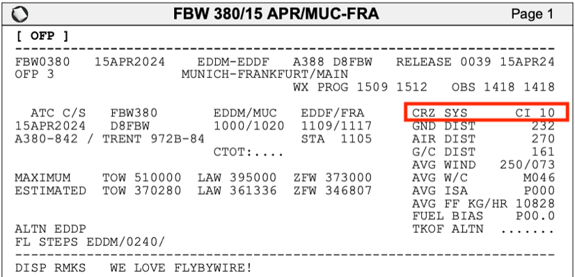
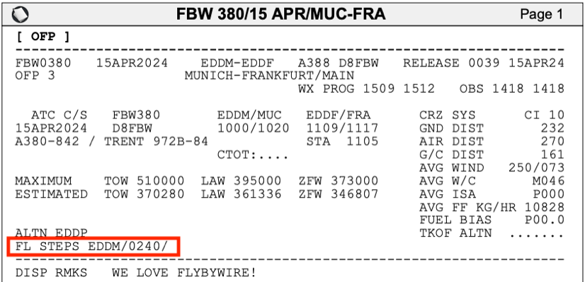
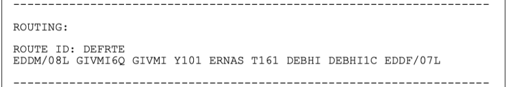

<link rel="stylesheet" href="/stylesheets/bg.css">

# Preparing the Flight Management System

This guide will help you prepare the Flight Management System in the A380X for your departure.
It includes a simple route that you can use to follow along easily and replicate in the simulator.

!!! warning "Disclaimer"
    The level of detail in this guide is meant to teach an Airbus A380 beginner to start the aircraft correctly.

    A *beginner* is defined as someone familiar with flying a GA aircraft or different types of airliners. Aviation 
    terminology and know-how is a requirement to fly any airliner, even in Microsoft Flight Simulator.

    This guide simplifies the process of starting the aircraft to accommodate beginners and the fact that this is a 
    simulation. More advanced sim pilots can use the [A380X SOP](../a380x-sop.md) directly. 

    When this guide refers to ATC it is referring to any Online ATC network but **NOT** the built-in ATC in the 
    simulator as this is very unrealistic and unreliable.

The simBrief route used in this guide:

[Download simBrief OFP](../assets/beginner-guide/03_preparing-fms/sample-ofp.pdf){ .md-button }

!!! tip "AIRAC Updates"
    Please note, we may update this OFP and guide occasionally to ensure it is current with the latest AIRAC
    provided by the simulator or external nav-data.

---

## Prerequisites

Below are a few Prerequisites before starting programming the FMS.

Visit [Cockpit Preparation](02_cockpit-preparation.md) to learn more.

* Make sure the aircraft is powered up.
  * External Power OR APU
* Make sure the ADIRS are set to NAV.
* Have a valid flight plan.
* Ensure IFR clearance has been obtained.

??? tip "Requesting IFR Clearance when using an Online ATC Network"
    Before departing for the flight, we must obtain an IFR clearance from ATC. The clearance may be obtained from
    clearance delivery or another specific frequency, depending on the airport and available services.

    If you are not flying on a network and are using the built-in ATC menu, simply find the appropriate selection in the menu and request for IFR clearance.

    Clearances will usually provide the following information below. As a pilot, you would need to read back the clearance correctly or acknowledge it if using the built-in ATC menu.

    - Cleared to the destination via specified route in the filed flight plan.
    - Initial cleared altitude after departure.
    - Assigned SID for departure OR radar vectors
    - Assigned departing runway.
    - [Transponder/squawk code](#entering-squawk-code).
    - Departure frequency.

    Additional reading material: [The CRAFT mnemonic](https://en.wikipedia.org/wiki/CRAFT_(aviation)){target=new}

---

## Chapters / Phases

This guide will cover the following topics in helping you set up the FMS:

<!-- TODO: Link the menu items -->

1. Understanding the FMS
2. FMS Initialization
   * Data & Status
   * Init & Flight Plan Initialization
   * Navaids
   * Fuel & Payload Management
   * Performance
3. Entering a Squawk Code
4. A380X simBrief Integration

## Understanding the FMS

<!-- TODO: Will contain data on how to use the FMS -->
During this guide we will be referring to a few key terms which are defined below.

### Using Keyboard and Mouse

The FMS can be managed entirely using your mouse and keyboard, allowing for a greater freedom and efficiency when selecting items and entering information.

Below is a screenshot of the FMS as you would find it after the initial start up of the aircraft. Two items are highlighted in the image below:

* Buttons show up as grey boxes.
  * If a button has a downwards pointing triangle, it indicates a dropdown menu.
  * If a button has greyed out text, it is disabled.
  * Tabs also show as buttons.
* The mouse pointer is identified as a yellow `X` with a dot in the middle.

Highlighted and selected buttons and fields will have a blue border around them.

{loading=lazy}

By using the mouse and using the different dropdown menus and buttons, it is easy to navigate through the entire FMS and quickly find the page or information you are looking for.

When you select an input field, you will be able to use your regular keyboard to type in the expected data. By pressing `ENTER`, you will confirm the entry in the field.

## FMS Initialization

### Data & Status

When the FMS first starts, it will show a screen showing the current status of the aircraft. This information includes:

* Aircraft type
* Engine type
* Navigation Database serial number and dates
* Pilot stored Waypoints, Routes, Navaids and Runways

<!-- TODO: Include description of the DATA menu and the available and currently unavailable options -->

### Init & Flight Plan Initialization

??? tip "What and Why?"
    The FMS contains information about the flight that needs to be set up by the pilots. This includes:

    * Flight Number
    * From, To and possible Alternate airports
    * Cruise level
    * Cost Index
    * Flight Plan Route
 
    These form the basis of the FMS Initialization and help the FMS manage the flight. It helps program the different systems in the aircraft to optimally fly the flightplan.

`FLIGHT PLAN INITIALIZATION........................................COMPLETE`<br/>

??? tip "Step 1 - FMS Initialization"
    The Flight Plan Initialization starts by opening the `INIT` page on the FMS from the `ACTIVE` menu.

    ^^Flight Number^^

    {loading=lazy}

    * Click the `FLT NBR` field so a blue typing cursor appears in the field.
    * Using your keyboard, type `FBW380` and press the `ENTER` key.

    This will confirm the flight number in the FMS. It can be used to identify your flight.

    ^^From, To and Alternate Airports^^

    * Click the `FROM` field so a blue typing cursor appears in the field.
    * Using your keyboard, type `EDDM` and press the `ENTER` key.
    * Click the `TO` field so a blue typing cursor appears in the field.
    * Using your keyboard, type `EDDF` and press the `ENTER` key.
    * (Optionally) Click the `ALTN` field so a blue typing cursor appears in the field.
    * (Optionally) Using your keyboard, type `EDDL` and press the `ENTER` key.

    This will set up the FMS for a flight from Munich to Frankfurt with the alternate airport set to Leipzig. 

    ^^Cost Index^^
    
    {loading=lazy}

    The Cost Index helps the FMS determine the balance between fuel consumption and flight duration. This is used by airlines to balance the fuel-related costs versus the time-related costs of a flight. A high Cost Index indicates that time efficiency is more important. A low Cost Index indicates that fuel efficiency is more important.

    The Cost Index can be found in the OFP as highlighted in the image.

    * Click the `CI` field so a blue typing cursor appears in the field.
    * Using your keyboard, type `10` and press the `ENTER` key.

    ^^Cruise Level & Temp^^

    {loading=lazy}

    The Cruise Level of the flight can be found on the OFP as highlighted in the image. It is listed as `0240` indicating `FL240`. 

    * Click the `CRZ FL` field so a blue typing cursor appears in the field.
    * Using your keyboard, type `240` and press the `ENTER` key.
    
    The `CRZ TEMP` field will automatically update.

    !!! warning "`CRZ TEMP` availability"
        The `CRZ TEMP` is not fully implemented yet and might not automatically be set.

??? tip "Step 2 - Flight Plan Entry"
    Our route for this flight can be found on the 2nd page of the OFP

    !!! info "Routing Disclaimer"
        Note that waypoints, STARs, and SIDs may be called differently due to different nav-databases or different AIRAC cycles between simBrief and the simulator.

    {loading=lazy}

    ^^Inputting a SID^^

    !!! info "Standard Instrument Departure (SID)"
        These are procedures that are defined and published that take a flight from the take-off phase to the en route phase.

        Also see: [SIDS and STARS](../../airliner/airliner-flying-guide/navigation.md#sids-and-stars)

    Now that the FMS has been initialized with the basic information of the flight, it is time to add the Flight Plan. This starts with clicking the `DEPARTURE` button on the `INIT` page.

    {loading=lazy}

    This will open the `F-PLN/DEPARTURE` page, from where you can select the Standard Instrument Departure (SID). 

    * Click the `RUNWAY` dropdown and select `08L 4000M ILS`.
    * Click the `SID` dropdown and scroll down until you can select `GIVM6Q`. 

    For this SID, there is no Transition (`TRANS`) waypoint, so the dropdown will remain gray. 

    {loading=lazy}

    Now you can click the `TMPY F-PLN`, which will enter the SID information in the Temporary Flight Plan in the FMS. A Temporary Flight Plan will show in yellow text to indicate it isn't active yet.
    
    You can use the arrow keys at the bottom of the screen to scroll through the current Flight Plan. The SID terminates at `GIVMI` and this is where we can begin to fill out the rest of the flight plan.

    ^^Enroute Flight Plan^^

    {loading=lazy}

    Our flight plan uses Airways between waypoints to simplify the routing by using standard defined routes in the airspace. It also makes it easier to enter the Enroute portion of the flight plan.

    * Click the `GIVMI` waypoint.
    * From the menu that opens, select `AIRWAYS`.
    * Click the `VIA` field so a blue typing cursor appears in the field.
    * Using your keyboard, type `Y1011` *(the airway)* and press the `ENTER` key.
    * Click the `TO` field so a blue typing cursor appears in the field.
    * Using your keyboard, type `ERNAS` *(the waypoint)* and press the `ENTER` key.
    * A second line with a new `VIA` and `TO` field will appear. Use these to follow the same procedure to enter `T161` as the airway and `DEBHI` as the waypoint.

    {loading=lazy}

    * Click the `TMPY F-PLN` button to load this into your Temporary Flight Plan.

    ??? info "DCT Before a Waypoint"
        There will be cases where your flight plan has waypoints and no airways, or a mix of both. When you go direct from one waypoint to another, it will usually look like the following: `WAYPOINT DCT WAYPOINT`. You might also see directs represented as two waypoints without a separator, which looks like `WAYPOINT WAYPOINT`.
    
        Let's look at an example and understand how to program these into the FMS. (*Please note this is not applicable to the sample flight plan in this guide, and we plan to create a more advanced flight plan entry guide at a later time.*)
    
        Below is the current flight plan we are utilizing:
    
        ```title="Current Sample Flight Plan"
        EDDM/08L GIVMI6Q GIVMI Y101 ERNAS T161 DEBHI DEBHI1D EDDF/07C
        ```
    
        Let's imagine for this example that there was no airway between `GIVMI` and `ERNAS`, as well as between `ERNAS` and `DEBHI`. The flight plan would look like the following:
    
        ```title="Example NO AIRWAY Flight Plan"
        EDDM/08L GIVMI6Q GIVMI DCT ERNAS DCT DEBHI DEBHI1D EDDF/07C
        ```
    
        !!! note ""
            The airways `Y101` and `T161` were replaced with `DCT` indicating from waypoint `GIVMI` proceed direct to `ERNAS` and after that proceed direct to `DEBHI`.
    
        When you encounter this type of routing, there are a couple of ways to input this leg without the use of the airways page on the FMS.
    
        One of the easiest ways is utilizing the `INSERT NEXT WPT` option in the menu when clicking a waypoint in the flight plan. To do this, simply find the starting waypoint on your F-PLN page, which in this case is `GIVMI`.
    
        * Click the `GIVMI` waypoint.
        * From the menu that opens, select `INSERT NEXT WPT`. You will see the following:
        * Click the dropdown field so a blue typing cursors appears in the field (do not select from the dropdown).
        * Using your keyboard, type `ERNAS` and press the `ENTER` key.
        
        {loading=lazy width=50%}
    
    ^^Planning the Arrival^^
    
    For the purposes of this guide, we will pre-plan our arrival into `EDDF` via the `DEBHI1D` STAR into 07C.
    
    !!! info "Standard Terminal Arrival Route (STAR)"
        Similar to the SID, these are procedures that are defined and published that take a flight from
        the last point in a route *(in our case `DEBHI`)* to the first point in the approach or the initial approach fix (IAF).
    
        Also see: [SIDS and STARS](../../airliner/airliner-flying-guide/navigation.md#sids-and-stars)
    
    Find the `EDDF` button at the bottom left of the Temporary Flight Plan. This will open the `F-PLN/ARRIVAL` page, from where you can select the Standard Terminal Arrival Route (STAR).

    * Click the `RUNWAY` dropdown and select `07C 4000M`
    * Click the `APPR` dropdown and select `I07CY`
    ??? note "Y or Z Designators"
        A designator such as Y or Z may be present. This suffix is to distinguish in the navigation database a difference between approaches to the same runway. While similar in nature, they may have different minimums, allowed equipment, or other differences.

    * Click the `VIA` dropdown and select `DF454`
    * Click the `STAR` dropdown and select `DEBH1D`

    For this STAR, there is no Transition (`TRANS`) waypoint, so the dropdown will remain gray. 

    {loading=lazy}

    Now you can click the `TMPY F-PLN`, which will enter the STAR information in the Temporary Flight Plan in the FMS.     

    ^^Verify the Flight Plan^^

    Verify the flight plan by scrolling through it and check all the waypoints. 

    !!! info "Viewing Flight Plan on ND"
        We can also verify the route looks correct by selecting `Plan` on the EFIS control panel and watching the ND as we scroll through. When doing so for a Temporary Flight Plan, the lines between waypoints will be dashed and yellow. The active flight plan will show as green solid lines.

    ??? info "MANUAL Leg and DISCONTINUITY"
        The flight plan might contain so-called discontinuities. These are breaks in the flight plan and often separate two flight plan sections, like the SID and first in-route waypoint or the STAR and the APPR. They are also often inserted when the flight plan is modified.

        Sometimes discontinuities are also part of a procedure to indicate that manual input is required
        (mostly clearance by ATC). The preceding legs are called MANUAL legs. 
    
        **Discontinuities after a MANUAL leg can not and should not be deleted. See below link on how to 
        handle discontinuities.** 
    
        In this flight plan we have a discontinuity between the STAR and approach procedure as shown below.

        {loading=lazy}

        See our detailed documentation for [Discontinuities](../../a32nx/a32nx-advanced-guides/flight-planning/disco.md){target=new} to understand how to appropriately handle these when encountered on your F-PLN page. 
    
        !!! warning ""
            Additionally, make note of this [Special Case](../../a32nx/a32nx-advanced-guides/flight-planning/disco.md#special-case) on the discontinuity page.

    After verifying the flight plan, you can use the `INSERT TMPY *` button on the bottom right of the `F-PLN` page. This will insert the Temporary Flight Plan into the Active Flight Plan.

### Navaids

??? tip "What and Why?"
    The Navaids are used to tune the different radio navigation frequencies. This includes VOR and ILS frequencies.

    * A VOR (Very High Frequency Omni-Directional Range) is a radio beacon that can be used for non-precision navigation. These beacons are used to follow or verify the route flown.
    * ILS (Instrument Landing System) is a radio navigation system that provides short-range guidance to aircraft for landing on a runway.

    Both can be entered using frequencies or identifiers for ease of use. 

    The A380X supports VOR and ILS autotuning when in range of a VOR before departure. We will verify this in the "How and Where?" step below. For ILS autotuning, the FMS will automatically load the departure runway ILS frequency if there is one. Once we get within 250NM of our destination and are in climb phase or later, the ILS frequency of the selected arrival runway will be autotuned.

`NAVAIDS..............................................................CHECK`<br/>

??? tip "How and Where?"
    To reach the Navaids page, go back to the `INIT` page. You can do so by either selecting `INIT` from the `ACTIVE` dropdown, or if you are on the `F-PLN` page after the previous section, you can just click the `INIT` button on the bottom of the `F-PLN` page. 

    Once on the `INIT` page, you can click the `NAVAIDS` button to go to the Navaids page.

    On this page, we would set any frequencies or identifiers needed for the departure and subsequently later en route, those required for the arrival.

    ^^VOR Tuning^^

    The A380X supports VOR autotuning when in range of a VOR before departure. You can verify this by checking the RADNAV page and seeing if the VOR frequency is already populated. You should verify the relevance of this VOR to your departure procedure and flight plan before takeoff.

    On this departure SID, we have routing instructions that rely on the Munich VOR `DMN` with a frequency of `116.0`.

    To enter this, you can click the `IDENT` field for `VOR1` and enter `DMN` and press `ENTER`. A page will open showing multiple options. Select the closest one, with the `116.0` frequency. Now you have the `DMN` VOR selected and can use it as a reference on the ND.

    ^^Departure ILS^^

    When selecting the SID earlier in the flight plan section, the A380X should have autopopulated the ILS/LOC frequency under the `LS` heading. If it hasn't, we can manually insert it for centerline guidance on take off.

    Our departure runway is EDDM/08L (runway 08 left), which has a frequency of `109.50`. When inputting a frequency, and we are in range of the ILS, it will autopopulate the identifier and course. You could also enter the identifier `IMNE` and it would automatically fill in the frequency.

    If the ILS information was not automatically populated, you can select the `IDENT` field under the `LS` header and type in `IMNE` and then press `ENTER`. The other fields will automatically get populated.

    ^^Arrival ILS^^

    With an ILS or LOC approach selected, the arrival ILS frequency should be automatically tuned correctly whenever the aircraft is in climb phase or greater and within 250 NM of the destination. Ensure that we verify the ILS frequency when we reach the arrival phase of the flight - see [Landing](07_landing.md#during-instrument-approach).

    {loading=lazy}

### Fuel & Payload

??? tip "What and Why?"
    Will contain the Fuel & Payload what/why

`ZFW/ZFWCG...........................................................INSERT`<br/>
`BLOCK FUEL..........................................................INSERT`<br/>
`RTE RSV/FINAL..................................CHECK/INSERT AS APPROPRIATE`<br/>
`MIN FUEL AT DEST...............................CHECK/INSERT AS APPROPRIATE`<br/>

??? tip "How and Where?"
    Will contain the Fuel & Payload how/where

### Performance

<!-- TODO: Decide if we include NOISE PROCEDURE and EO ACCEL ALTITUDE and THRUST REDUCTION/ACCELERATION ALTITUDE -->

??? tip "What and Why?"
    Will contain the Performance what/why

`PRELIMINARY TAKEOFF PERF DATA.......................................INSERT`<br/>
`V1, VR and V2.......................................................INSERT`<br/>
`TOGA/FLEX/DERATED............................................SELECT/INSERT`<br/>
`FLAPS...............................................................SELECT`<br/>
`ANTI-ICE............................................................INSERT`<br/>
`TRANS ALTITUDE..............................................AS APPROPRIATE`<br/>

??? tip "How and Where?"
    Will contain the Performance how/where

<!--

TODO: Consider more sections to add:
* Secondary Flight Plan
* Route Summary (verification)
* FMS Verification

`..........................................................................`<br/>
`..........................................................................`<br/>
`..........................................................................`<br/>
-->

---

## A380X simBrief Integration

<!-- TODO: Update -->

This section has been moved to our dedicated [simBrief Integration](../../../aircraft/a32nx/feature-guides/simbrief.md#importing-the-simbrief-ofp-to-the-fms-mcdu) feature guide.

---

After setting up the FMS, continue with [Engine Start and Taxi](04_engine-start-taxi)
