<link rel="stylesheet" href="/stylesheets/bg.css">

# Takeoff, Climb and Cruise

This guide will explain the correct procedures to accomplish takeoff, climb and establish cruise altitude.

!!! warning "Disclaimer"
    
This is for simulation purposes only.

    The level of detail in this guide is meant to get an Airbus A380 beginner safely up in the air and to cruise level
    under normal conditions, while simplifying details which are not (yet) important for a beginner.

    A *beginner* is defined as someone familiar with flying a GA aircraft or different types of airliners. Aviation terminology and know-how is a requirement to fly any airliner, even in Microsoft Flight Simulator.

---

## MSFS Start from Gate or Runways

Microsoft Flight Simulator allows you to start your flight from cold & dark at a gate or directly from the runway with
the aircraft ready for takeoff.
For this guide, we assume you started cold & dark at the gate and taxied to the runway holding point as per the previous
chapters of this beginner guide.
If you did start on the runway, you can skip the first part (Lineup) and directly continue
reading [Takeoff](#2-takeoff).

## Prerequisites

Aircraft is in `TAXI` state as per previous chapters.

[Download FlyByWire Checklist](../assets/sop/FBW_A380X_Checklist.pdf){ .md-button }

## Chapters / Phases

This guide will cover these phases:

1. [Lineup](#1-lineup)
2. [Takeoff](#2-takeoff)
3. [Initial climb](#3-initial-climb)
4. [Climb](#4-climb)
5. [Cruise](#5-cruise)

---

## Base Knowledge About the Airbus A380 for Flight

This section is focused on differences to other non-Airbus airliners a user might be used to.

??? tip "What is a Fly-by-Wire System?"
    Traditional mechanical and hydro-mechanical flight control systems use a series of levers, rods, cables, pulleys and
    more, which pilots move to adjust control surfaces to aerodynamic conditions. Their "hands on" design gives pilots a
    direct, tactile feel for how the aircraft is handling aerodynamic forces as they fly. On the other hand, mechanical
    systems are also complicated to operate, need constant monitoring, are heavy and bulky, and require frequent
    maintenance.

    In fly-by-wire systems, when the pilot moves flight controls, those movements are converted into electronic signals,
    which are then interpreted by the aircraft's Electrical Flight Control System (EFCS) to adjust actuators that move
    flight control surfaces. Computers also monitor sensors throughout the aircraft to make automatic adjustments that
    enhance the flight.
    
    Because fly-by-wire is electronic, it is much lighter and less bulky than mechanical controls, allowing increases in
    fuel efficiency and aircraft design flexibility, even in legacy aircraft. And to prevent flight critical failure, most
    fly-by-wire systems also have triple or quadruple redundancy back-ups built into
    them. [source: BAE Systems](https://www.baesystems.com/en-us/definition/what-are-fly-by-wire-systems){target=new}
    
    See also: [Fly-by-wire Wikipedia](https://en.wikipedia.org/wiki/Fly-by-wire){target=new}

??? tip "What is Autotrim?"
    The A380 has a feature called "Autotrim", which makes it unnecessary to hold the sidestick or use the trim wheel for
    holding the current pitch. This system is always active, even when the __Autopilot__ is off (in Normal Law, which means
    under normal circumstances with a fully functional aircraft).

??? tip "What is Autothrust?"
    The A380 has __Autothrust__ which is similar to Autothrottle (e.g., in a Boeing), but it does not move the thrust
    levers. Basically, the thrust levers are only moved by the pilot and never move on their own. The thrust levers act as a
    maximum allowed power setting for the Autothrust system. During normal flight (after takeoff) the levers stay in the CL
    climb detent, and the Autothrust system will set engine power accordingly.

??? tip "What is Autopilot?"
    The A380's __Autopilot__ system works a bit differently from other manufacturer's systems. The A380 FCU controls allow
    setting certain values and then push or pull the knobs. Pushing usually means automatic control (Managed Mode) and
    pulling will use the manually selected value (Selected Mode).

    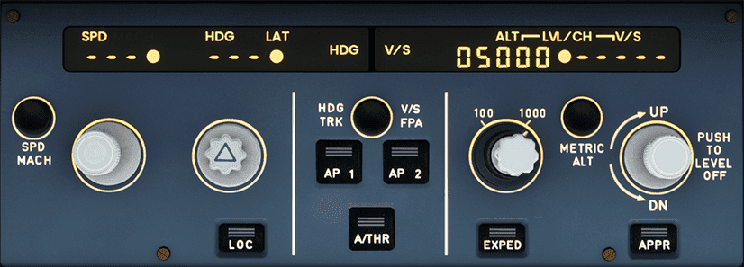{loading=lazy} 
    
TODO: update screenshot with new FCU

??? tip "Using the FCU Knobs in Microsoft Flight Simulator"
    In Microsoft Flight Simulator, pushing is clicking the knob "UP" and pulling is clicking the knob "DOWN" 
    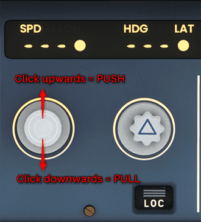
    {loading=lazy} 
TODO: update screenshot with new FCU

??? tip "What are Flight Phases"
    The A380 uses flight phases to manage different parts of a flight. These are preflight, takeoff, climb, cruise, descent,
    approach, go around, done. They match the PERF pages in the MCDU (see [Preparing the MCDU](03_preparing-fms)).

??? tip "What are Flight Envelope Protections"
    The A380 includes many protections for the pilot, which make it nearly impossible to stall or overspeed the aircraft.
    It's beyond this beginner-guide to go into details (Normal law, Alternate Law, Alpha Floor, etc.)
    See also: [Protections](../../a32nx/a32nx-advanced-guides/protections/overview.md).
    
TODO: check if this requires update

---

### 1. Lineup

**Situation**

- ATC (Ground or Tower) has instructed us to hold at a runway holding point and wait until we are cleared to "line up"
  or "take off". 
- Aircraft is still in TAXI state (see previous chapters) and parking brakes are set.

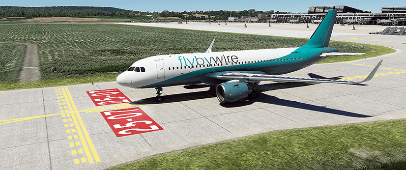{loading=lazy} 

TODO: update screenshot with 380

Typically, it is here at the latest that we are asked to switch to Tower ATC frequency for takeoff clearance.

`TAKEOFF OR LINEUP CLEARANCE ....................................... OBTAIN` 

If we are cleared to "line up" (or take-off) we will do the following steps. 

??? tip "What and Why"
    The following steps are done to ensure that the aircraft is ready for takeoff and that all systems are set up correctly.

`CABIN CREW ........................................................ ADVISE` 
`PACKS 1 and 2 .................................................AS REQUIRED` 
`EXTERIOR LIGHTS ...................................................... SET` 
??? note "Exterior Lights"
    Set the RWY TURN OFF & CAMERA ON, the Landing light to ON, and the nose light to T.O.
`TAXI (ETACS) ......................................................... OFF` 
`NAVIGATION DISPLAY RANGE ............................................. SET` 
??? note "Navigation Display Range"
    Set the ND range to at least see the first waypoint after takeoff. 
`ELECTRONIC FLIGHT INSTRUMENT SYSTEM CONTROL PANEL OPTIONS ............ SET` 
??? note "EFIS Control Panel"
    It is recommended setting the weather radar on the pilot in command side, and the terrain radar on the pilot monitoring side.
    !!! info ""
        The Weather Radar is currently not available for the FBW A380X for Microsoft Flight Simulator as the simulator 
        does not provide the required data. . The Terrain Radar is available and can be set to the pilot monitoring side.
`TRAF .................................................................. ON` 
`APPROACH PATH ................................................ CHECK CLEAR` 
`STROBE LIGHTS ......................................................... ON` 
`TAKEOFF RUNWAY ................................................... CONFIRM` 
`SLIDING TABLE ..................................................... STOWED` 
`TCAS TA ................................................. TA ONLY or TA/RA` 

??? tip "Where and How?"
[//]: # (TODO)
    
TODO: add additional info, images or links to the flight deck

`BEFORE TAKEOFF CHECKLIST below the line ......................... COMPLETE` 
??? note "Before Takeoff Checklist - Below the line"
    `CABIN CREW ........................................................ ADVISE` 
    `PACKS 1 and 2 .................................................AS REQUIRED` 
    `EXTERIOR LIGHTS ...................................................... SET` 

??? - tip "Entering Runway"
    Before we start rolling, we visually check that no other aircraft is on final approach. We can also use TCAS on the 
    ND to check for aircraft in the vicinity.

    If everything is clear, we release the parking brake and slowly roll onto the runway in the direction of takeoff and 
    come to a stop on the runway's center line.

    There is also a *rolling start,* where we would not stop but directly apply thrust for takeoff once we are straight 
    on the runway. But, as a beginner, a full stop is recommended so we can double-check everything.

    When we reached our starting point, we stop and set the parking brakes.

    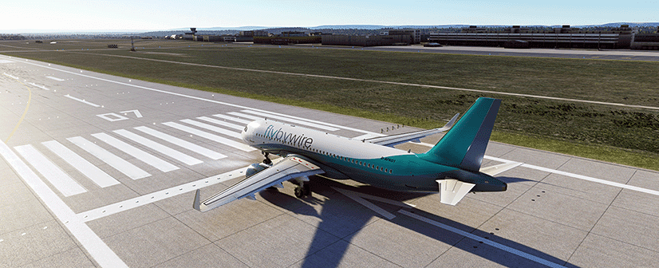{loading=lazy} 
    
TODO: update screenshot with 380 exterior

    If we were only cleared to "line up" we wait here until we get clearance to *take off*.

`PARKING BRAKE ........................................................ SET` 

This concludes *Lineup*.

---

### 2. Takeoff

**Situation**

- Aircraft is on runway and fully setup for takeoff as per previous chapters.

Once we are cleared for takeoff, we will start the takeoff roll:

`ATC CLEARANCE ................................................... OBTAINED` 
`PACKS .......................................................CHECK AS REQ.` 

#### Takeoff Roll
`PARKING BRAKE ........................................................ OFF` 
`BRAKES ............................................................. PRESS` 
`TAKEOFF ..........................................................ANNOUNCE` 
`SIDESTICK ........................................................ FORWARD` 
??? note "Sidestick"
    Push sidestick forward half the way to put pressure on the front gear 
    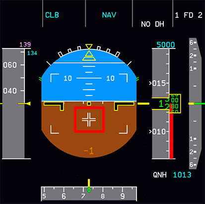{loading=lazy}
`THRUST LEVERS ........................................................ 25%` 
`BRAKES ........................................................... RELEASE` 
`THRUST LEVERS ............................................ FLX/MCT OR TOGA` 
`CHRONOMETER ........................................................ START` 
`DIRECTIONAL CONTROL ........................................... USE RUDDER` 
`PRIMARY FLIGHT DISPLAY and ENGINE indications ....................... SCAN` 
??? note "PFD and ND"
    - The PFD Flight Mode Annunciator (FMA) now shows several things which we should check when the aircraft starts rolling:
        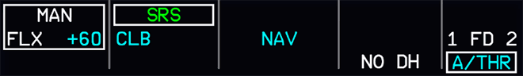{loading=lazy}
        
TODO: update screenshot for A380X

        From the left:
    
        - Thrust: set to MAN FLX + 60
        - Vertical guidance:
            - Active (green): SRS (pitch guidance to maintain V~2~ + 10)
            - Armed (blue): CLB mode (is next after SRS is done)
        - Lateral guidance:
            - Active: RWY (automatic runway axis follow up through ILS use)
            - Armed: NAV (navigation guidance according to HDG knob)
        - __Autopilot__, Flight Director, Autothrust:
`TAKEOFF THRUST ..................................................... CHECK` 

??? tip "Vertical and Lateral Guidance"
    Vertical and lateral guidance are **only shown** via Flight Director, as we have not turned on the __Autopilot__ yet 
    and need to be followed manually by the pilot.
        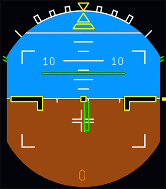{loading=lazy}#
        
TODO: update screenshot for A380X

??? tip "Center line"
    Keep the aircraft on the center line while accelerating down the runway.

#### Monitor Speeds and V-Speeds

??? tip "V-Speeds"
    There are three important speeds for takeoff, which we have configured earlier when programming the MCDU's PERF page for
    takeoff. These are shown on the PFD's speed tape.

    **V~1~**: The speed beyond which takeoff should no longer be aborted. V~1~ is depicted as a cyan "1" next to the 
    speedband in the PFD.
    
    **V~R~**: Rotation speed. The speed at which the pilot begins to apply control inputs to cause the aircraft nose to 
    pitch up, after which it will leave the ground. V~R~ is depicted as a cyan circle next to the speedband in the PFD.
    
    **V~2~**: Takeoff safety speed. The speed at which the aircraft may safely climb with one engine inoperative. V~2~ 
    is depicted by a magenta triangle next to the speedband in the PFD.
    
    On a long enough runway, V~1~ (depicted by "1") and V~R~ (depicted by "o") are often very close together and can't 
    be clearly distinguished on the PFD speed tape.

    As we lift off from the ground, monitor the PFD's V/S band. As long as that shows a positive rate of climb we are 
    ok to take the gear up. In real life the pilot monitoring would be the one to call out "positive rate of climb."

    
TODO: add screenshot for A380X speed band with V speeds

`SIDESTICK ........................................................ NEUTRAL` 
??? note "Sidestick"
    At about 80 knots, slowly release the forward pressure on the sidestick until about 100 knots, when the sidestick should
    be in the neutral position.
`V1 ............................................................... MONITOR` 
??? note "At V1"    
    The throttle hand remains on the thrust levers until reaching V~1~ to be able to quickly abort the start. Remove the
    hand from the thrust levers at V~1~ to avoid accidentally aborting after V~1~.
`ROTATION ......................................................... PERFORM` 
??? note "Rotation"
    At V~R~ apply smooth positive backward stick movement on the sidestick and aim for a rotation rate (pitch rate) of 
    3deg/sec for about 5 seconds (15° - 18° pitch attitude). Once airborne, follow the flight director's 
    guidance for pitch attitude. 
    
    Count one-one thousand, two-one-thousand, etc. and hit 15 degrees at five-one-thousand - practice this.
        
    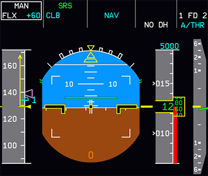{loading=lazy}
`POSITIVE CLIMB ................................................... CONFIRM` 
??? note "Positive Climb"
    The pilot flying (PF) will call out "Positive Climb" when the vertical speed indicator shows a positive rate of climb.
    The pilot monitoring (PM) will confirm this callout.
    
    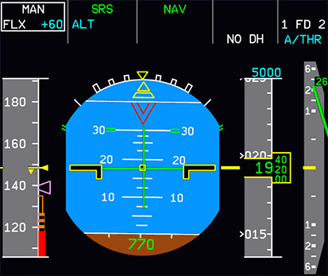{loading=lazy}.
`LANDING GEAR .......................................................... UP` 
??? note "Gear up"
    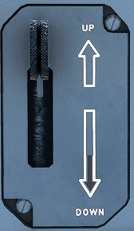

    - We confirm that the landing gear is up by looking at the landing gear annunciators, and the lower ECAM Wheels page.

    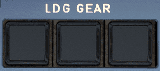{loading=lazy}  
    
TODO: update screenshot for A380X

    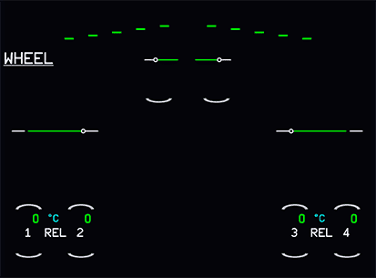{ loading=lazy} 
    
TODO: update screenshot with new lower ECAM

`AUTOPILOT .................................................... AS REQUIRED` 

This concludes *Takeoff*.

---

### 3. Initial Climb

**Situation**

- Aircraft has left the ground and is climbing at about 15°.

#### After Takeoff

After takeoff, the aircraft will use `FLX/MCT` or `TO GA` thrust until thrust reduction altitude is reached (typically ~
1500 ft above runway, this is part of the MCDU setup)

After reaching **thrust reduction altitude**, the `PFD FMA` now shows a flashing *LVR CLB* message to instruct the pilot to 
move thrust levers to the `CL` detent.

`THRUST LEVERS ......................................................... CL` 
??? note "Thrust Levers in CL detent" 
    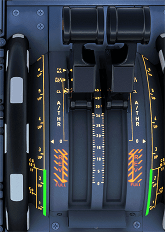{loading=lazy} 
    
TODO: update screenshot with new throttle quadrant

`A/THR........................................................ CHECK ACTIVE` 
??? note "Autothrust"
    This activates the __Autothrust__ system (FMA shows `A/THR` in white now). In the A380 (and most Airbus models) we will
    not touch the thrust levers again before final approach and landing (under normal flight conditions).

    The aircraft will now climb to the altitude selected in the FCU (in our case, 5.000ft).
`PACKS 1 and 2 ......................................................... ON` 
`AUTOPILOT .................................................... AS REQUIRED` 
??? note "Autopilot"
    **Activate the __Autopilot__ at this point by pressing the AP1 button on the FCU.**
    
    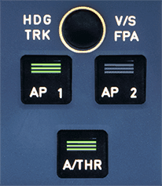{loading=lazy} 
    
TODO: update screenshot with new FCU

    
    The FMA now shows AP1 in white in the upper-right corner.

??? tip "FCU Autopilot Displays and Controls"
    The FCU (Flight Control Unit) shows three important values:

    - SPD "---" : means the __Autopilot__ is in Managed Speed mode (e.g., 250kt <10000ft, 290kt above).  
      If we pull the SPD knob we can select a speed which the __Autopilot__ will then apply.
    - HDG "---" : means the lateral navigation is in Managed HDG Mode and the __Autopilot__ follows the planned route. 
      Dialing the HDG knob will let us select a heading and by pulling the knob we tell the __Autopilot__ to fly this 
      heading (Selected Heading Mode). 
    - ALT "5000" : means the selected altitude is 5000ft 

    
TODO: add screenshot

`At F speed: FLAPS 1 .................................................. SET` 
??? note "Flaps during takeoff and climb"
    Depending on the start configuration, there will be different markers next to the speedband in the `PFD` to show when to
    retract flaps:

    - `CONF-2` (Flaps position 2): At "F" and positive speed trend
    - `CONF-1+F` (Flaps position 1): At "S" and positive speed trend

    **When reaching S-speed retract flaps.** 
    S-speed is signified with an S next to the speed band in the `PFD`.

    We always retract flaps by only one step at a time. So, when we took off with `FLAPS 2` (`CONF-2`) we retract `FLAPS` at "F" to `FLAPS 1`. Then at "S" we retract them to `FLAPS 0`.

    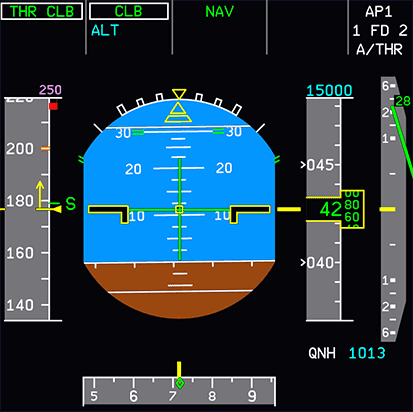{loading=lazy}
    
TODO: update screenshot for A380X

`At S speed: FLAPS ZERO ............................................... SET` 

`EXTERIOR LIGHTS ...................................................... OFF` 
??? note "Taxi and Rwy Turn Off Lights"
    The `TAXI` and `RWY TURN OFF` lights are automatically switched off when the landing gear is retracted. The flight 
    crew should still move the switches to the `OFF` position as part of after take off flows.

`GROUND SPOILERS ................................................... DISARM` 
`APU BLEED ............................................................ OFF` 
`APU MASTER SWITCH .................................................... OFF` 
`TCAS ............................................................... TA/RA` 
`ANTI-ICE ..................................................... AS REQUIRED` 

`AFTER TAKEOFF CHECKLIST down to the line ........................ COMPLETE` 
??? note "After Takeoff Checklist - Down to the line"
    `LDG GEAR ................................................................... UP` 
    `FLAPS ....................................................................... 0` 
    `PACK 1+2 ................................................................... ON` 
    `APU MASTER ................................................................ OFF` 

At this point, the aircraft is climbing to the initially cleared altitude. The __Autopilot__ will manage the climb to the
selected altitude.

??? info "Departure ATC Check-In"
    This is usually a good time to contact ATC Departure to check in with your current altitude. In most cases, ATC will 
    now give us a higher climb altitude. If we did not receive a higher altitude, we will level off at the previously 
    cleared altitude (cleared by ATC or navigational charts). If we have the __Autopilot__ activated, it will level off
    automatically at the Selected Altitude.

`FLIGHT LEVEL ............................................. SET AS REQUIRED` 
??? note "Flight Level"
    Dial the newly cleared altitude into the FCU. (e.g., 15 000 ft) and push for managed climb (CLB) or pull for open
    climb (OP CLB)

    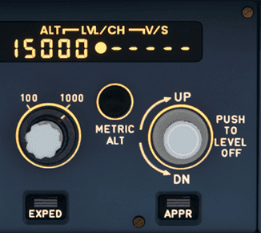{loading=lazy} 
    
TODO: update screenshot with new FCU

??? warning "Use OP CLB or CLB mode and not V/S"
    It is not recommended to use V/S for climbing or descending in the A380 (at least not for beginners) as the V/S 
    guidance has priority over the speed guidance, and speed needs to be watched very closely when using V/S.

    
    If the selected target V/S is too high (relative to the current thrust condition and speed), the FMGC will steer the
    aircraft to the target V/S, but the aircraft will also accelerate or decelerate. When the speed reaches its authorized
    limit, V/S automatically decreases to maintain the minimum or maximum speed limit.

    See also [Protections](../../a32nx/a32nx-advanced-guides/protections/overview.md).

`AFTER TAKEOFF CHECKLIST below the line .......................... COMPLETE` 
??? note "After Takeoff Checklist - Below the line"
    `ALTIMETERS (at transition altitude) ....................................... STD` 
    `LANDING LIGHT (at 10,000ft) ............................................... OFF` 

This concludes the *Initial Climb*.

---

### 4. Climb

**Situation:**

- Aircraft is climbing to or is at our initially cleared climb altitude.
- *After takeoff checklist* is completed.
- ATC has given us clearance for further climb.

`CRUISE FLIGHT LEVEL ...................................... SET AS REQUIRED` 
??? note "Climb to Cruise Level"
    Typically, the climb to the flight plan's cruise level (e.g., FL240) happens in several steps (step climbs). Each to 
    be instructed and cleared by ATC.

    The aircraft will now continue climbing while managing thrust and pitch level. The __Autopilot__ ensures that the
    aircraft stays at the Selected or Managed Speed setting and climbs to the new altitude while managing thrust
    automatically.

    The PFD's `FMA` now shows: 
    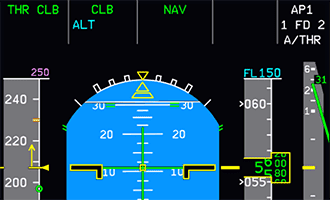{loading=lazy}
    
TODO: update screenshot for A380X

`ANTI-ICE ..................................................... AS REQUIRED` 

#### At 10,000 feet

Turn off the landing lights, and if the aircraft is stable (good weather, no planned turns, etc.) you can turn off 
the seatbelt signs. The aircraft will now accelerate to CLB speed (defined in `MCDU PERF CLB` page).

`LANDING LIGHT ........................................................ OFF` 
`SEAT BELT SIGNS .............................................. AS REQUIRED` 
`EFIS OPTIONS ................................................. AS REQUIRED` 
`ECAM MEMO ......................................................... REVIEW` 
`OPTIMAL/MAX ALTITUDE ............................................... CHECK` 

`BAROMETRIC REFERENCE ........................................ SET STANDARD` 
??? note "At the transition altitude"
    When the aircraft reaches the transition altitude, the barometric setting will automatically flash on the primary 
    flight display. It is recommended to set STD on the electronic flight instrument system control panel and on the 
    integrated standby instrument system.
    
    *NOTE:* this will vary depending on where you are in the world. For example, in the U.S. the transition altitude is
    18,000 feet. In the Netherlands it is 3000. Check with your local aviation authority for more details. Upon passing the
    set transition altitude, you will set your barometer to `STD`, as notated in the Check Baro Setting item in the previous
    section. Standard altitude is `29.92 in` or `1013 QNH`.

??? tip "MCDU and PFD at cruise level"
    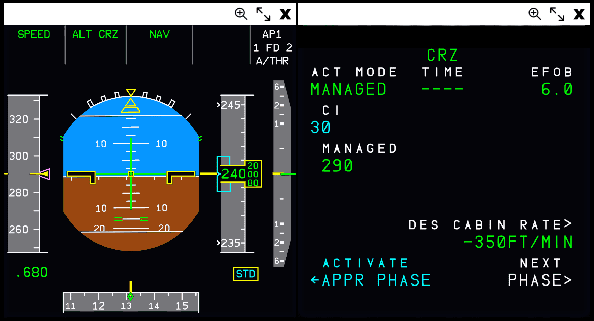{loading=lazy} 
    
 TODO: update screenshot for A380X

This concludes the *Climb*.

---

### 5. Cruise

**Situation**

- Aircraft has leveled off at planned cruise level.
- Speed is cruise speed as per ECAM PERF CRZ page.

`ALT CRZ on flight mode annunciator ................................. CHECK` 
??? note "Cruise Phase"
    The FMA now shows `ALT CRZ` in white in the second column of the FMA (Vertical Guidance). This means the aircraft is
    in cruise mode and will maintain the selected altitude.

    Verify that the aircraft is cruising on the cruise flight level inserted on the CRZ panel of the flight management 
    system of the active performance page. This will ensure that the aircraft flies at the targeted cruise speed so fuel 
    consumptions is optimized. This will also benefit to a soft autothrottle mode, as well have more accurate predictions.

This is usually the quietest time of the flight. It allows time to double-check the systems by going through all ECAM
pages, etc.

`ECAM MEMO ......................................................... REVIEW` 
`SD PAGES .......................................................... REVIEW` 
`FLIGHT PROGRESS .................................................. MONITOR` 

Regular ATC frequency changes with altitude and position check-ins are common.

Here are some **typical activities** which might happen during cruise mostly on request from ATC or other circumstances
like weather, traffic, etc.

??? info "Altitude Change"
    **Altitude change (also called flight level change)** 
    Like before, during climb, set your new altitude in the FCU and push the ALT knob. The aircraft will descent or climb
    to the new altitude automatically.

??? info "Course Change w/Selected Heading"
    **Course change with Selected Heading** (given or cleared by ATC) 
    Dial heading knob to the desired heading and pull knob for Selected Heading Mode. The aircraft will automatically
    change course to the new heading. If you want the aircraft to follow the planned route again, you can push the knob 
    for Managed Heading Mode.

??? info "Direct course to a waypoint (DIR TO)"
    **Direct course to a waypoint (DIR TO)**  
    ATC regularly instructs us to go "direct to (waypoint) XYZ". Use the ECAM DIR page to select the waypoint from the
    flight plan's list of waypoints. In rare cases it is a waypoint not in the current flight plan, then you can enter a
    new waypoint in the MCDU and put it into the upper left entry field. Select DIRECT* on the right-bottom to execute 
    the change.

    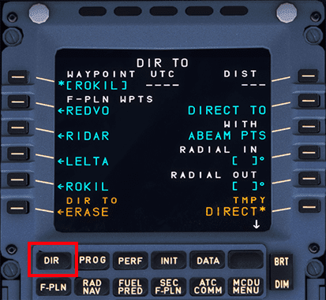{loading=lazy}
    
TODO: update screenshot for A380X

??? info "ATC requests specific speed"
    **ATC requests specific speed ** 
    Sometimes ATC requests a specific speed to keep separation between aircraft. Pull the speed knob to switch to Selected
    Speed Mode. The current speed will be preselected. Dial to the desired speed. The aircraft will immediately begin to
    target the new speed by either increasing or decreasing thrust.

At some point (200-300 NM from destination) we would start with descent-planning and setting up the aircraft for
descent and approach.

This concludes the *Cruise*.

Continue with [Descent Planning and Descent](06_descent)
