<link rel="stylesheet" href="/stylesheets/bg.css">

# Descent Planning and Descent

This guide will explain the correct procedures to plan and fly a descent
from cruise altitude through STAR and Instrument Approach up to the final approach.

The actual final approach (ILS approach) will be covered by a separate chapter.

!!! warning "Disclaimer"
    <p style="color:coral;">This is for simulation purposes only.</p>
    The level of detail in this guide is meant to get an Airbus A380 beginner safely from cruise 
    level down to the ILS glideslope.

    A *beginner* is defined as someone familiar with flying a GA aircraft or different types of 
    airliners. Aviation terminology and know-how is a requirement to fly any airliner even, in 
    Microsoft Flight Simulator.

---

## Prerequisites

Aircraft is in `CRUISE` state and phase as per previous chapters

[Download FlyByWire Checklist](../assets/sop/FBW_A380X_Checklist.pdf){ .md-button }

## Chapters / Phases

This guide will cover these phases:

1. [Descent and Approach Planning](#1-descent-and-approach-planning)
2. [Starting the Descent](#2-starting-the-descent)
3. [Flying the STAR and Approach](#3-flying-the-star-and-approach)
4. [Intercepting ILS](#4-intercepting-ils)

---

## Base Knowledge: Route, Star, Approach and ILS

### Basics Information

As we have learned in previous chapters, a flight route begins with an origin airport and a SID to safely guide the 
aircraft away from the airport to the first waypoint on their actual route. Similar to a **SID**, the arrival to an 
airport is done via a **STAR** (Standard Terminal Arrival Route) and an **IAP** (Instrument Approach, often APPR) to safely 
bring the aircraft into a position to land on the destination airport safely and with as little ATC communication as 
possible.

??? tip "Standard Terminal Arrival Route (STAR)"
    #### STAR

    A Standard Terminal Arrival Route (STAR) ensures safe and efficient traffic from the last en-route waypoint to the 
    initial approach fix (IAF) of the Instrument Approach (IAP). It separates aircraft, avoids conflicts and helps with 
    noise abatement through specific routing, levels/altitudes, speed restrictions and checkpoints often with holding 
    areas.

    One main objective is, to do this with a minimum of communication between the ATC controller and the pilot. As the 
    STAR is part of the flight plan, a pilot can simply continue from the normal route into the STAR if ATC has not 
    given any other instructions. Sometimes ATC might give an explicit clearance for the STAR or change the STAR to
    manage traffic and landing situation (different runways, etc.).

    Often a STAR contains a clearance point which mustn't be passed without explicit clearance by ATC. If clearance is 
    not given, then a holding must be flown as described in the charts.

    Please also have a look at our airliner guide's SIDs and STAR section 
    [SIDs and STARS](../../airliner/airliner-flying-guide/navigation.md#sids-and-stars)

    Find a good overview over charts in our airliner guide: 
    [Reading a Chart](../../airliner/airliner-flying-guide/navigation.md#reading-a-chart)

??? tip "Instrument Approach (IAP)"
    #### Instrument Approach

    The Instrument Approach (IAP or APPR) has similar goals as a SID or STAR - safely bring an aircraft into a 
    position to land while ensuring separation between multiple aircraft, avoiding terrain, support with noise 
    abatement, etc.

    IAP are often designed for handling maximum traffic in even bad weather conditions. With only little traffic and 
    good weather, it is quite common that ATC instructs the pilot to leave the approach route by giving the pilot 
    heading vectors for a more direct route to the Final Approach Fix (FAF, also called final approach point).

    When flying with Online ATC (VATSIM, IVAO, PilotEdge, ...) expect being vectored to the FAF quite often.

    Understand important ILS approach chart features here: 
    [Approach Chart](../../airliner/airliner-flying-guide/navigation.md#chart-sample-1)

??? tip "Instrument Landing System (ILS)"
    #### Instrument Landing System (ILS)

    The Instrument Landing System (ILS) is one of several modern forms of helping an aircraft during its final approach 
    to land even in non-optimal weather situations. ILS uses a localizer for lateral guidance and a glideslope for 
    vertical guidance from the Final Approach Fix down to a minimum at which the pilot needs to perform the final 
    landing sequence visually.

    Modern airliner like the A380 are even able to use the ILS to land fully automatically as long as the runway's ILS 
    supports it.

    Understand important ILS approach chart features here: 
    [Approach Chart](../../airliner/airliner-flying-guide/navigation.md#chart-sample-1)

!!! info "Microsoft Flight Simulator and navigation charts"
    Although Microsoft Flight Simulator allows some flight planning through the user interface, it is highly recommended
    to use navigational charts when flying airliners. MSFS' flight planning does not provide sufficient information to 
    correctly fly a STAR or an approach.

    There are several good sources for charts - free or subscription based. A good free solution is 
    [ChartFox](https://chartfox.org/), which only requires a free VATSIM account. One of the most known 
    subscription-based sources for charts is [Navigraph](https://navigraph.com/home). Navigraph has been integrated into 
    the FlyByWire A380X flyPad, whereas Chartfox is TBD.

    Also, often a simple internet search will do the trick: Search for "&lt;airport icao code&gt; charts": 
    E.g., "EDDM charts"

---

### 1. Planning the Descent and Approach

**Situation:**

- Aircraft is in `CRUISE` state and phase as per previous chapters.
- Distance to destination is ~200NM (on a short flight, start as early as possible and maybe even before the flight).<p>

!!! warning "Pilot's responsibility"
    #### Pilot's responsibility

    It is the sole responsibility of the pilot to conduct proper flight planning, and especially proper descent 
    planning. 

    It is not at all ATC's task to do descent planning for pilots by giving descent instructions. On the other 
    hand, ATC often actually gives descent instructions, especially on common routes, as they want the aircraft in their 
    responsibility to be at certain altitudes when approaching the destination airport. Nevertheless, pilots must know 
    when approaching their top of descent and if necessary need to proactively request clearance to descend from ATC.

    Good descent and approach planning is the foundation for a successful landing. It has to be done early during the 
    flight or even before the flight.

??? tip "Important Data Points for Descent Planning:"
    - **Cruise Flight Level:** The higher we fly, the earlier we need to start descending. Also for short flights, too 
      high a cruising altitude can make it impossible to actually descend to the destination airport in time. Therefore, 
      verify your flight plan if overall distance and flight level make sense.
    - **Flight Plan Constraints:** STARs often have flight level (FL) or altitude constraints which we must adhere to. 
      We must plan our descent, so we can meet these altitude constraints, even when they themselves are still far away 
      from the destination airport.
    - **Speed**: STARs also regularly have speed constraints which we need to take into consideration as slowing down 
      will cost time and is hard to do while descending. If we start our descent too late, we might not be able to slow
      down in time as required by a constraint.
    - **Aircraft capability and passenger comfort:** Although not a big concern in the A380, general aircraft 
      capabilities and passenger comfort also come into play.

#### Step-by-step Guide for Descent Planning
1. Read the STAR chart and determine if there are altitude and/or speed constraints which we need to consider.
2. Consider the STAR and APPR route as optional and do not count on them to be flown and available for descending. ATC might want to vector us to a different runway or at least shortcut our approach. But they won't be able to if we are still too high for the final approach.
3. Determine the first constraint you need to meet. This could be a STAR waypoint with an altitude constraint, the Final Approach Fix altitude or even the airport (or runway) elevation itself.
4. Calculate the required distance needed to descend to that waypoint with a standard descent angle of 3°. We can use the FlyByWire flyPad in the cockpit or a simple rule of thumb calculation (details below).
5. Use the MCDU PROG page's DIST function to read out the current distance to this waypoint. It is also possible to use the MCDU flight plan page, maps or the NDs distance rings to help determine the current distance.

??? tip "ECAM PROG page and ND distance rings"
    #### ECAM PROG page
    
    The ECAM PROG page can be accessed by pressing the ECAM page button on the lower ECAM display and then selecting the
    PROG page. This page will show the distance to the next waypoint, the estimated time of arrival at the next
    waypoint, and the estimated time of arrival at the destination.

    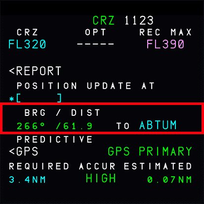{loading=lazy}  
    <p style="color:yellow; font-size:18px;">TODO: update screenshot for A380X</p>
    
    **ND distance rings:**

    The ND distance rings can be used to determine the distance to a waypoint or fix. The distance rings can be set to a
    specific distance and will show the distance to the waypoint or fix. The distance rings can be set by pressing the 
    ND button on the lower ECAM display and then selecting the distance rings option.

    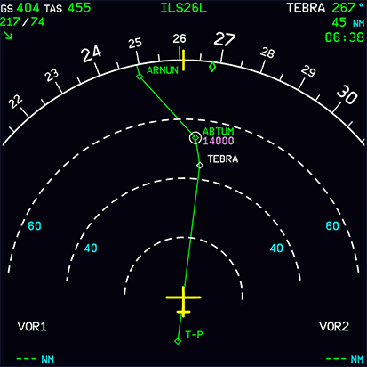{loading=lazy}
    <p style="color:yellow; font-size:18px;">TODO: update screenshot for A380X</p>

??? tip "FIX INFO Distance Ring"
    #### FIX INFO Distance Ring

    A great aid for knowing when to descend is the FIX INFO feature.

    You can add a ring around a waypoint or fix with a specified distance. As we need 57NM for our descent from FL320 to 
    FL140 at ABTUM we can set the fix distance ring to 57NM.

    Now we can easily see our TOD (top of descent) on the ND.

    !!! block ""
        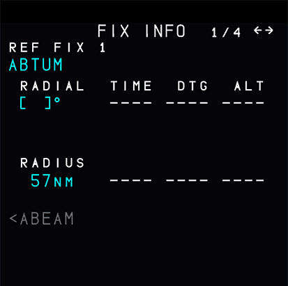{loading=lazy width=45% align=left}
        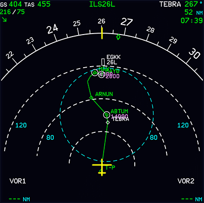{loading=lazy width=45% align=right}

    <p style="color:yellow; font-size:18px;">TODO: update screenshot for A380X</p>

    The MCDU FIX INFO page can be accessed by selecting the first waypoint on the F-PLN page and pressing LSK 1L 
    "FIX INFO".

    See our feature guide [FIX INFO](../../a32nx/a32nx-advanced-guides/flight-planning/fixinfo.md) for how to use this 
    function.
    <p style="color:yellow; font-size:18px;">TODO: update link/page for A380X</p>

??? tip "How to Calculate the Required Distance for Descent"
    #### Calculate the Required Distance for Descent
    **Example data:**

    - Flight to EGKK via STAR TEBRA 2G.
    - Flight level FL320.
    - STAR constraint at waypoint ABTUM "at FL140".

    **Example chart:**

    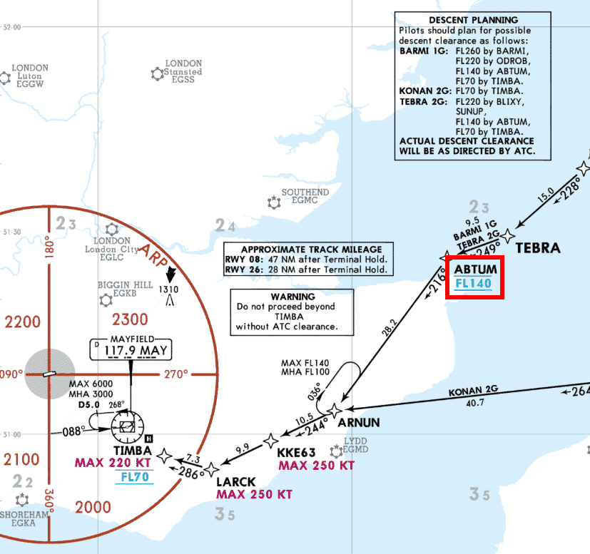{loading=lazy}<br/>
    <sub>*Copyright © 2021 Navigraph / Jeppesen<br/>
    "Navigraph Charts are intended for flight simulation use only, not for navigational use."*

    **Using the flyPad:**

    Standard calculation with 3° descent path:<br/>
    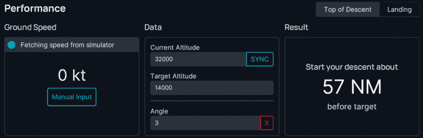{loading=lazy}

    Calculation with a specific distance to calculate the required descent velocity (V/S):<br/>
    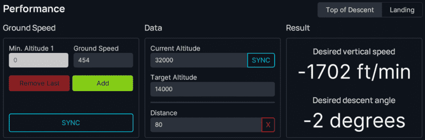

??? tip "Rule of Thumb"
    #### Rule of Thumb
    
    ```
    Distance = "Altitude difference"*3/1000+margin**

    Altitude difference: 32000-14000=18000
    Times 3:             18000*3=54000
    Divided by 1000:     54000/1000=54
    Plus margin (~10%):  59NM
    ```

    The margin can be lower for headwind and larger for tailwind. Some pilots also change the margin to compensate for 
    slowing down while descending.

    As can be seen on the chart, there will be a further descent to TIMBA at FL70 and after that (not visible on the    
    chart above), there will be a descent to the final approach which will be at 2000ft at the Final Approach Fix FF26L.

    The same methodology/calculation as our initial descent can be applied to these descents as well, but they require 
    less planning as they are usually designed in a way that an aircraft with a 3° descent angle can make these descents 
    with ease.

    ATC will quite often instruct certain altitudes within the STAR and APPR which deviate from the STAR and APPR 
    charts. Please expect such instructions at any time.

#### Advanced Arrival Planning

<p style="color:yellow; font-size:18px;">TODO: consider removing "advanced" as this shouldbe standard</p>

!!! warning "Important Notice"
    The following is a more advanced process for planning our arrival. It is obviously important when we want to have a 
    more realistic experience, but in Microsoft Flight Simulator you can skip this part for now. <br/>
    This process is best done with an Online ATC service, as the built-in MSFS ATC does not provide the necessary 
    information at the right time.

For a more advanced arrival planning, we can collect the following information and execute the following steps:

??? tip "Entering DEST DATA on the MFD"
    ##### Entering DEST DATA on the MFD

    Before we descend, we should also reconfirm our destination runway and input or update our destination data into the
    MCDU PERF APPR page. This is typically done about 50NM before the starting the descent.
    We can obtain this data from the destination airport's ATIS information and the airport charts.

    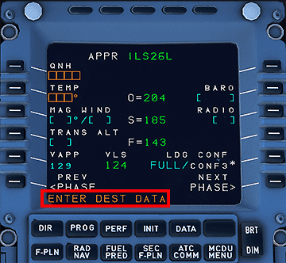{loading=lazy}
    <p style="color:yellow; font-size:18px;">TODO: update screenshot for A380X</p>

    From ATIS we get: `QNH`, `TEMP`, `MAG WIND` and `TRANS LVL` - if not refer to the approach chart.

    ATIS Example:
    <p style="color:yellow; font-size:18px;">TODO: update with new route to EDDF</p>
    ```
    GATWICK INFORMATION K TIME 2020, RUNWAY IN USE 26L
    TRANSITION LEVEL FL70, SURFACE WIND 260,7 KNOTS
    CAVOK TEMPERATURE +16, DEW POINT +12, QNH 1018,
    ACKNOWLEDGE RECEIPT OF INFORMATION K AND ADVISE AIRCRAFT
    TYPE ON FIRST CONTACT
    ```

    From the chart, we get `Trans level` and `BARO` (=DA or MDA) or `RADIO` (=RA or DH). 

    - CAT I ILS uses DA or MDA and is entered into the `BARO` field.
    - CAT II/III ILS use RA or DH, which is put in the `RADIO` field.
    - `BARO` is based on barometric altitude whereas `RADIO` is based on radio altitude (distance to ground).

    For more information on the different types of minimums, see the 
    [Minimums and MDA/DH](../../airliner/airliner-flying-guide/approaches.md#minimums-and-mdadh) section on the 
    [Approaches](../../airliner/airliner-flying-guide/approaches.md) page in the airliner flying guide.

??? tip "Trans level: By ATC"
    ##### Trans level: By ATC

    In the particular example below, the `Trans level` field states `By ATC`. If you are not flying on a network such as
    VATSIM or IVAO, you can try the following things:

    - Search online for the real life D-ATIS at your arrival airport (much like the ATIS example above).
    - Use the `Trans ALT` + 1000 ft.
    - If you have imported your flight plan via our simBrief integration, this value would be autopopulated for you.

    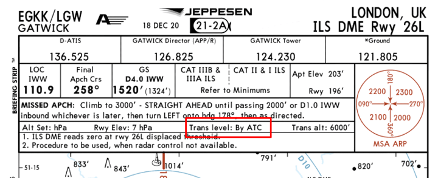{loading=lazy}<br/>
    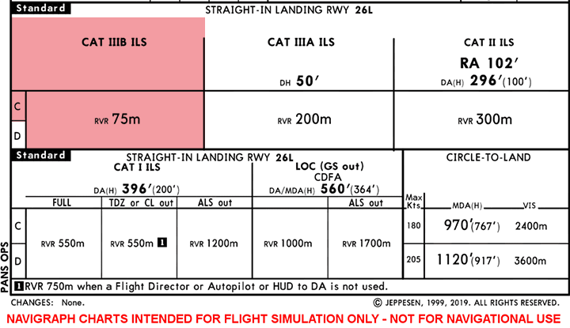{loading=lazy}<br/>
    <sub>*Copyright © 2021 Navigraph / Jeppesen*

??? tip "ILS in the A380"
    ##### ILS in the A380

    The A380 is capable of a CAT IIIB ILS approach and has an approach category of "C" - see the red area on the chart.
    (see [Wikipedia Aircraft approach category](https://en.wikipedia.org/wiki/Aircraft_approach_category){target=new})

    In this chart for EGKK 26L ILS there is no DH for CAT IIIB defined - so we can enter "NO" or "NO DH" into the 
    `RADIO` field.
    <p style="color:yellow; font-size:18px;">TODO: update text for EDDF</p>

    If we are using Microsoft Flight Simulator without any Online ATC services (VATSIM, IVAO, PilotEdge, ...), and using
    the MSFS built-in ATC, you usually can't request ATIS information for the destination airport at this point. MSFS 
    ATC makes ATIS only available once close to the destination airport.

    If we are flying with Online ATC, you can request ATIS via the `MCDU-ATSU-AOC` page or your Online ATC network's 
    client at this time. 

    <p style="color:yellow; font-size:18px;">TODO: double check this with new MFD</p>

??? tip "METAR Information"
    ##### METAR Information

    We can in any case request the METAR weather information for the destination airport via the same page.

    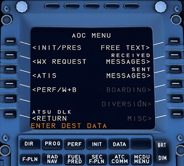{loading=lazy} 
    <p style="color:yellow; font-size:18px;">TODO: update screenshot with new MFD</p>

    If we used Simbrief for flight planning, we can also see METAR information on the flyPad after importing the 
    SimBrief plan to the flyPad.

    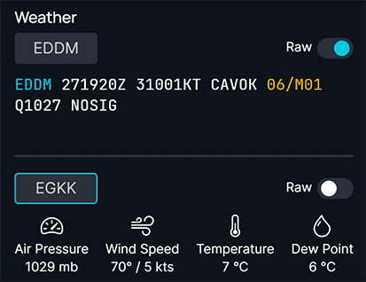{loading=lazy}

    Once we have confirmed the destination runway and the destination data, we are set for the approach, and we can 
    continue to focus on the descent.

    <p style="color:yellow; font-size:18px;">TODO: double check this with new MFD</p>

`WEATHER AND LANDING INFORMATION ................................... OBTAIN`<br/>
`LANDING ELEVATION .................................................. CHECK`<br/>
`BAROMETRIC REFERENCE .............................................. PRESET`<br/>
`LANDING PERFORMANCE ................................................ CHECK`<br/>

<p style="color:yellow; font-size:18px;">TODO: VERIFY LANDING CALC WILL BE PRESENT IN NEW FMS</p>

##### Flight Management System (FMS) Checks
If not already inserted, insert the applicable APPR, STAR, TRANS and APPR VIA in the active flight plan arrival page
of the flight management system.

`FMS ACTIVE/F-PLN/ARRIVAL PAGE ............................... INSERT/CHECK`<br/>
`DES PANEL OF THE FMS ACTIVE/PERF PAGE ....................... INSERT/CHECK`<br/>
`APPR PANEL OF THE FMS ACTIVE/PERF PAGE ...................... INSERT/CHECK`<br/>
`GA PANEL OF THE FMS ACTIVE/PERF PAGE ............................... CHECK`<br/>
`FMS POSITIONAL/NAVAIDS PAGE ........................................ CHECK`<br/>
`FMS ........................................................... CROSSCHECK`<br/>

##### OANS (Onboard Airport Navigation System) and BTV (Brake to Vacate)
If available, set up the OANS and BTV for the destination airport.

??? tip "OANS"
    The Onboard Airport Navigation System (OANS), developed jointly by Thales and Airbus, is a groundbreaking technology
    designed to enhance pilot navigation during airport operations. 

    Key features of OANS include:

    **Overview Map Display:** OANS provides pilots with an overview map display of the airport apron and taxiways. This 
    display indicates the precise location of the aircraft on the map, aiding pilots during taxiing and ground movements.

    **Geo-Referenced Map Integration:** The system integrates the plane’s position on a high-resolution, geo-referenced map 
    using a standardized Airport Mapping Database. This ensures accurate and clear navigation guidance for pilots, 
    especially when they find themselves in unfamiliar airports after landing.
    
    **Efficiency Benefits:** By helping pilots navigate airports more efficiently, OANS aims to:
    - Reduce taxi time.
    - Streamline airport handling operations.
    - Maximize turnaround times
    
    **Adaptation to Multiple Platforms:** Initially certified for the A380, OANS has been adapted to other Airbus platforms,
    including the A320, A330, A340, and A350 XWB. Thales’s expertise allows effective adaptation of systems designed for 
    newer platforms into earlier ones3.

    In summary, OANS bridges the technological gap between the air and the ground, providing pilots with clear and 
    concise directions from landing through arrival at the gate, and vice versa3.

??? tip "BTV"
    Brake to Vacate (BTV) is a system that helps pilots to select the most appropriate runway exit for their aircraft 
    based on the aircraft’s current position, speed, and weight. The system calculates the optimal exit based on the 
    aircraft’s deceleration capabilities and the distance to the exit. 

    By selecting the most appropriate exit, pilots can reduce taxi times and improve airport efficiency. This is 
    especially important for busy airports with high traffic volumes, where every minute saved can help to reduce 
    congestion and improve overall airport operations.

    BTV is a valuable tool for pilots, providing them with the information they need to make informed decisions about 
    runway exits. By selecting the most appropriate exit, pilots can help to reduce taxi times, improve airport 
    efficiency, and enhance the overall passenger experience.

`RUNWAY SHIFT ................................................. AS REQUIRED`<br/>
`ND MODE ............................................................. PLAN`<br/>
`ND RANGE ............................................................ ZOOM`<br/>
`RUNWAY ............................................................ SELECT`<br/>
`RUNWAY EXIT ....................................................... SELECT`<br/>
??? note "Exit Selection"
    It is recommended to select the exit in accordance with the runway conditions. It is recommended to select an exit 
    after the wet line to anticipate any changes of runway condition, as well as a smoother deceleration for passenger 
    comfort. It is also recommended to take into account arrival gate, the ground circulation, the runway exit 
    configuration, and the predicted turn around time, which is displayed on the navigation display
`AUTO BRAKE/BTV ....................................... SELECT, AS REQUIRED`<br/>
??? note "Brake / BTV"
    It is recommended to use of the autobrake system to have equal brake pressure and prevent brake overheat. Select the
    appropriate autobrake mode, depending on the weight, the runway length, the conditions and the winds. However, if 
    the pilot selects the BTV system, set the BTV mode before removing the onboard airport navigation display from the 
    navigation display. It is recommended on contaminated runway to use the autobrake mode 3. It is recommended to use 
    of the HI mode if the BTV mode is not available or on short runway conditions
`OANS RUNWAY LENGTH VS CHARTS RUNWAY LENGTH .................... CROSSCHECK`<br/>

<p style="color:yellow; font-size:18px;">TODO: add link to advanced guide or video</p>

`LANDING BRIEFING ................................................. PERFORM`<br/>

This concludes *Descent and Approach Planning*.

---

### 2. Descent

**Situation:**

- Aircraft is in `CRUISE` state and phase as per previous chapters.
- Descent and approach planning is done.
- First descent point (altitude at certain waypoint) is identified.
- Distance to descent point is calculated, which is called TOD (top of descent).

??? tip "Descent Clearance from ATC & TOD"
    A few minutes before we reach our calculated descent point (TOD) we request clearance for descent from ATC if not 
    already given a descent instruction before.

    **Do NOT start the descent without clearance from ATC.**

    The A380 has a downward pointing arrow at the TOD to support the pilot with the decision of when to descend. 

    **Ultimately, it is still the pilot's responsibility to calculate and validate the TOD.**

    When clearance is given, we can start our descent to the flight level or altitude ATC has given us.

`DESCENT CLEARANCE ................................................. OBTAIN`<br/>
`CLEARED ALTITUDE ON AUTO FLIGHT SYSTEM CONTROL PANEL ................. SET`<br/>
`ANIT-ICE ..................................................... AS REQUIRED`<br/>

#### Starting the Descent

`DESCENT ......................................................... INITIATE`<br/>
`ALTITUDE ............................................................ PUSH`<br/>

??? tip "How to initiate the descent"
    For descending, we set the new flight level or altitude in the `FCU` with the `altitude selector`. We can then 
    either PUSH the selector for `Managed Altitude Mode` (constraints are respected, also known as 
    [DES](../../a32nx/a32nx-advanced-guides/flight-guidance/vertical-guidance/managed-modes.md#des-descent)) or PULL the
    selector for `Selected Altitude Mode` (constraints are ignored, also known as 
    [OP DES](../../a32nx/a32nx-advanced-guides/flight-guidance/vertical-guidance/selected-modes.md#op-des-open-descent)). 
    
    <p style="color:yellow; font-size:18px;">TODO: update screenshot with new FCU if needed</p>

??? info "What is DES mode"
    Managed Descent (DES) Mode will follow a calculated vertical profile, this may lead to unexpected occurrences of 
    very high and very low V/S. Users not familiar with Airbus Managed Descent should use OP DES instead as it provides 
    a linear descent most users would expect. 
    
    See the [Vertical Guidance Guide](../../a32nx/a32nx-advanced-guides/flight-guidance/vertical-guidance/overview.md) 
    for more information on using managed vertical modes.

    When either of these altitude modes are engaged, the relevant mode will appear in the Second Column of the `FMA`, 
    and will be displayed in green.<br/>
    (See [Vertical Mode Annunciations](../../a32nx/a32nx-briefing/pfd/second-column.md)).

    <p style="color:yellow; font-size:18px;">TODO: update links</p>

??? warning "Using V/S not recommended for beginners"
    It is not recommended to use V/S for climbing or descending in the A380 (at least not for beginners) as the V/S 
    guidance has priority over the speed guidance, and speed needs to be watched very closely when using V/S.

    If the selected target V/S is too high (relative to the current thrust condition and speed), the FMGC will steer the
    aircraft to the target V/S, but the aircraft will also accelerate or decelerate. When the speed reaches its 
    authorized limit, V/S automatically decreases to maintain the minimum or maximum speed limit.

    See also [Protections](../../a32nx/a32nx-advanced-guides/protections/overview.md).
    <p style="color:yellow; font-size:18px;">TODO: update links</p>

??? tip "VNAV and ATC in the FlyByWire A380X"
    In case we are cleared to a lower altitude or flight level with altitude constraints above the clearance 
    is an ideal scenario for the called so `VNAV` autopilot mode, which would be activated by using 
    "`Managed Altitude Mode`" (pushing the `ALT selector`). 

    The autopilot will automatically level off at the constraint and continue descending when the constraint is no 
    longer valid. ATC typically will not clear us to our final target altitude directly, but will give us several step 
    descents down to our required altitude.

    ATC will often still expect us to respect the STAR's constraints, although they might have given us a lower 
    clearance. We should then only descent to the constraint's altitude. We repeat the process until we have reached our
    desired final approach altitude.

`DESCENT .......................................................... MONITOR`<br/>
`RATE OF DESCENT ....................................... ADJUST AS REQUIRED`<br/>
`SPEEDBRAKES .................................................. AS REQUIRED`<br/>

!!! info "Airline SOPs"
    Some airline's SOPs (standard operating procedures) might have a different order for the following steps.

#### At 20,000 feet

`CABIN CREW ........................................................ ADVICE`<br/>
`TERRAIN RADAR ................................................ AS REQUIRED`<br/>
`WEATHER RADAR ................................................ AS REQUIRED`<br/>
??? note "Weather Radar"
    The Weather Radar is currently not available in the A380X. It is planned to be implemented in the future if and when
    the simulator provides the required weather data. 
 
#### At 10,000 feet

??? tip "What and Why?"
    As we reach the 10,000 foot mark in our descent, we have to take a few more steps to prepare the aircraft to land. 
    We make sure the seatbelt sign is on so passengers are secure and not moving around during descent. We also make sure 
    the landing lights are on so we are visible to other aircraft on approach. 

    The `LS` buttons are turned on so we have the landing system active for when we intercept the ILS. 

`LANDING LIGHTS ........................................................ ON`<br/>
`SEAT BELTS SIGN ....................................................... ON`<br/>
`CSTR BUTTON ........................................................... ON`<br/>
`LS BUTTON .................................................... AS REQUIRED`<br/>
`NAVAIDS ................................................ AS REQUIRED/CHECK`<br/>

??? tip "How and Where?"
    <p style="color:yellow; font-size:18px;">TODO: add screenshots and description</p>

`APPROACH CHECKLIST .............................................. COMPLETE`<br/>
??? note "Approach Checklist"
    `CABIN CREW ............................................................. ADVISE`<br/>
    `LANDING DATA .............................................................. SET`<br/>
    `AUTOBRAKE/BTV ..................................................... AS REQUIRED`<br/>
    `LANDING BRIEFING ...................................................... CONFIRM`<br/>
    `ECAM STS ............................................................... NORMAL`<br/>
    `ALTIMETER .................................................... ____ QNH/HPA SET`<br/>
    `LAND LIGHT ................................................................. ON`<br/>
    `MINIMA .................................................................... SET`<br/>
    `SEAT BELTS ................................................................. ON`<br/>

??? tip "Cabin Crew in real life"
    In real life, the cabin crew will be asked to prepare the cabin for landing at some point during the descent. The 
    exact moment and process might differ between airlines, but most seem to do this when the Seatbelt Signs are turned 
    on (typically at the latest at 10,000ft).

    The Cabin Crew will notify the pilots either by a "Cabin Ready" button (A380) or by a call to the cockpit once
    they are ready and strapped in themselves. Typically, we will be in final approach by that time.

    <p style="color:yellow; font-size:18px;">TODO: check SOP for updated 380 cabin crew</p>

This concludes *Starting the Descent*.

---

### 3. Flying the STAR and Approach

**Situation:**

- Aircraft is in `DES` phase.
- Descent has started (we are after TOD).
- We have not yet reached the first waypoint of the STAR.
- `MCDU PERF APPR` page is filled (beginners can skip this - see chapter 
  [Advanced arrival planning](#advanced-arrival-planning)).


Flying the STAR and Approach is very similar to any other part of the route within the flight plan. Apart from 
descending and adhering to constraints, the lateral flight path just follows the programmed route.

Let the __Autopilot__ do this for you, and just adjust altitude and speed according to the charts or ATC instructions.

??? tip "ATC Instructions During STAR and Approach"
    At some point during the descent and when close enough to the airport, we will be instructed by ATC to contact ATC 
    Approach for the airport we are flying into.

    Be prepared for ATC instructions to deviate from the STAR or Approach route to separate from other aircraft 
    or to shortcut the approach when there is little traffic. ATC will then typically give you new heading instructions 
    (heading vectors) and will guide you the rest of the STAR and Approach with additional heading instructions until 
    intercepting the ILS localizer.

    **Example for shortcuts:**
    
    ROKIL STAR/Transition EDDM (Munich) 26R - it is only in times with a lot of traffic that we would have to fly the whole downwind part of this transition.
    
    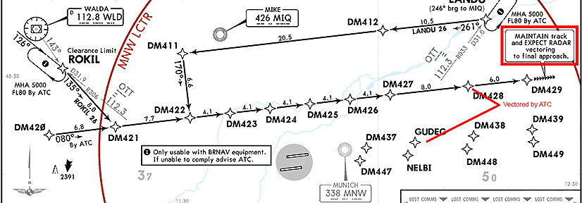{loading=lazy}<br/>
    <sub>*Copyright © 2021 Navigraph / Jeppesen<br/>
    "Navigraph Charts are intended for flight simulation use only, not for navigational use."*

    <p style="color:yellow; font-size:18px;">TODO: update to EDDF</p>


---

### 4. Intercepting ILS

**Situation:**

- Aircraft is in `DES` phase.
- Aircraft is set up for flight <10,000ft (`seat belt signs` on, `landing lights` on, etc.).
- We are either within the IAP (Instrument Approach) and at the correct altitude and speed or at a heading vector, 
  altitude, and speed instructed by ATC.

??? tip "Reaching the beginning of the ILS Approach"
    At the start of the Instrument Approach (or by ATC vectoring) we will be on a path to the Final Approach Fix and/or 
    intercepting the ILS localizer and eventually the ILS glideslope.

    To intercept the ILS, we need to be at the correct altitude and should not have an approach angle larger than 30°. 
    The `LS` button should also be `ON`on both the captain and first officer's sides of the FCU.

    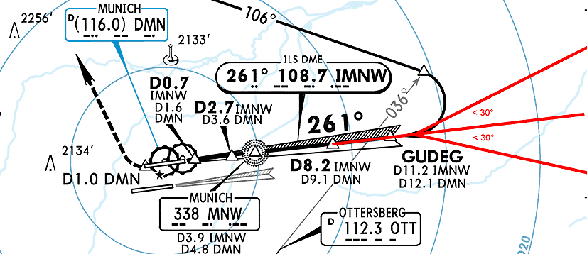{loading=lazy}<br>
    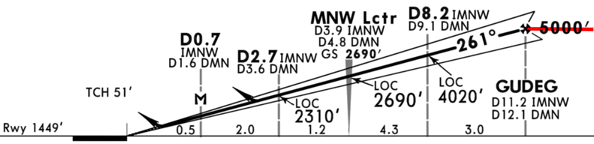{loading=lazy}<br/>
    <sub>*Copyright © 2021 Navigraph / Jeppesen<br/>
    "Navigraph Charts are intended for flight simulation use only, not for navigational use."*

    <p style="color:yellow; font-size:18px;">TODO: update to EDDF</p>

`APPROACH PHASE ............................................ CHECK/ACTIVATE`<br/>
??? note "Approach Phase"
    The aircraft will activate the APPR phase automatically if flown over the pseudo waypoint in NAV mode. However, if 
    the aircraft is in heading or track mode, It is recommended to activate the APPR phase 15 nautical miles from 
    touchdown.
`MANAGED SPEED ...................................................... CHECK`<br/>
??? note "Managed Speed"
    It is recommended to regularly verify the managed speed and to monitor the target speed.

    When in NAV, LOC*, or LOC mode is engaged, the aircraft will automatically decelerate at the DECEL waypoint.

`SPEEDBRAKES .................................................. AS REQUIRED`<br/>

More details regarding the ILS approach and landing in the next chapter.

This concludes *Intercepting ILS*.

Continue with [Final Approach and Landing](07_landing)
