<link rel="stylesheet" href="/stylesheets/bg.css">

# Approach and ILS Landing

This guide will explain the correct procedures to fly a final approach and conduct an ILS landing.

!!! warning "Disclaimer"
    
This is for simulation purposes only.

    The level of detail in this guide is meant to get an Airbus A380 beginner currently on approach to intercept the 
    ILS and land the aircraft safely on the runway.

    A *beginner* is defined as someone familiar with flying a GA aircraft or different types of airliners. Aviation 
    terminology and know-how is a requirement to fly any airliner, even in Microsoft Flight Simulator.

---

## Prerequisites

The aircraft is on approach shortly before intercepting the ILS and is still in phase and state `DES` as per previous 
chapters.

[Download FlyByWire Checklist](../assets/sop/FBW_A380X_Checklist.pdf){ .md-button }

## Chapters / Phases

This guide will cover these phases:

1. [Intercepting the ILS Localizer](#1-intercepting-the-ils-localizer)
2. [Intercepting the ILS Glideslope](#2-intercepting-the-ils-glideslope)
3. [Preparation and Checklist for Landing](#3-preparation-and-checklist-for-landing)
4. [Landing](#4-landing)
5. [Vacate Runway](#5-vacate-runway)

---

## 1. Intercepting the ILS Localizer

**Situation:**

- Aircraft is in `DES` phase.
- Aircraft is set up for flight <10,000ft (`seat belt signs` on, `landing lights` on, etc.).
- We are within the IAP (Instrument Approach) and either:
    - at the altitude and speed from the chart (Final Approach Fix altitude and 250knots if there are no other speed 
      restrictions on the chart).
    - or we are at a heading vector, altitude, and speed instructed by ATC.

### During Instrument Approach

During the Instrument Approach, (or by ATC vectoring) we will be on a path to the Final Approach Fix and/or a
path to intercept the ILS localizer and eventually the ILS glideslope.

As a last instruction from ATC Approach we are usually instructed to contact Tower ATC when fully established on the
ILS localizer.

To intercept the ILS Localizer, we follow these steps:

`ILS FREQUENCY ..................................................... VERIFY` 
??? note "ILS Frequency"
    Verify that the correct ILS frequency is tuned in the `MFD-RNAV` page. We find the correct frequency on the 
    pproach chart. 

    
TODO: verify RNAV page location in MFD

    === "Check ILS frequency"

    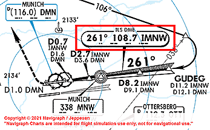{align=left width=45%}
    
    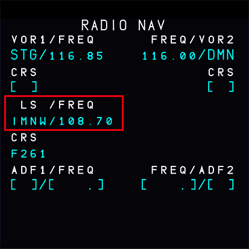{align=right width=45%}
    
     
TODO: update screenshots for A380

`LS (Landing System) ............................................. CHECK ON` 
??? note "LS Button on Glare Shield"
    Turn on the `ILS localizer and glideslope scales` with the `LS` button on the glareshield if not already done 
    before. There is an `LS` button on both the captain and F.Os side of the FCU.

    === "Turn on ILS scales"
    
    
TODO: update screenshots for A380

    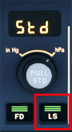{loading=lazy align=left}
    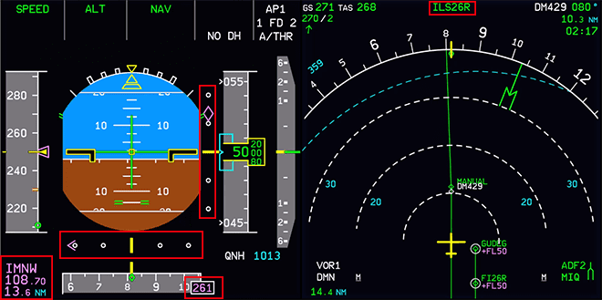{align=right width=75%}

`ALTITUDE .......................................................... VERIFY` 
??? note "Verify Altitude"
    Make sure we are on the correct altitude (5000ft in this example) and we should not have an approach angle larger 
    than 30°. 

    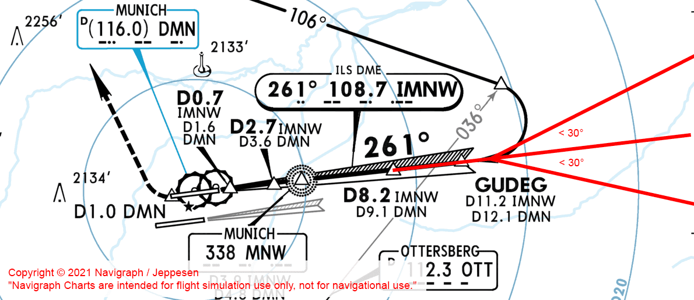{loading=lazy} 
    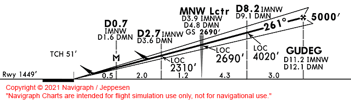{loading=lazy}
    
    
TODO: update screenshots for EDDF

    Optional: Turn on `ROSE LS Mode` for the `ND` (can also be on F.O.'s side). The ROSE LS Mode shows the deviation 
    from the localizer approach heading path.
    
    
TODO: update screenshots for A380

    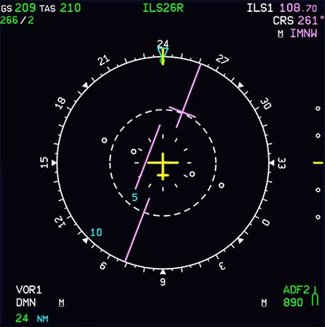{loading=lazy}

    
TODO: update screenshots for A380

### After ATC Clearance
Once ATC has cleared us for the approach, we will fo the following:

`ATC CLEARANCE FOR APPROACH ...................................... OBTAINED` 
??? note "APPR Phase and Speed"
    Check if the `APPR` phase is activated. This is usually automatically done by the aircraft at a certain 
    point during the approach, but we make sure that at this point at the latest it is activated. 

    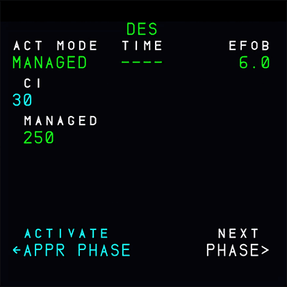{loading=lazy } 
    
    
TODO: update screenshots for A380

    
    When in the APPR phase, the `Autopilot` together with "Managed Speed Mode" relieves the pilot of a lot of stress 
    by managing the speed according to flaps setting automatically (S-Speed after `FLAPS 1`, F-Speed after `FLAPS 2`, 
    V~app~ after landing flap selection).
`SPEED MODE ....................................................... MANAGED` 
??? note "Managed Speed Mode"
    Set `SPEED` to `Managed Speed Mode` (push the `Speed Selector`). The aircraft should now decelerate to `green dot` 
    speed.
`APPR MODE .......................................................... PRESS` 
??? note "Activate APPR mode"
    Turn on `APPR` in the `FCU` to command the aircraft to intercept the ILS localizer. The aircraft will keep the 
    current heading until the localizer is captured and guides the aircraft towards the runway. The `lateral ILS 
    localizer scale` shows the `deviation marker` moving towards the middle of the `lateral deviation scale`. Also, the 
    lateral `FMA` shows `LOC` in blue (armed). 

    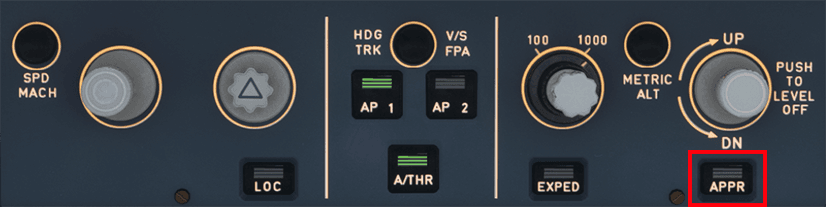{loading=lazy} 
    
TODO: update FCU screenshot

    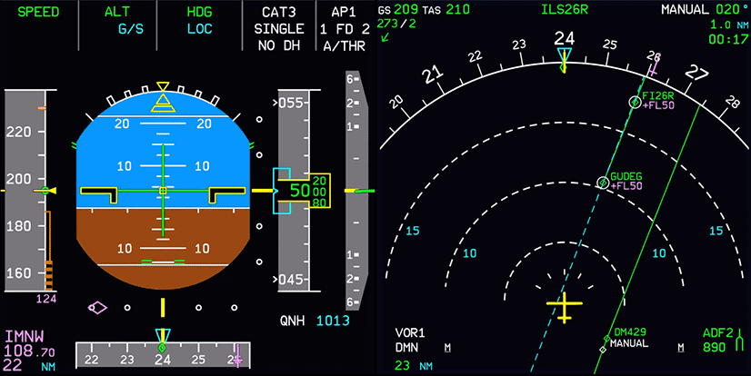{loading=lazy} 
    
TODO: update screenshots for A380

    !!! tip "What is the blue-dashed line?" 
        You might ask what the blue dashed line is. It is part of the FIX INFO feature which allows drawing distance 
        rings or radial lines from navigation fixes. For this illustration, it helps us to visualize the localizer 
        signal path at 261° into the runway, which we are going to capture with the APPR mode.
        
TODO: update screenshots for EDDF

!!! warning "Arming APPR"
    Using `APPR` also arms the glideslope descent (G/S) and the aircraft will descend as soon as it captures the ILS 
    glideslope signal.
    
    Do not descend without ATC clearance and only when directly on the ILS localizer path as only as obstacle clearance 
    is guaranteed.
    
    To help with this you can use the `LOC` button first (only localizer capture) and when cleared for approach press 
    `APPR`
`AUTOPILOT 1+2.......................................................... ON` 
??? note "Autopilot 1+2"
    Turn on `AUTOPILOT 1+2` to have same additional redundancy in case of a failure.
`FLIGHT MODE ANNUNCIATOR (FMA) ...................................... CHECK` 
??? tip "FMA"
    The pilot can verify on the flight mode annunciator the approach capability (CAT2, CAT3 SINGLE, CAT3 DUAL, or 
    AUTOLAND) for the selected approach.

    Also the `lateral FMA` should show `LOC` in blue (armed) and the `vertical FMA` should show `G/S` in blue (armed).
`FLAPS 1 (at V~FE~ -15)................................................ SET` 
??? note "Flaps 1"
    Set `FLAPS` to 1 at about V~FE~ -15 knots (but never before speed is below V~FE~) for the first slat/flap
    configuration (`CONF1`). The aircraft will then decelerate further to prepare for the next flaps configuration. Our
    target is to be in CONF 1 and at S-speed by the time you need to set flaps 2 (CONFIG 2) before the glideslope
    intercept (S-speed will be slow enough to set flaps 2).

    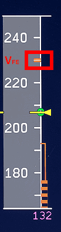{loading=lazy}
`TCAS MODE .......................................................... TA/RA` 
`LOC CAPTURE ...................................................... MONITOR` 
??? note "Capturing the Localizer"
    It is recommended to pay close attention to the LOC beam capture. Verify that during the capture phase, the LOC 
    deviation is within the LOC scale. The deviation should be displayed on the primary flight display and on the 
    navigation display. 

    The aircraft will turn towards the localizer and the deviation marker will move towards the center of the lateral
    deviation scale. The lateral `FMA` will show `LOC` in green when the localizer is captured.
    
    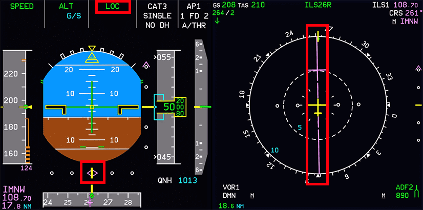{loading=lazy} 
    
TODO: update screenshots for A380

`ATC CONTACT ........................................................ TOWER` 
??? note "Contact Tower"
    When we are established on the ILS localizer (the lateral `FMA` shows `LOC` in green) we will contact Tower ATC and 
    report that we are established on the ILS localizer (including call sign and runway).

    Tower ATC will then give us clearance for the ILS approach to the target runway. This clears us to descend on the 
    ILS glideslope.

    **Do not descent without explicit clearance from ATC.**

This concludes *Intercepting the ILS Localizer*

---

## 2. Intercepting the ILS Glideslope

**Situation:**

Verify these items:

`APPR MODE ......................................................... ACTIVE` 
`AUTOPILOT 1+2 ......................................................... ON` 
`LOC CAPTURE ...................................................... MONITOR` 
`ILS LOCALIZER ................................................ ESTABLISHED` 
`FLAPS 1 .............................................................. SET` 

After ATC has given us clearance for the ILS approach, we can also start descending using the ILS glideslope.

### ILS Glideslope
Check that the `APPR` button is activated on the `FCU` to arm the ILS glideslope descent mode. 

The vertical `FMA` now shows `G/S` (glideslope) in blue.

`G/S CAPTURE ...................................................... MONITOR` 
??? note "Capturing the Glideslope"
    The aircraft will start descending when the deviation marker is in the middle (we have captured the ILS glideslope). 
    The vertical `FMA` will now display `G/S` in green.

    {loading=lazy } 
    
TODO: update screenshots for A380

    We are now descending along the glideslope. The radio altimeter comes alive at 2,500ft above the ground to display 
    the actual precise height above ground.

??? tip "ATC instructed approach speed"
    The A380 `Autothrust` will manage speed during approach automatically and will reduce speed further with each flap 
    setting. In real life and also when flying with Online ATC like VATSIM, we need to expect that ATC instructs us to 
    stay at a certain speed (e.g., 160knots until 5NM to the runway). 

    In this case, we would use `Selected Speed Mode` (select a speed in the `FCU` and pull the knob) until the 
    instructed distance to the runway where we would then go back to `Managed Speed Mode` and drop the gear then as well
    as setting flaps to 3 and flaps to full - see below.

`GO AROUND ALTITUDE ................................................... SET` 
??? note "Go Around Altitude"
    Set the `Go Around Altitude` in the `FCU` to the altitude where we would go around if we don't see the runway or 
    are not stable for landing. This is usually the `Missed Approach Altitude` from the approach chart.

`FLAPS 2 (~2.500ft and below V~FE~).................................... SET` 
??? Note "Flaps 2"
    Verify that the aircraft is decelerating toward the F speed. If the aircraft interception of the ILS/GLS glideslope 
    is below 2 000 feet above ground level, It is recommended setting flaps 2 at one dot below the glideslope. If 
    the aircraft is above the glideslope, or the aircraft does not decelerate, it is recommended to extend the landing 
    gear. It is not recommended to use the speed brakes due to limited effect at low speed.

    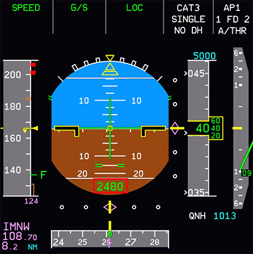{loading=lazy } 
    
TODO: update PFD example

This concludes *Intercepting the ILS Glideslope*

---

## 3. Preparation and Checklist for Landing

**Situation:**

Verify these items:

`ILS LOCALIZER & GLIDESLOPE.................................... ESTABLISHED` 
`FLAPS 2 .............................................................. SET` 

### 2000 feet and below

`LANDING GEAR ........................................................ DOWN` 
`AUTOBRAKE ........................................................ CONFIRM` 
`GROUND SPOILERS ...................................................... ARM` 
`EXTERIOR LIGHTS ...................................................... SET` 

`FLAPS 3 (after L/G down and below V~FE~).............................. SET` 
`WHEEL SYSTEM DISPLAY PAGE .......................................... CHECK` 
??? note "SD WHEEL Page"
    Verify the wheel system display page appears below 800 feet above ground level or at the extension of the landing 
    gear. It is recommended to verify the five landing gear green indication, as well as at least one green triangle on 
    each landing gear. This indicates the landing gear strut is locked at the down position.

`FLAPS (below V~FE~).................................................. FULL` 
`AUTOTHRUST .................................... CHECK IN SPEED MODE OR OFF` 

??? tip "Ready at 1000 feet"
    **We need to be fully set up and stable at 1,000ft above the ground.** 

    What does that mean? Flaps fully extended, Autothrottle in speed mode or off completely, and the landing checklist 
    is complete.
    
    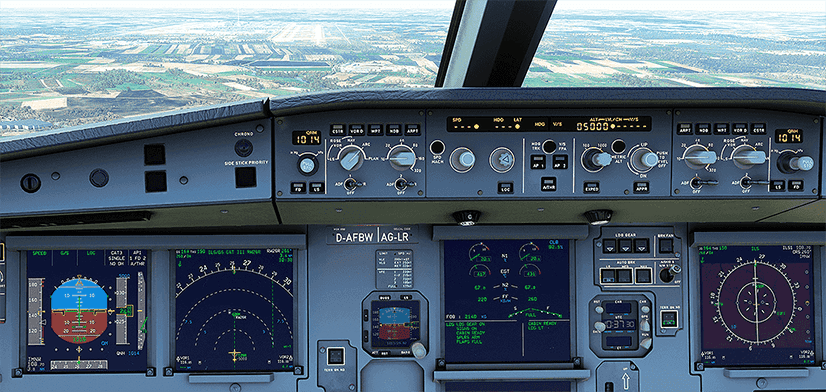{loading=lazy} 
    
TODO: update cockpit example

    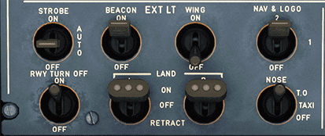{loading=lazy } 
    
TODO: update landing lights example

`LANDING MEMO ................................................ NO BLUE LINE` 
`CABIN .............................................................. READY` 
??? note "Cabin Crew"
    In real life, the cabin crew will have been asked to prepare the cabin for landing during the descent. The exact moment and process might differ between airlines, but most seem to do this when the `Seatbelt Signs` are turned on during descent (typically at the latest at 10,000ft).

    The Cabin Crew will notify the pilots either by a "Cabin Ready" button (A380) or by a call to the cockpit (---) once they are ready and strapped-in themselves.

    In the Microsoft Flight Simulator, we simulate this by pressing the `CALLS ALL` button on the left of the overhead panel. This will set the "Cabin Ready" status as shown in the ECAM and there will be a short announcement playing "Cabin Crew take your seats for landing".

    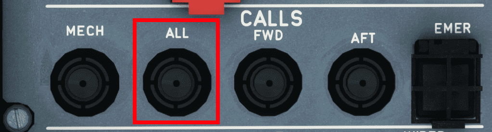{loading=lazy } 
TODO: update calls panel

`LANDING CHECKLIST ............................................... COMPLETE` 
??? note "Landing Checklist"
    `A/THR MODE ........................................................ AS REQUIRED` 
    `SIGNS ...................................................................... ON` 
    `LDG GEAR ................................................................. DOWN` 
    `FLAPS ..................................................................... LDG` 
    `SPLRS ..................................................................... ARM` 

!!! warning "Thrust levers during landing"
    For the landing, we have our hand on the thrust levers for a potential go-around, so we can quickly push the levers 
    forward into `TO GA`. 
    
    **We do not move the levers until the last seconds before landing.**

This concludes *Preparation and Checklist for Landing*

---

## 4. Landing

**Situation:**

- Aircraft is fully set up for landing as per previous chapters.
- Configuration is `FLAPS FULL`.
- Aircraft is at about 1000ft above the ground.
- Wind is calm (no crosswind for this beginner guide).

Verify these items:

`LANDING GEAR ........................................................ DOWN` 
`NOSE LIGHT ........................................................... T.O` 
`RWY TURN OFF LIGHT .................................................... ON` 
`AUTOBRAKE ........................................................ CONFIRM` 
`GROUND SPOILERS ...................................................... ARM` 
`EXTERIOR LIGHTS ...................................................... SET` 
`FLAPS ............................................................... FULL` 
`AUTOTHROTTLE .................................. CHECK IN SPEED MODE OR OFF` 

??? tip "Autoland"
    Although the A380 can do an automatic landing (**Autoland**) we will do a manual landing as this is more common and 
    also more fun.

    For an advanced guide on Autoland, see [here](../../a32nx/a32nx-advanced-guides/flight-guidance/autoland.md).

!!! warning "Clearance"
    We MUST get landing clearance from ATC before we actually are allowed to land. Without landing clearance, we must do
    a go-around (not part of this beginner guide) before touching the runway. Usually, ATC will have given us clearance 
    at this point. Late clearance is rare and communicated to us beforehand.

`AUTOPILOT ............................................................ OFF` 
??? note "Autopilot OFF"
    Next, we turn the **Autopilot** `OFF` at about 500ft above the ground by pressing the green lit `AP1+2` buttons on 
    the `FCU`.

    We leave the **Autothrust** on, so we don't have to worry about thrust and speed at all (Leaving **Autothrust** on 
    for landing is common for the Airbus).
    
    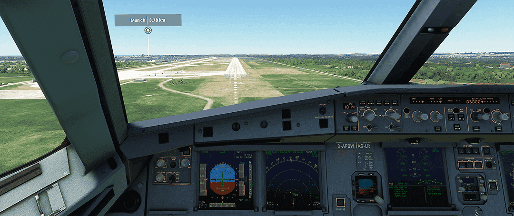{loading=lazy} 
    
TODO: update cockpit screenshot

??? tip "PAPI lights"
    At the beginning of the runway you will notice an array of lights to the runway side. These are called PAPI lights 
    and act as a visual indicator as to whether or not the airplane is on the correct glideslope. The lights also 
    indicate whether the plane is too high or too low off glideslope. For example, if you see 4 white lights, that means 
    the plane is too high. If you see 4 red lights, that means the plane is too low. We want two white lights and 2 red 
    lights.

    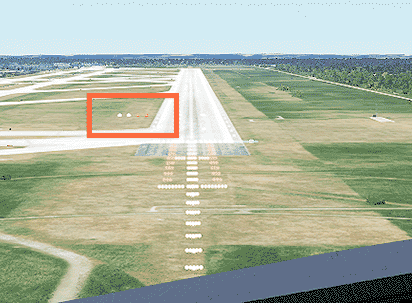{loading=lazy}

    See also [Wikipedia:PAPI](https://en.wikipedia.org/wiki/Precision_approach_path_indicator)

    We correct our pitch only very carefully when too high (3-4 white) or too low (3-4 red). We don't need a lot of 
    input to the sidestick to correct.

??? tip "Touchdown zone and center line"
    We aim for the middle of the touchdown zone, which is marked by the touchdown zone markers.

    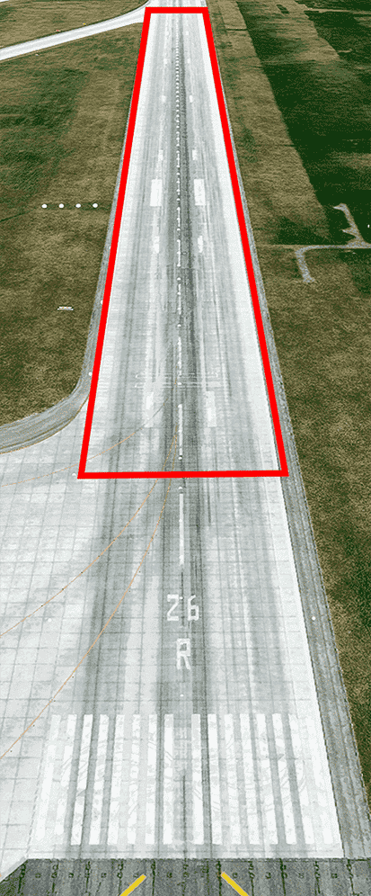{loading=lazy}

    Also, we try to aim for the center line of the runway in a way that it points directly under us.

    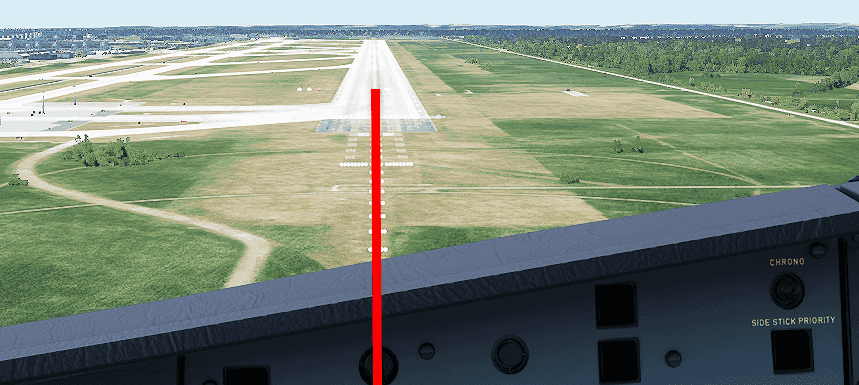{loading=lazy}
    
TODO: update screenshots for A380

    Correct your final heading and bank very carefully. We should not need to correct much at this point.

`LAND ON FMA (at 350ft agl) ......................................... CHECK` 
`ILS COURSE ......................................................... CHECK` 

`ONE HUNDRED ABOVE ................................................ MONITOR` 

`MINIMUM .......................................................... MONITOR` 
`LANDING  or GO-AROUND............................................. MONITOR` 
??? note "Go-Around"
    If you are not stable for landing at 100ft above the ground, you should do a go-around. This is a common procedure 
    and not a failure.

    Thie beginner guide does not cover a go-around - see the advanced guide for this.
    
TODO: link to advanced guide

`FLARE (~40ft agl) ............................................... INITIATE` 
??? note "Flaring"
    Once over the runway threshold, we look towards the end of the runway to better judge our pitch, especially for the 
    so-called **Flare**.

    The flare follows the final approach phase and precedes the touchdown and roll-out phases of landing. In the flare, 
    the nose of the plane is raised, slowing the descent rate and therefore, creating a softer touchdown, and the proper 
    attitude is set for touchdown.  
    
    At the runway threshold we should be about 50ft above ground and prepare to set the thrust levers to idle and flare.

    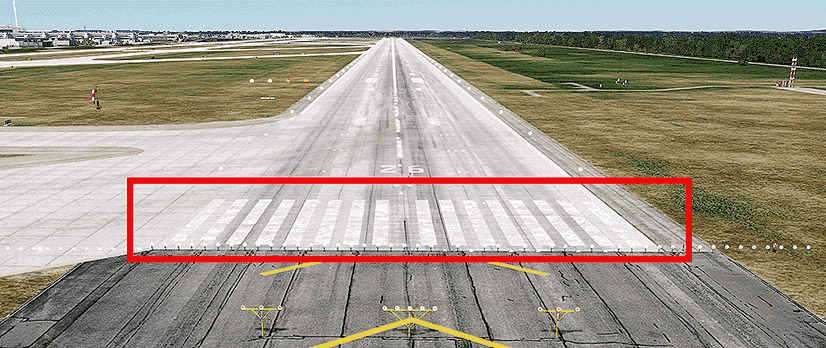{loading=lazy}

    At about 40ft, we start our flare by pulling back on the sidestick carefully. We only need a few degrees in positive
    pitch and hold the aircraft there. Too much flare will cause the aircraft to float down the runway, too little will 
    cause a harder landing.
`ATTITUDE ......................................................... MONITOR` 
??? note "Attitude"
    We hold the attitude of the aircraft until it settles on the ground.

    **Do not push the sidestick forward (nose down) once flared.** 

    We let the aircraft settle to the runway while holding the pitch.
`THRUST LEVERS ....................................................... IDLE` 
??? note "Executing the Flare and Thrust Idle"
    When the main gear touches the ground, we pull back the thrust levers to idle.
    
    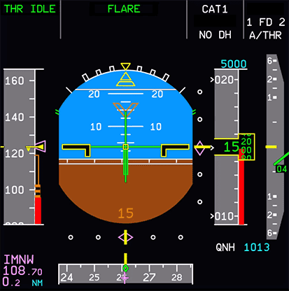{loading=lazy } 
    
TODO: update PFD screenshot

`DEROTATION ...................................................... INITIATE` 
??? note "Derotation"
    We let the front gear settle gently on the runway (don't slam it down) and hold the center line of the runway while 
    we are reducing speed. The speed reduction should be monitored on the `PFD` speed band and the speed trend arrow.

`REVERSER LEVERS ..................................................... PULL` 
??? note "Reverser Levers"
    It is recommended to select MAX REV as soon as the landing gear touches down. If for operational reason the use of 
    the thrust reversers are limited, it is recommended to maintain IDLE REV until the aircraft reaches the taxi speed.
`GROUND SPOILERS EXTENDED................................. CHECK / ANNOUNCE` 
??? note "Ground Spoilers"
    Verify the slats/flaps display on the lower part of the primary flight display. Ensure that the ground spoilers are 
    deployed. In the event of no deployment, check that all thrust levers are positioned at the IDLE detent. If no 
    ground spoilers extended, set both thrust reversers to MAX REV, and press the brake pedals.
`REVERSERS ............................................... CHECK / ANNOUNCE` 
??? note "Reversers"
    You can verify the reversers on the Engine Warning Display. It should display the reverser deployment.
`AUTO BRAKE ................................................ CHECK/ANNOUNCE` 
??? note "Auto Brake"
    The `Autobrakes` should now have activated and started to further decelerate the aircraft. This can be checked by 
    the `Autobrake` annunciators.
    
    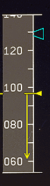{loading=lazy}

    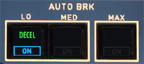{loading=lazy}
    
TODO: update for A380

`REVERSE LEVERS (at <80knots) ........................................ IDLE` 

This concludes *Landing*

---

## 5. Vacate Runway

**Situation:**

- Aircraft has landed and is moving along the center line of the runway.
- Speed is <40knots.

### At Taxi Speed

`REVERSE LEVERS ...................................................... STOW` 
`AUTOBRAKE ......................................................... DISARM` 
??? note "Auto Brake Disarm"
    The autobrake can be disarmed at the pilot’s discretion. It is recommended to use one of the autothrottle 
    instinctive disconnect pushbuttons to disarm the autobrake. If BTV mode was used, the autobrake will disarm 
    automatically at 10 knots.

### Vacate the runway
We look for the next runway exit and slow down to about 10knots before we start turning off the runway.

We continue rolling forward until we passed the runway entry marker with the **full length** of our aircraft.

{loading=lazy} 

TODO: update aircraft exterior screenshot

We can now safely stop the aircraft and do our "After Landing" checklist - see next chapter.

If ATC did not already contact us on the ground, we would contact them now to let them know we have vacated the runway. 

They will give us taxi instructions, so we can continue taxiing to our gate once we have completed the after landing
tasks.

!!!info "After landing tasks in simulation"
    In real life, the A380 will have two pilots which can actually do things in parallel, such as talking to ATC, 
    taxiing the aircraft and doing the after landing tasks. In the simulation we are typically alone, so it is perfectly
    fine to stop once we have fully vacated the runway and do these things one after the other. 

This concludes *Vacate Runway*

Continue with [After Landing Steps](08_after-landing)
