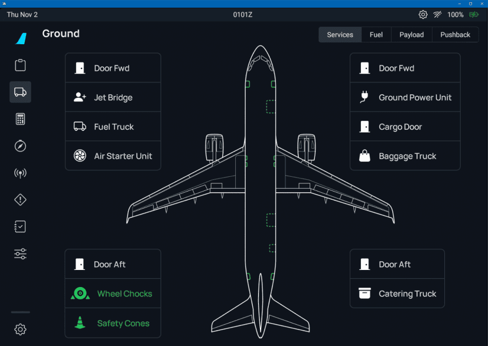

<link rel="stylesheet" href="/stylesheets/bg.css">

# Powering Down

This guide will explain the correct procedures to power down the aircraft when at the gate after arriving at the destination and taxiing to the designated gate.

Obviously this is not strictly required in a simulator, but for interested sim pilots this might be an interesting process for a more realistic experience.

!!! warning "Disclaimer"
    The level of detail in this guide is meant to help a Airbus A380 beginner correctly shut down the aircraft.

    A *beginner* is defined as someone familiar with flying a GA aircraft or different types of airliners. Aviation terminology and know-how is a requirement to fly any airliner, even in Microsoft Flight Simulator.

---

## Prerequisites

- Aircraft is at the gate after landing and taxi as per previous chapters.

[Download FlyByWire Checklist](../assets/sop/A32NX%20Documentation/FBW%20A32NX%20Checklist.pdf){ .md-button }

## Chapters / Phases

This guide will cover these phases:

1. [Parking at the Gate](#1-parking-at-the-gate)
2. [Disembarking Passengers and Baggage](#2-disembarking-passengers-and-baggage)
3. [Securing the Aircraft](#3-securing-the-aircraft)

---

## Preface
Shutting down and securing an aircraft is an important part of the overall procedure. Obviously, less important in a simulator, as the next flight will have the aircraft start in a cold and dark state again.

If we want to actually do a turn around and start a new flight directly, the procedure will be a little different, as we would not turn off certain systems and at some point simply start with the preparation of the aircraft procedure again.

## 1. Parking at the Gate

**Situation**

- We arrived at the designated gate after taxiing from the runway where we landed.
- Aircraft is in taxi state as per previous chapters.
- Engines are still running.
- Lights are still in taxi configuration (`RWY TURN OFF` set to on and `NOSE` is to taxi, `LAND`-ing lights are off).
- `APU` has been turned on during taxi and is `AVAIL`, `APU BLEED` is off.
- **After Landing** checklist is completed.

`RWY TURN OFF LTS ...................................................... ON` 
`AUXILIARY POWER UNIT ............................................... AVAIL` 
`NOSE LT ............................................................. TAXI` 
`LANDING LTS .......................................................... OFF` 

**At the gate:**

{loading=lazy} 
TODO: update screenshot
 

**Steps after arriving at the gate:**

- Set parking brake (`PARK BRK`).

`PARKING BRAKE ......................................................... ON` 

{loading=lazy} 
TODO: update screenshot
 

- `NOSE TAXI` and `RWY TURN OFF` lights are usually turned off even before we turn into the gate to not blind the ground personnel. This of course is only done if enough lighting is available to safely navigate and park into the gate. Turn them off if they were used while parking.

`EXTERIOR LIGHTS ...................................................... OFF` 

{loading=lazy} 
TODO: update screenshot
 

`AUXILIARY POWER UNIT BLEED ............................................ ON` 

{loading=lazy width=20%} 
TODO: update screenshot
 

`ENGINE MASTER SWITCHES (1, 2, 3, 4) .................................. OFF` 

{loading=lazy } 
TODO: update screenshot
 

`ENGINE N1 < 5%  .................................. OFF` 

{loading=lazy width=50%} 
TODO: update screenshot
 
is this necessary to keep in? not mentioned in SOP at all.

- Turn off `Seat Belt` sign.

`SEAT BELTS ........................................................... OFF` 

{loading=lazy width=20%} 
TODO: update screenshot
 

- Turn off `BEACON` (leave `NAV & LOGO` on as long as the aircraft has power from external or APU, `STROBES` can remain on AUTO).

`BEACON ............................................................... OFF` 

{width=20%} 
TODO: update screenshot
 

- Complete **Parking** checklist.

{loading=lazy width=50%}

If external power were available, the ground crew would have connected it by now, and we can turn on `EXT PWR`. Turning off the APU depends on the turn around time. For a shutdown, we do this after the passengers have disembarked to still have airflow in the cabin. See last chapter.

`EXTERNAL POWER ........................................................ ON` 

This concludes *Parking at the Gate*.

## 2. Disembarking Passengers and Baggage

**Situation:**

- **Parking** checklist is completed.

In real life, there are many things that begin automatically after parking at the gate. The Jetway is connected to the aircraft, doors are opened, passengers disembark, cargo is unloaded, etc. The pilots don't have to do much to trigger these steps.

In the simulator, though, we would have to trigger these events by ourselves. For this, we use the FlyByWire flyPad's ground functionality or the Microsoft Flight Simulator's built-in ATC to start these procedures. There are also some nice add-on tools out there which help with this.

Taking care of passengers and luggage with the FlyByWire flyPad:

- Go to the flyPad (view can be activated by `Ctrl+0`).
- Connect the Jetway (PAX).
- Call cargo/baggage (Baggage).

{loading=lazy} 
TODO: update screenshot

Obviously, this would take a while in real life, and we would not be able to shut down the aircraft before all passengers and crew have disembarked.

For a turn around we would start preparing the aircraft for the next flight and the cabin crew would coordinate everything from disembarking the passengers to cleaning and resetting the cabin.

After refueling, the pilot would signal to the cabin crew that they could let the new passengers board the aircraft once the cabin is ready.

This concludes *Disembarking Passengers and Baggage*.

## 3. Securing the Aircraft

**Situation:**

- **Parking** checklist is completed.
- Aircraft is empty (no passengers or cargo).
- Cabin is cleaned and ready for shutdown.

**To secure the aircraft, we follow these steps: **

- Turn off all fuel pumps.

`FUEL PUMPS ........................................................... OFF` 

{loading=lazy width=80%} 
TODO: update screenshot
 

- Turn off the `ADIRS`.

`ADIRS (1+2+3) ........................................................ OFF` 

{loading=lazy } 
TODO: update screenshot
 

- Turn off `OXYGEN`.

`OXYGEN CREW SUPPLY ................................................... OFF` 

{loading=lazy} 
TODO: update screenshot
 

- Turn off `APU BLEED`.

`AUXILIARY POWER UNIT BLEED ........................................... OFF` 

{loading=lazy width=20%} 
TODO: update screenshot
 

- Turn off emergency exit lights `EMER EXIT LT` and no smoking lights `NO SMOKING`.

`EMERGENCY EXIT LIGHTS ................................................ OFF` 
`NO SMOKING ........................................................... OFF` 

{loading=lazy} 
TODO: update screenshot
 

- Optional or depending on airline SOPs: Reset air conditioning, lighting, and screen brightness.
- Turn off `APU MASTER` (expect the APU to still be AVAIL for a few minutes if you also had APU Bleed on shortly before, as it needs a cool down period).

`AUXILIARY POWER UNIT MASTER SWITCH ................................... OFF` 

{loading=lazy width=20%} 
TODO: update screenshot
 

- Wait 2 minutes for the APU FLAP door to close before you turn off the power, as this requires either APU or external power.

`EXTERNAL POWER ....................................................... OFF` 

{loading=lazy width=20%} 
TODO: update screenshot
 

`EXTERIOR LIGHTS ...................................................... OFF` 

{loading=lazy width=20%} 
TODO: update screenshot
 

`ALL BATT (Battery 1, Essential, Battery 2, APU Battery) . . .. . . . . . . . . . . . . . . . . OFF` 
??? note "APU Flaps"
	It is recommended to wait until the APU flap is closed before shutting off the APU battery.

{loading=lazy width=70%} 
TODO: update screenshot
 

Now the aircraft is back in a cold and dark state.

This concludes *Securing the Aircraft*

