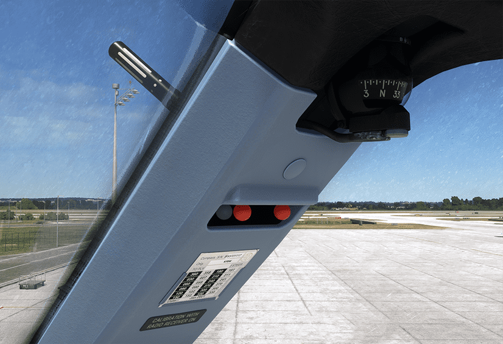

# Compass and Eye Reference

[Back to A380 Flight Deck Overview](../index.md){ .md-button }

---

## Overview

## Standby Compass

At the top, the standby compass provides magnetic heading information, allowing the pilots to navigate the aircraft
manually in case the main electronic navigation systems fail. It is a traditional, analog compass, a reliable fallback
that isn’t dependent on the aircraft’s electrical systems.

## Eye Reference Indicator

Below the compass, there’s the eye reference indicator, commonly referred to as the "ball."
In the Airbus A380, the eye reference indicator consists of two red balls and one white ball in the middle. The pilot
adjusts their seat so the white ball is hidden behind a red ball from their viewpoint. When properly aligned, this
ensures that the pilot's eyes are at the correct height and position for an optimal view of both the outside environment
and the cockpit instruments. This is especially critical for accurate visual reference during critical flight phases
like takeoff and landing.

## Visual Ice Indicator

There are two visual ice indicators outside the aircraft, between the two windshields. They provide
the flight crew with a visual backup to the ice detection system.

The visual ice indicators can be illuminated by the flight crew using the "ICE IND & STBY COMPASS" switch on the 
overhead panel to check for ice accumulation on the windshield.

---

[Back to A380 Flight Deck Overview](../index.md){ .md-button }
