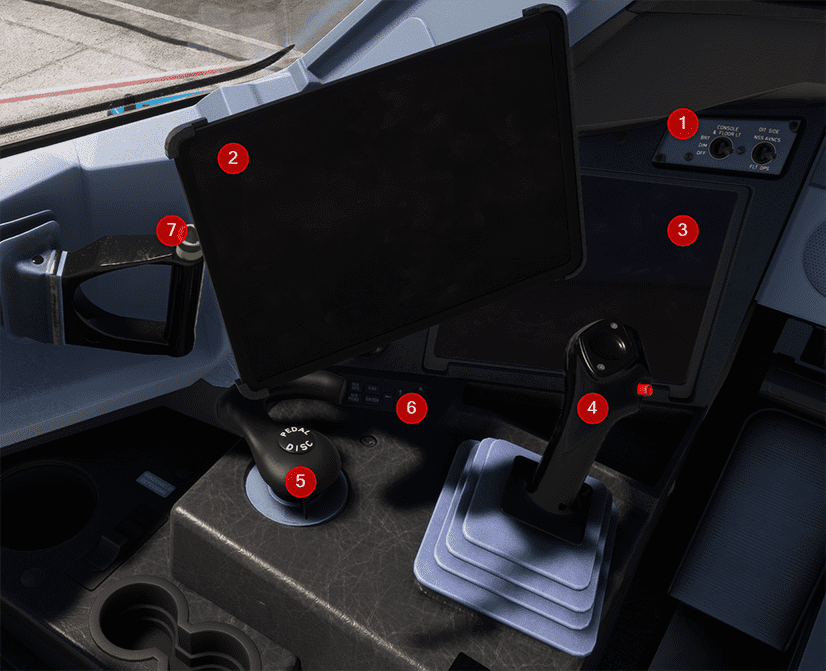

# Lateral Consoles

[Back to A380 Flight Deck Overview](../index.md){ .md-button }

---

## Overview

## 1. OIT Domain Switch and Console & Floor Light Switch

The OIT Domain switch is used to select the OIT domain for the OIT display (3).
The avionics domain includes the applications that exchange data with the aircraft avionics:
The flight operations domain includes the applications that support the flight crew on ground and in flight.
These applications are part of the Airbus Electronic Flight Bag (EFB)

!!! note "OIT in the A380X"
At the time of writing this document, the OIT is not yet implemented in the A380X.
Many of its features can be found in the flyPad EFB next to it.

## 2. Electronic Flight Bag (EFB) - flyPad

The flyPad is FlyByWire's version of an EFB which allows the user to manage the aircraft and the flight by providing
access to aircraft settings, flight plans, ground services, performance calculations, navigational charts, online ATC
frequencies and more.

[flyPadOS 3 Documentation](/aircraft/common/flypados3/)

## 3. OIT Display

The Onboard Information System (OIS) provides tools for the flight crew to operate the aircraft.
The OIS includes aircraft technical information, operating manuals, performance computation tools and mission management
information. The main goal of the electronic documentation is to provide the flight crew with attractive documentation,
that enables easy access to the necessary information related to operational needs.
It replaces all the previously used paper documentation and charts.

The OIS applications can be divided into:

- Tools for flight operations support
- Tools for cabin operations support
- Tools for maintenance operations support
- Services to the passengers, flight crew and cabin crew.

The applications are hosted on two sub-networks or domains of the Network Server System (NSS):

- The avionics domain (NSS AVNCS)
- The flight operations domain (FLT OPS)

!!! note "OIT in the A380X"
At the time of writing this document, the OIT is not yet implemented in the A380X.
Many of its features can be found in the flyPad EFB next to it.

## 4. Sidestick

The sidesticks are the pilots' primary control for manual flight.

They are spring-loaded and automatically return to the neutral position. They do not receive any feedback from the
control surfaces, as Airbus uses the fly-by-wire system without force feedback.

When the autopilot is engaged, the sidsticks are locked in neutral position.

If the pilot applies a force above a given threshold:

- The sidesticks unlock
- The autopilot disengages
- The AUTO FLT AP OFF alert triggers

Each sidestick has two controls:

- The Radio Push To Talk switch
- The sidestick pb, for autopilot disengagement, or sidestick priority

At all times, only one flight crew member should fly the aircraft. However, if both flight crew members use their
sidesticks simultaneously, their orders are algebraically added. The flight control laws limit the combined order to the
equivalent of the full deflection of one sidestick. In this case, the two green SIDE STICK PRIORITY lights on the
glareshield come on and "DUAL INPUT" voice message is activated.

The sidestick pushbutton is used as priority takeover pushbutton:

- The pilot can deactivate the other sidestick and take full control by pressing and keeping pressed his sidestick
  pushbutton.
- If the sidestick pushbutton is pressed for more than 30 seconds, the priority is latched and the other sidestick is
  maintained deactivated.
- At any time, a deactivated sidestick can be reactivated by momentarily pressing the sidestick pushbutton.

## 5. Steering Handwheels (Tiller)

The steering handwheels, also called tillers, which are interconnected, can steer the nose wheel up to 70° in either
direction.

After takeoff, the steering system centers the nose wheel automatically.

The center button on either handwheel removes control of nose-wheel steering from the rudder pedals until the button is
released.

[//]: # (TODO)

TODO: update the linked page to reflect both aircraft
 

See [Nose Wheel and Tiller Operation](../../../../../aircraft/a32nx/feature-guides/nw-tiller.md)

## 6. Additional Control Device (ACD) for the OIT

The Additional Control Device (ACD) enables navigation through applications if the keyboard and pointing device is
retracted or not available.

## 7. Cockpit Window Control Handle

The cockpit window control handle is used to open and close the cockpit windows.

---

[Back to A380 Flight Deck Overview](../index.md){ .md-button }