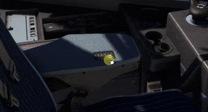
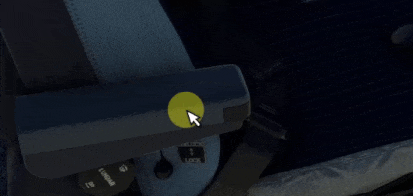

# Seats

[Back to A380 Flight Deck Overview](../index.md){ .md-button }

The seats in the A380X are fully animated and can be moved forward and backward as well as sideways to allow for easy 
access to the cockpit. 

Also, the arm rests can be moved forward and backward.

[//]: # (TODO)

TODO: insert seat screenshot showing controls
 

## Outer Arm Rest

## Inner Arm Rest

[Back to A380 Pilot Briefing Overview](../index.md){ .md-button }
