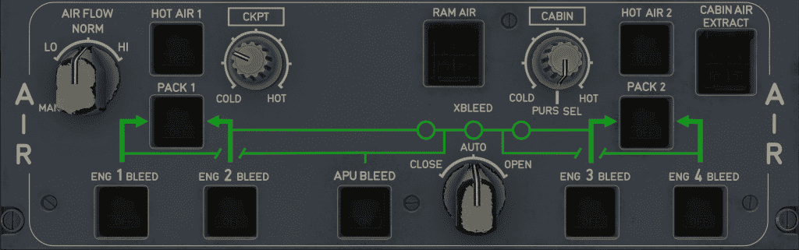

# Air Panel

---

[Back to Overhead](../overviews/ovhd.md){ .md-button }

---

{loading=lazy}

[//]: # (TODO API Doc Link)

## Usage

### AIR FLOW selector

- NORM
    - The airflow in the cabin/cockpit is automatically controlled.
- HI
    - The airflow in the cabin/cockpit is in manual mode.
    - The pack airflow is 120% of the MAN default value.
- LO
    - The airflow in the cabin/cockpit is in manual mode.
    - The pack airflow is 80% of the MAN default value.
- MAN
    - The airflow in the cabin/cockpit is in manual mode.
    - The pack airflow is a default value.

### PACK 1+2 pb

- AUTO
    - The pack is on and automatically controlled.
- OFF
    - The pack is off.
- FAULT:
    - When any pack valve position disagrees with the requested position.
        - Associated with the following ECAM alert:
            - AIR PACK 1(2) VLV 1(2) FAULT
    - Or when the pack overheats.
        - Associated with the following ECAM alert:
            - AIR PACK 1(2) OVHT
        - The FAULT light goes off when the overheat disappears.
    - Or when the pack has failed.
        - Associated with one of the following ECAM alerts:
            - AIR PACK 1(2) FAULT
            - AIR PACK 1+2 FAULT
    - Or when there is a bleed leak on one pack.
        - Associated with the following ECAM alert:
            - AIR PACK 1(2) LEAK.

### HOT AIR 1+2 pb

- AUTO
    - The hot air valve operates automatically.
- OFF
    - The hot air valve is closed.
    - Associated with the following ECAM alert:
        - COND HOT AIR 1(2) OFF
- FAULT
    - An overheat is detected in the applicable duct.
    - Associated with the following ECAM alerts:
        - COND DUCT OVHT
        - AIR HOT AIR 1(2) LEAK
    - The FAULT light goes off when the temperature decreases below 70°C, and the HOT AIR 1(2) pb is set to OFF.

### RAM AIR pb

- OFF
    - Both RAM air inlets are closed.
    - During a descent required by a loss of cabin pressurization, the RAM air inlets may
      automatically open by system logic, even if the RAM AIR pb is not set to ON. In this
      case, the outflow valves stay closed.
- ON
    - The RAM air inlets will open provided that the DITCHING pb on the CAB PRESS panel is not set to ON.
    - When the differential pressure is lower than 1 PSI: Each outflow valve will open to approximately 20%.
    - When the differential pressure is higher than 1 PSI: Each outflow valve will continue to operate normally.

### CKPI selector

- COLD...HOT
    - The cockpit temperature is 24°C.
    - Each gradation corresponds to 2°C.

### CABIN selector

- COLD...HOT
    - The cabin temperature is 24°C.
    - Each gradation corresponds to 2°C.

- PURS SEL:
    - Cabin temperature regulation is only controlled from the Flight Attendant Panel (FAP).

### CABIN AIR EXTRACT pb-sw

- Closed and dark:
    - The cabin overboard valves are closed.
- OVRD (Open and illuminated):
    - The cabin overboard valves are open.

### ENG 1+2+3+4 BLEED pb-sw

- AUTO
    - The engine bleed valve is automatically controlled.
- OFF
    - The engine bleed valve is closed.
- FAULT
    - The engine bleed position disagrees with the requested position, or
    - An overpressure is detected, or
    - An engine bleed overheat is detected.
        - Associated with the following ECAM alerts:
            - AIR ENG 1(2)(3)(4) BLEED FAULT
    - A leak is detected in the applicable engine or inner (outer) wing.
        - Associated with the following ECAM alerts:
            - AIR L(R) INR WING LEAK
            - AIR L(R) OUTR WING LEAK
            - AIR ENG 1(4) BLEED LEAK
            - AIR ENG 2(3) BLEED LEAK
    - The FAULT light goes off when the flight crew selects OFF, and the applicable failure disappears.

### APU BLEED pb-sw

- OFF (dark)
    - The APU bleed valve is closed.
- ON (illuminated)
    - The APU bleed valve is open when:
        - The APU is running
        - The aircraft altitude is below 22500 ft
        - No APU leak is detected.
- FAULT
    - The ECAM detects an APU bleed leak
        - Associated with the following ECAM alerts:
            - AIR APU BLEED LEAK

### X BLEED selector

- AUTO
    - The cross bleed valves are automatically controlled.
- CLOSE
    - The cross bleed valves are closed.
- OPEN
    - The cross bleed valves are open.

---

[Back to Overhead](../overviews/ovhd.md){ .md-button }

---