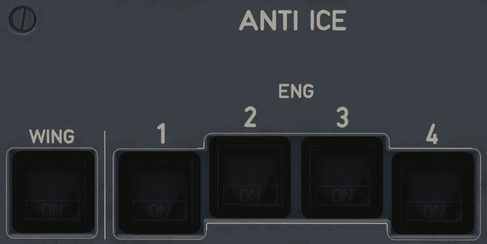

# Anti Ice Panel

---

[Back to Overhead](../overviews/ovhd.md){ .md-button }

---

{loading=lazy}

[//]: # (TODO)
<!-- TODO 
!!! note "API Documentation: [Anti Ice Panel API](../../../../../aircraft/a32nx/a32nx-api/a32nx-flightdeck-api.md#anti-ice-panel)"
-->

## Usage

### WING anti-ice

- OFF:
    - Wing anti-ice is off.
- ON:
    - Wing anti-ice is on.
    - The ECAM displays the WING A-ICE memo.
    - On ground, the wing anti-ice valves will open for 30s. Wing anti-ice will then be
      inhibited for 10 min, provided the aircraft is not in flight. If the flight crew does not
      switch off the wing anti-ice, the ON light will remain on, even though the wing anti-ice
      valves are closed. The wing anti-ice valves will then reopen after takeoff thrust
      reduction.
- FAULT:
    - The wing anti-ice valve position disagrees with the requested position
    - Or, the wing anti-ice valve is open, but a low pressure is detected.
    - Amber light and ECAM caution message.
    - The FAULT light goes off, when the affected wing anti-ice system is recovered, after
      applying the appropriate procedure.
    - If the system cannot be recovered, the FAULT light will
      remain on for the remainder of the flight.

### ENG 1+2+3+4

- OFF:
    - The anti-ice of the applicable engine is off.
- ON:
    - The anti-ice of the applicable engine is on.
    - The ECAM displays the ENG A-ICE memo.
- FAULT:
    - Amber light and ECAM caution message, if the position of the anti-icing valve disagrees with 
      the corresponding pushbutton selection.

---

[Back to Overhead](../overviews/ovhd.md){ .md-button }

---
